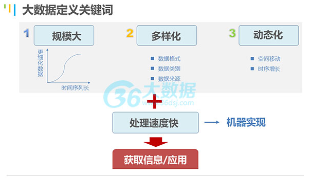
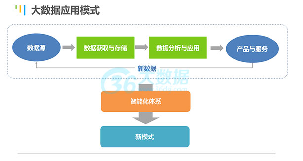

[TOC]

**大数据**
> 现在互联网数据每2年翻一倍，数据来源多样性、格式多样性、呈在线状态。  
> 如何在大数据中进行沙里淘金很重要，传统的软件对这些大数据进行处理能行吗？ ----出现了云计算。
>> 从技术上看，大数据与云计算的关系就像一枚硬币的正反面一样密不可分。大数据必然无法用单台的计算机进行处理，必须采用分布式架构。它的特色在于对海量数据进行分布式数据挖掘。但它必须依托云计算的分布式处理、分布式数据库和云存储、虚拟化技术。
> 
> http://www.36dsj.com/

**云计算**
> 概要思想就是资源（不限于计算资源）池化，按需分配。（资源在云资源提供商中进行集中池化、给客户按需要进行分配）  
> 有了强大的计算资源加入到了沙里淘金的事业，那么就少不了智能化的出现。 ----出现了机器学习。

**机器学习**
> 让程序不依赖外部明显的指示，而通过自己对数据的学习建模，并利用建好的模对新的输入进行科学的预测。  

# 大数据的定义
借助机器，通过对这些大数据（规模大、多样性、动态性）进行快速的处理分析，获取想要的信息或者应用的整套体系，才能称为大数据。  

# 大数据能做什么
从数据源进行数据的采集与存储，在这基础上进行分析和应用，形成产品和服务；而我们的产品和服务会产生新的数据，这些新数据也会循环进入我们的流程当中。如下所示：  

这个产品或者服务，现在阶段来看应该是两个方向：精准化定制、预测。

**精准化定制**  
主要是针对供需两方的，获取需方的个性化需求，帮助供方定准定位目标，然后依据需求提供产品，最终实现供需双方的最佳匹配。
- 个性化产品，比如智能化的搜索引擎，搜索同样的内容，每个人的结果都不同。或者是一些定制化的新闻服务，或者是网游等。
- 精准营销，现在已经比较常见的互联网营销，百度的推广，淘宝的网页推广等，或者是基于地理位置的信息推送，当我到达某个地方，会自动推送周边的消费设施等。
- 选址定位，包括零售店面的选址，或者是公共基础设施的选址。

**预测**  
预测主要是围绕目标对象，基于它过去、未来的一些相关因素和数据分析，从而提前做出预警，或者是实时动态的优化。   
- 决策支持类的，小到企业的运营决策，证券投资决策，医疗行业的临床诊疗支持，以及电子政务等。
- 风险预警类的，比如疫情预测，日常健康管理的疾病预测，设备设施的运营维护，公共安全，以及金融业的信用风险管理等。
- 实时优化类的，比如智能线路规划，实时定价等。

## 集群
refer: https://bd.cstor.cn/

- Hadoop集群  
(Hadoop基础集群)

- HBase集群  
(基于Hadoop的HBase基础集群)

- HBase+Hive集群  
(基于Hadoop的HBase和Hive基础集群)

- Spark集群  
(基于Hadoop的Spark集群)

- Storm集群  
(基础Storm集群)

- 包含全部组件集群  
(Hadoop,HBase,Hive,Spark,Storm)

### 实验

- HDFS
> 2.部署HDFS集群    
3.读写HDFS文件    
4.部署YARN集群    

- MapReduce
> 5.单词计数  
6.二次排序  
7.计数器  
8.join操作  
9.分布式缓存  

- Hive
> 10.部署Hive  
11.新建Hive表  
12.Hive分区  

- Spark
> 13.部署Spark集群  
14.SparkWordCount  
15.RDD综合实验  
16.Spark综例   
17.Spark-sql  
18.Streaming  
19.GraphX  

- Zookeeper
> 20.部署Zookeeper  
21.进程协作  

- HBase
> 22.部署HBase  
> 23.新建HBase表  

- Storm
> 24.部署Storm  
> 25.实时WordCountTopology  

- Flume
> 26.将文件数据Flume至HDFS  

- Kafka
> 27.订阅推送示例  

- Pig
> 28.Pig版WordCount  

- Redis
> 29.Redis部署与简单使用  
> 30.MapReduce与Spark读写Redis  

- MongoDB
> 31.读写MongoDB  

- LevelDB
> 32.读写LevelDB  

- Mahout
> 33.K-Means  

- 聚类算法
> 34.使用Spark实现K-Means  

- 分类算法
> 35.使用Spark实现SVM   

- 关联规则算法
>36.使用Spark实现FP-growth   

- 综合实战
> 37.交通大数据    
38.互联网数据处理    
39.精确营销    
40.环境大数据  
41.智能硬件大数据托管  
42.银行贷款风险评估  

