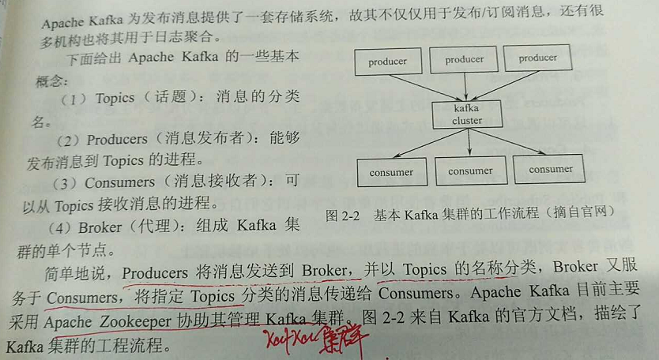

[TOC]

## 大数据概念与应用
大数据：指的是无法在可承受时间范围内用常规软件工具进行捕捉、管理和处理的数据集。

**大数据的特征**
- 大量，PB级别是常态。  
- 多样，来源、格式多样性。
- 高速，数据增长速度快。
- 价值，需要对大量的数据处理，挖掘其潜在的价值。  
- 准确性，处理的结果要保证一定的准确性。

**大数据的技术支撑**
- 存储，存储成本的下降。
- 计算，运行计算速度越来越快。
- 智能，机器拥有人类的智慧。

**大数据的研发涉及到如下几个流程**  

1. 数据的采集。
> 自带数据库。

2. 数据的导入/预处理。
> 数据清理，达到数据格式标准化、异常数据清除、数据错误纠正、重复数据的清除等目标。  
> 数据集成，将多个数据源中的数据结合起来并统一存储，建立数据仓库。  
> 数据变换，通过平滑聚集、数据概化、规范化等方式将数据转换成适用于数据挖掘的形式。  
> 数据归约，

3. 数据的统计/分析。
> 利用分布式数据库，或者分布式计算集群来对存储于其内的海量数据进行普通的分析和分类汇总，以满足大多数常见的分析需求。
>> 这些方面可以使用R语言。

4. 大数据挖掘。
> 与大数据的统计/分析不同，大数据挖掘一般没有设定主题，全凭在现有数据上运行各种算法，从而起到预测效果，或者实现更高级别的数据分析需求。
>> 方法有：预测建模、关联分析、聚类分析、偏差分析、C4.5算法、CART算法、K近邻算法、朴素贝叶斯算法、支持向量机算法、EM算法、Apriori算法、FP-Tree算法、PageRank算法、HITS算法、K-Means算法、BIRCH算法、AdaBoost算法、GSP算法。

### 问题：
- 新摩尔定律？

	人类的数据量每18个月翻一倍；	

- 大数据的现象是怎么产生的？
	
	存储成本、计算能力、智能化对人工的替代

- 大数据有哪些特征？

	5v+1c 大量volume、多样variety、高速velocity、价值value、准确性veracity、复杂性complexity

- 如何对大数据的来源进行分类？

	数据产生的主体：少量的企业应用产生的、大量的人产生的、巨量的采集器

- 大数据预处理的方法有哪些？

- 大数据的挖掘有哪些方法？

## 数据采集与预处理

> 采集和汇聚的数据可能是异构的。  

### 大数据的采集架构

数据来源：
- 公司自有的生产/业务系统。  
- 网络爬虫。   

#### Apache Kafka数据采集
一分布式发布、订阅消息系统。
> 相对于其它的消息系统、拥有高吞吐量；----是故可可以用于数据的采集。

其工作流程如下：   

### 数据预处理原理
在数据挖掘前，需要对原始数据进行（数据清洗、集成、变换）一系列的处理，使其达到数据挖掘的是低标准/规范。

#### Data Cleaning
> 一般面临着填补存在遗漏的数据值、平滑有噪声的数据、识别或除去异常值、解决数据不致问题。

填充缺失值的方法：
> 忽略元组。  
> 用属性均值填充缺失值。  
> 用同类样本的属性均值填充。

光滑噪声数据：
> 分箱。  --用‘近邻’来光滑有序的值。  
> 回归。 --线性回归查找拟合2个属性的最佳路线，使得其中1个属性可以预测另1个属性。可扩展到多元线性回归。     
> 聚类。 --  

数据清洗可认为是一个过程，包括检测偏差与纠正偏差两个步骤。 

#### Data Integration
> 将多个不同数据源的数据合并到一起形成一致的数据存储。

#### Data Transformation
> 将数据转换成适合挖掘的形式。  
>> 通常包含：平滑处理、聚集处理、数据泛化处理、规格化、属性构造等。

### 数据仓库与ETL工具

数据仓库
> 是在企业管理/决策中面向主题的、集成的、随时间变化的、非易失性的数据集合。 
>> 相对于数据库应用，数据仓库不是一个产品，更像一个‘过程’：将分布在企业各处的业务数据进行整合、加工和分析的过程。  

Extract-Transform-Load   ETL
> 一些专业的构造数据仓库的工具集，包含了数据抽取、转换、装载。 如开源的Kettle

#### Kettle

## 数据挖掘算法 
### 数据挖掘概述
KDD Knowledge Discovery in Database 数据库的知识发现
> 把数据库比作矿床。  
> 从数据库中发现的知识表示形式可以是概念、规律、规则、模式等。

数据挖掘是一个多学科交叉领域
> 数据库技术、人工智能、高性能计算、机器学习、模式识别、知识库工程、神经网络、数理统计。

问题：数据挖掘与传统的数据统计分析区别？
> 处理大数据的能力更强，且无需太专业的统计背景就可以使用数据挖掘工具。  
> 从应用上来：数据挖掘更符合企业界的需求，方便企业终端用户使用，而并非给统计学家检测用的。

### 分类 
#### 贝叶斯决策与分类器
#### SVM算法 
#### 案例：在线广告推荐中的分类

### 聚类
#### 非监督机器学习方法与聚类
#### 常用聚类算法
#### 案例：海量视频检索中的聚类

### 关联规则
### 预测模型
### 数据挖掘的综合应用

# 4、大数据挖掘工具
## Mahout

## Spark MLlib

# 5、R语言

# 6、深度学习

## 概述 
### 人工智能简史
### 神经网络
### 大数据与深度学习
### 人工智能的未来 

## 深度神经网络 

## 软硬件实现 
### TensorFlow
### Caffe
### 其它深度学习软件
### 深度学习一体机

## 深度学习应用
### 语音识别
### 图像分析
### 自然语言处理

# 7、大数据可视化

## 数据可视化基础

## 大数据可视化方法

## 大数据可视化软件与工具

# 8、互联网大数据处理

## 互联网信息抓取

## 文本分词

## 倒排索引

## 网页排序算法 

## 历史信息检索

# 9、大数据商业应用
## 用户画像与精准营销

用户画像
> 用户信息的标签化。

## 广告推荐

## 互联网金融

# 10、行业大数据
## 地震大数据

## 交通大数据

## 环境大数据

## 警务大数据

