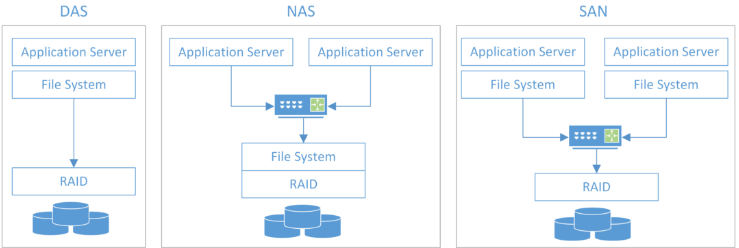
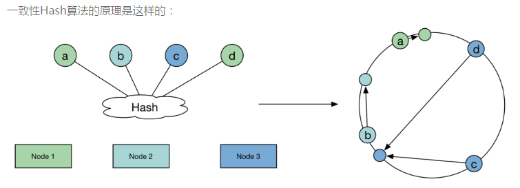
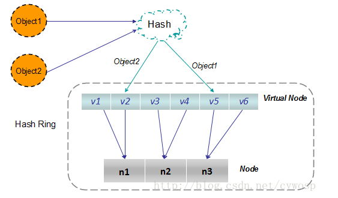

[TOC]

云存储：以数据存储和管理为核心的云计算。  

问题：作为电影下载网IT的你，需要将公司的数据找个厂商存储起来、或者找合作伙伴提供解决方案，你应该如何解决？？？
> 数据量是多少？？ 数据的特点？？（非结构化？结构化？半结构化？） 是否涉及到公司核心数据？？  公司的组织架构（有没有分公司需要保存数据）？   
>> 


## 当下存储相关背景知识

### 存储方案
* 元数据方案
	* Key->pos
	* 数据库

* 一致性HASH方案
	* 并不直接存储key->value


### 存储类型
- 块存储
	- 直接附加存储DAS
	- 存储域网络SAN
		- IP SAN
		- FC SAN

> 为现有各种应用提供通用的存储能力。 

- 分布式文件存储
	- 网络附加存储NAS
	- google文件系统GFS
	- Hadoop分布式文件系统 

> 文件存储以标准文件系统接口形式向应用系统提供海量非结构化数据存储空间。   
> 分布式文件系统把分布在局域网内各个计算机上的共享文件夹集合成一个虚拟共享文件夹，将整个分布式文件资源以统一的视图展现给用户。     

- 对象存储 
	- BC-oNest
	- Amazon S3

> 是互联网发明的小文件存储系统。  

- 表存储
	- 日志详单类存储
	- NoSQL存储
		- BigTable
		- HBase
	- OLTP关系数据库
	- OLAP数据仓库

> 管理结构化或半结构化数据。  


refer：https://wenku.baidu.com/view/107d23d0c5da50e2524d7ffc.html


块是最基础的服务；基于块可以搞文件，基于文件可以搞对象（对象就是多了个元数据）； ---是不是表也是基于文件的。
> 所以读写最快的当属块服务了。   
> 对象：数据和数据属性的综合体。   


### 存储技术
- DAS 
> Direct Attached Storage，即服务器直连存储。  
> 文件系统直接通过RAID完成对硬件访问。
>> 优点：部署简单，  
>> 缺点：不易于扩展。

- SAN 
> Storage Aera Network，即存储区域网络。（分IP SAN, FC SAN）  
> RAID接口通过网络暴露出来。  
>> 优点：基于块存储，性能高，速度快。    
>> 缺点：不易于用户访问、数据共享。  

- NAS 
> Network Attached Storage，即网络存储服务。  
> 文件系统通过网络暴露出来给应用服务。
>> 优点：基于文件存储、可多用户访问和共享。  
>> 缺点：性能较低、不利于扩展。


如下所示：  

 


## 一致性HASH
**关键点**
- 环形hash空间，这是虚拟出来的，指的是md5计算出来的范围0-(2^32 -1)


先来看看一致性hash出现的过程。
> http://yikun.github.io/2016/06/09/%E4%B8%80%E8%87%B4%E6%80%A7%E5%93%88%E5%B8%8C%E7%AE%97%E6%B3%95%E7%9A%84%E7%90%86%E8%A7%A3%E4%B8%8E%E5%AE%9E%E8%B7%B5/


普通hash算法
```python
for item in range(ITEMS):
    k = md5(str(item)).digest()
    h = unpack_from(">I", k)[0]
    n = h % NODES #通过取余的方式进行映射，得到存储的节点
    node_stat[n] += 1
```
上面这个算法最大的缺点就是当节点数变化（新增、删除）时，原来的数据大部分需要重新映射。如下： 
```python
for item in range(ITEMS):
    k = md5(str(item)).digest()
    h = unpack_from(">I", k)[0]
    # 原映射结果
    n = h % NODES
    # 现映射结果
    n_new = h % NEW_NODES
    if n_new != n:
        change += 1  #Changed: 9900989 (99.01%)
```
那么当node数发生变化时，如何保证尽量少引起迁移呢？   ---一致性HASH算法，如下：  

  
```python
for n in range(NODES):
    h = _hash(n)
    ring.append(h)
ring.sort()

for item in range(ITEMS):
    h = _hash(item)
    n = bisect_left(ring, h) % NODES
```
但上面这个算法还是有缺点：不能将所有的items均匀的映射到nodes里面。  
> 原因是nodes不是平均分布在环上。  
> 在openstack的swift组件解决了此问题
>> 将环上的空间均匀的映射到一个线性空间，这样，就保证分布的均匀性。  
>
> 也可以用‘虚拟节点’的办法，就是在hash空间中增长一些虚拟节点（增加数量来达到平衡）。   
>> 虚拟节点：实际机器在hash空间中的一个复制。 

虚拟节点法  
object从hash找到node的流程如下：  

   


