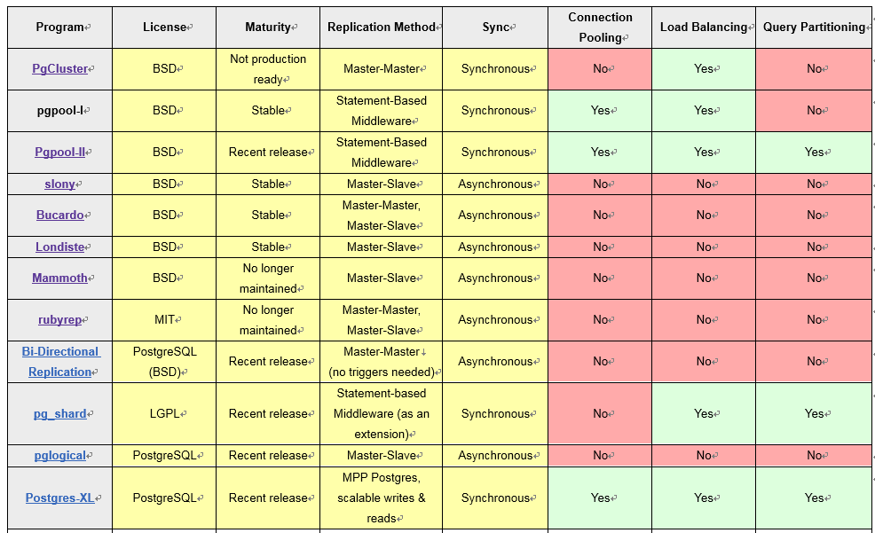
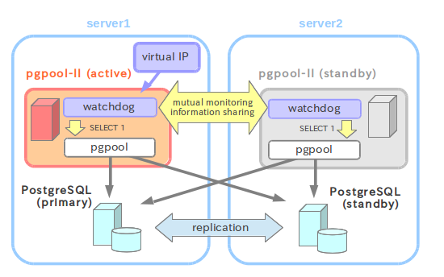
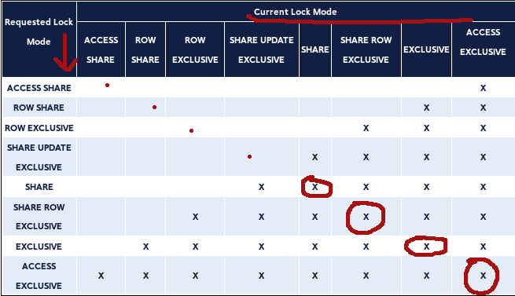

[TOC]


oid： 行的对象标识符（对象 ID）。这个字段只有在创建表的时候使用了 WITH OIDS ，或者是设置了default_with_oids 配置参数时出现。 这个字段的类型是 oid （和字段同名）。
 XID：事务ID，也是 32 位的量。在长时间运转的数据库里，它也可能会重叠。重叠后数据库就有可能出错，所以需要采取措施解决。 只要我们采取一些合适的维护步骤，这并不是很要命的问题。


## 环境

配置文件  /etc/postgresql/9.1/main/postgresql.conf 
> 怎么这么奇怪，conf放在main手册里面；

问题：查看postgres中是否有xxx数据
> find / -name *_fsm  
> grep xxx ./ -rn  
> strings filename


### 更改postgres账号密码
PostgreSQL安装会创建一个默认的linux用户postgres、以及一个数据库用户postgres（管理员）。  
其中数据库管理员的密码随机，需要修改：
> 步骤一：登录PostgreSQL
>
> >	sudo -u postgres psql

> 步骤二：修改登录PostgreSQL密码
>
> >	ALTER USER postgres WITH PASSWORD 'postgres';

> 步骤三：退出PostgreSQL客户端
>
> >	\q


修改linux用户postgres密码
> 步骤一：删除用户postgres的密码
>
> >	sudo  passwd -d postgres

> 步骤二：设置用户postgres的密码
>
> >	sudo -u postgres passwd


### utf8

pg的utf8存储，包含如下几个方面：

- 数据库服务器字符集编码。
    - show server_encoding;
    - \l
- 数据库客户端字符编码。
    - show client_encoding;  ==  \encoding
    - set client_encoding to 'utf8';`
- 本地环境编码，如文本编辑器、ssh连接工具、cmd窗口。


## 指令
pg的指令有点奇怪，都是以\打头的，如下：
```sql
#如何进入pg控制台
#psql -h localhost -p 5432 -U postgres testdb
#su postgres  --> psql 进入postgres控制台；


\l 看数据库
	#有两个模板，即template0, template1，如果create database不指定参数，就以这些为模板进行创建，默认用template1这个模板。如create database dbname template=template0 encoding='UTF8';则以template0为模板来创建dbname,编码为utf-8.
\dt 看表（默认只列出public模式下的）
\d|d+ tablename 看表结构
\c testdb;  连接testdb
\quit
\password 改密
\conninfo 看连接信息

drop role username;   #删除用户
drop database dbname; #删除db
```

## 默认的系统表、视图、函数
### 系统表
| name               | des                                             |
| ------------------ | ----------------------------------------------- |
| pg_class           | tables, indexes, sequences, views ("relations") |
| pg_database        | databases within this database cluster          |
| pg_db_role_setting | per-role and per-database settings              |

### 视图
| name             | des                                                          |
| ---------------- | ------------------------------------------------------------ |
| pg_locks         | currently held locks                                         |
| pg_roles         | database roles                                               |
| pg_user          | database users                                               |
| pg_settings      | parameter settings                                           |
| pg_tables        | tables                                                       |
| pg_views         | views                                                        |
| pg_stat_activity | One row per server process, showing information related to the current activity of that process, such as state and current query. See pg_stat_activity for details. |
|                  |                                                              |


#### pg_settings  
可以这样来设置一些配置值； show xx; set xx = yy;  

| name | des |
|---|-----|
|timezone||
|search_path|schema的搜索路径|


### 函数
| name             | des                          |
| ---------------- | ---------------------------- |
| pg_lock_status() | view system lock information |

## 特性
### 模式schema
概念有点像命名空间或者把它想像成一个文件系统中的目录（差别：schema不能嵌套）。
不同的schema可以包含相同的对象（表、函数等等），一个schema不能包含相同的对象。


db下会包含模式，模式下再包含表， 那么模式有哪些用处：
- 允许多个用户使用一个数据库而不会干扰其它用户。
- 把数据库对象组织成逻辑组，让它们更便于管理。
- 第三方的应用可以放在不同的模式中，这样它们就不会和其它对象的名字冲突。

```bash
select * from pg_namespace;
\dnS
    查看当前db下的所有模式
\dn

select search_path;
set search_path=hulz;

psql  -f ${FILE} "host=${DB_IP} port=${DB_PORT} dbname=${DB_NAME} user=${DB_USER} password=${DB_PASSWORD} options=--search_path=${SCHEMA_NAME}"
drop schema 1, 2, 3 cascade;

select * from pg_tables;
select tablename from pg_tables where schemaname='public';
    #查看当前db下的所有表名；
```


### 集群cluster


### pgpool
 pgpool有一个ip，user/app访问db就是pgp提供的service；  


### HA
Standby and active    




## 锁
死锁、数据不一致，这些问题大部分都是因为程序员对数据库的锁机制不了解导致的。  
关注点：一句sql会触发什么样的锁、它的生命周期是多长、在这个生命周期内与会与什么样的语句（锁）冲突？  
- 锁的分类；（可以看出锁的范围）
> 类型角度：共享、排它、意向。  
> 粒度角度：表级、页级（表与行之间的一种折衷，从开销、并发性、冲突率想）、行级、键级。

- 锁的触发方式；
> 显示（用户请求、即发出特殊的指令）  
> 隐式（标准的sql触发）

- 锁的生命周期；


## 如何解决死锁
死锁：是指两个（或多个）事务相互持有对方期待的锁。

### 查找当前表锁，
```sql
select * from pg_locks;
relation 
16614
```

### 发生死锁的表名及该表的所属关系， 
```sql
select * from pg_class where relfilenode = 16614;
relname        relnamespace  relowner
t_transaction     16613          16395  
```


### 查找表属于的用户， 
```sql
select * from pg_user where usesysid = 16395;
usename
spe
```

### 查找表属于哪个模式， 
```sql
select * from pg_namespace where oid = 16613;
nspname
deadlock
```

### 查找当前死锁的语句，（这句话应该最先上？因为他看的很清楚，具体到了某一条sql语句） 
```sql
select * from pg_stat_activity ;
```

杀掉死锁进程
> select pg_cancel_backend('进程ID');   
> pg_terminate_backend() 函数也可以杀掉进程。


## version-9.1锁的细节
### 表级锁 

### 行级锁 


### 建议性锁 

总结：表级锁可以通过 pg_locks 系统视图查看，但行级锁不行，所以这让调试锁更为困难，所以我希望这在 Postgres 的未来版本中变得可能。
总结：表级和行级的锁可以是显式的也可以是隐式的。建议性锁一般是显式的。




## 问题集
## utc时间

pg可以设置以下三种范围内的时间格式：

* 全局参数  
/etc/postgresql/9.1/main/postgresql.conf    
timezone='UTC'   如果没有设置，那么就看pg的宿主机上的时区设置了； 
```sql
show timezone;
set timezone to 'prc';
```

* 数据库级配置  
```sql
alter database dbname set timezone='UTC'; 
select * from pg_db_role_setting ; 
```

* 用户级配置  
```sql
alter role rolname set timezone='UTC'; 
select * from pg_db_role_setting ;
```

* 会话级别  
有个问题需要注意下：即使以上三种的设置都是一样的，但由于连接db的方式不同(jdbc, odbc, psycopg2)，执行出的来的效果也不同；


```bash

postgres=# create user hulz with password 'debian'; 
CREATE ROLE
postgres=# create database hulz_db owner hulz;
CREATE DATABASE
postgres=# grant all privileges on database hulz_db to hulz;
GRANT
postgres=# select now();
              now              
-------------------------------
 2017-09-15 09:40:03.368704+00

# 数据库级别的设置
postgres=# alter database hulz_db set timezone='prc';
ALTER DATABASE
postgres=# show timezone;                            
 TimeZone 
----------
 UTC
postgres=##pg_db_role_setting定义引用：https://www.postgresql.org/docs/9.1/static/catalog-pg-db-role-setting.html
postgres=# select * from pg_db_role_setting;     
 setdatabase | setrole |   setconfig    
-------------+---------+----------------
       16653 |       0 | {TimeZone=prc}
postgres=# \c hulz_db
SSL connection (cipher: DHE-RSA-AES256-SHA, bits: 256)
You are now connected to database "hulz_db" as user "postgres".
hulz_db=# show timezone;
 TimeZone 
----------
 PRC
postgres=# select * from pg_database where oid=16653;
 datname | datdba | encoding | datcollate  |  datctype   | datistemplate | datallowconn | datconnlimit | datlastsysoid | datfrozenxid | dattablespace |          datacl          
---------+--------+----------+-------------+-------------+---------------+--------------+--------------+---------------+--------------+---------------+--------------------------
 hulz_db |  16652 |        6 | en_HK.UTF-8 | en_HK.UTF-8 | f             | t            |           -1 |         11911 |          670 |          1663 | {...}

# 用户级别的设置
hulz_db=# alter role hulz set timezone='UTC';       
ALTER ROLE
hulz_db=# select * from pg_db_role_setting;  
 setdatabase | setrole |   setconfig    
-------------+---------+----------------
       16653 |       0 | {TimeZone=prc}
           0 |   16652 | {TimeZone=UTC}
postgres=# select * from pg_authid where oid = 16652;
 rolname | rolsuper | rolinherit | rolcreaterole | rolcreatedb | rolcatupdate | rolcanlogin | rolreplication | rolconnlimit |             rolpassword             | rolvaliduntil 
---------+----------+------------+---------------+-------------+--------------+-------------+----------------+--------------+-------------------------------------+---------------
 hulz    | f        | t          | f             | f           | f            | t           | f              |           -1 | md5c0f0270e76aa4afa79dbc5ce122d0e54 |

```


## 删除自增长的数据
Truncate 或者 delete from 均不能重置自增长的id；　　
> select setval('dataset_id_seq',1,false); --从1开始	

其它方法
> alter sequence dataset_id_seq restart with 100;  
> alter sequence dataset_id_seq start with 1 ; --只能增大 不能减小


