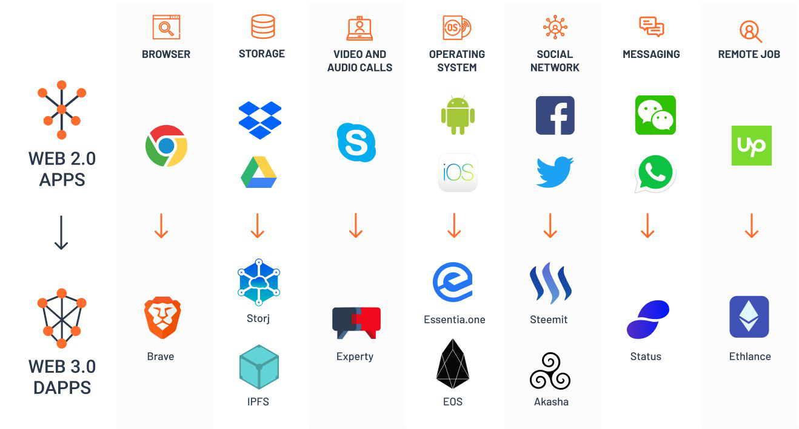

[toc]

## DecentralizedApplication去中心化的应用
什么是去中心化应用（Dapps）？
> 想象一下这个场景：你的计算机利用闲置的容量为全球各地的人和企业提供服务，你的汽车在不停地行驶，在你办公时运送乘客，你上网浏览还能拿到报酬。

下面是当前DAPP的布局

### 浏览器
#### Brave 新锐浏览器
+BAT/USDT
基于区块链的去中心化、透明的数字广告平台。
使用BAT可以支付内容商的内容费 和 用户的注意力，同时让广告商得到很理想的投资回报；

### 存储
#### Storj
+STORJ/USDT
是一个基于区块链的端对端加密的分布式云存储平台，用户通过私钥来管理数据；
相比传统的云存储更快、便宜、可靠；
同类产品还有Sia；

#### Sia
SC/USDT

#### IPFS
+FIL/USDT
星际文件系统：一种点对点的分布式文件系统，旨在连接所有具有相同文件系统的计算机设备；

### 视频、音频知识解答
#### Experty
EXY/USDT
Experty是一个分散的咨询平台，允许知识专家在他们打电话的时间内安全，即时地支付，而无需第三方中介。
顾问每分钟设定他们的费率，并在他们自己销售的任何地方分享他们的专业知识。寻求建议的人通过该配置文件与他们联系，并通过区块链智能合约自动进行支付。

### 操作系统
#### EOS
+EOS/USDT

#### Essentia.one
Cant find coin.

### 社交
#### STEEM/USDT
一去中心化的社交媒体平台。用户可以通过发文或者为平台上的热门内容反对票获得奖励。

#### Akasha
Cant find coin.

### 即时通信
#### Status
+SNT/USDT
开源通讯平台，可以理解为微信。

### 就业市场
#### Ethlance
是districtox (DNT/USDT)旗下的一个应用；

+DNT/USDT
是一个去中心化的自治的集市和社区（district）网络，所有网民都可以免费创建districts。
Ethlance是district0x上的第1个集市，提供zhao聘和找Gong作的服务。

## 待续
