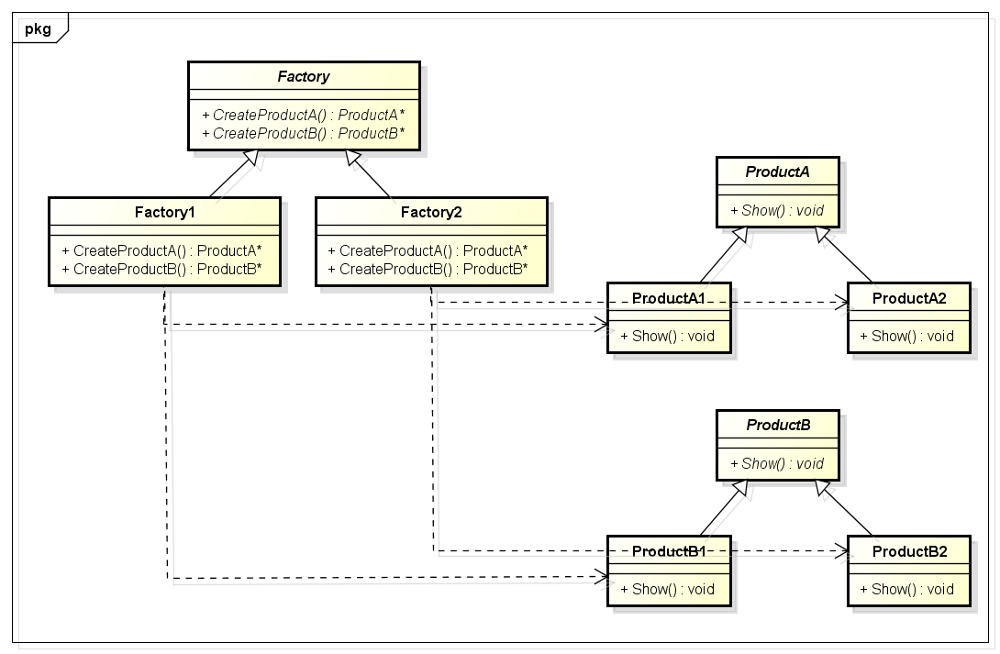
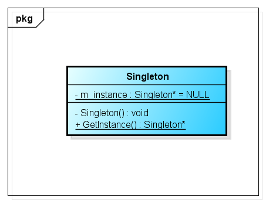
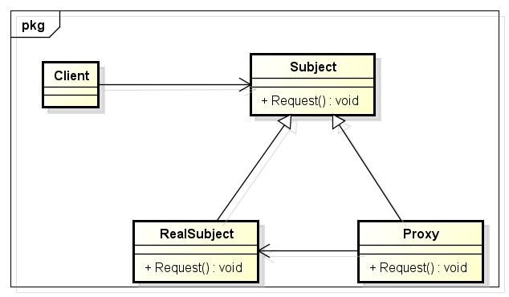

[TOC]

## ReadMe

使用设计模式是为了可重用代码、让代码更容易被他人理解、保证代码可靠性。
最主要解决的问题是通过封装和隔离变化点来处理软件的各种变化问题。

创建型设计模式：如何创建实例。  
结构型设计模式：如何组合类和对象以获得更大的结构。  
行为型设计模式：对象之间如何通信。 

|范围 | 创建型 | 结构型 | 行为型|
|----|------|------|-----|
|对象创建 |Singleton（单例）|
| |Prototype（原型）
| |Factory Method（工厂方法）
| |Abstract Factory（抽象工厂）
| |Builder（建造者）
||||
|接口适配 ||Adapter（适配器）
| ||Bridge（桥接）
| ||Façade（外观）
||||
|对象去耦 |||Mediator（中介者）
| |||Observer（观察者）
||||
|抽象集合 ||Composite（组合）|Iterator（迭代器）
||||
|行为扩展 ||Decorator（装饰）|Visitor（访问者） 
| |||Chain of Responsibility（职责链）
||||
|算法封装 |||Template Method（模板方法）
| |||Strategy（策略）
| |||Command
||||
|性能与对象访问 ||Flyweight（享元）
| ||Proxy（代理）
||||
|对象状态 |||Memento（备忘录）
| |||State（状态）
||||
|其它 |||Interpreter（解释器）

其中又可以按类、对象来分：如下  

## 各种Pattern

refer http://www.jianshu.com/p/ecabec602791

- 对象创建
	- [单例](#单例模式)
	- [原型](#原型模式)
	- [简单工厂](#简单工厂模式)
	- [工厂方法](#工厂方法模式)
	- [抽象工厂](#抽象工厂模式)
	- [建造者](#建造者模式)
- 接口适配
	- [适配器](#适配器模式)
	- [桥接](#桥接模式)
	- [外观](#外观模式)
- 对象去耦
	- [中介者](#中介者模式)
	- [观察者](#观察者模式)
- 抽象集合
	- [组合](#组合模式)
	- [迭代器](#迭代器模式)
- 行为扩展
	- [装饰](#装饰模式)
	- [访问者](#访问者模式)
	- [职责链](#职责链模式)
- 算法封装
	- [模板方法](#模板方法模式)
	- [策略](#策略模式)
- 性能与对象访问
	- [享元](#享元模式)
	- [代理](#代理模式)
- 对象状态
	- [备忘录](#备忘录模式)
	- [状态](#状态模式)
- 其它
	- [解释器](#解释器模式)

### 简单工厂模式

> 产品越来越多，对应的new也就越来越多，越来越管理，且每个new都有异常机制，帮需要一个集中管理的地方，引入简单工厂。

**概要：提供一个创建对象实例的功能，而无须关心其具体实现。**
> 被创建实例的类型可以是接口、抽象类、也可以是具体的类。

问题：当简单工厂增加一种产品时？
> 势必对简单工厂进行修改。
>> 由于对已经存在的函数进行了修改，那么以前进行过的测试，都将是无效的，所有的测试，都将需要重新进行，所有的代码都需要进行重新覆盖。 --引入工厂方法

### 工厂方法模式

> 对“工厂”进行一次抽象，让一个工厂实例类专心的生产一种产品。

**概要：定义一个用于创建对象的接口，让子类决定实例化哪一个类，Factory method使一个类的实例化延迟到其子类。**

问题：当后期产品越来越多，建立的工厂也会越来越多，工厂又跟New一样变得凌乱而难于管理。
> 引入抽象工厂，让一个工厂可以创建一系列相关的产品。

### 抽象工厂模式

> 抽象工厂中一个工厂实例类能创建一系列相关的对象，而非一个单一的产品。所以它好比是工厂方法的叠加。

**概要：提供一个创建一系列相关或相互依赖对象的接口，而无需指定它们具体的类。**

### 单例模式

**概要：保证一个类只有一个实例，并提供一个访问它的全局访问点。**
> 它的出现是用来替换全局变量的吗？

### 建造者模式

**概要：将一个复杂对象的构建与它的表示分离，使得同样的构建过程可以创建不同的表示。**
> 与抽象工厂模式不同的是，建造者模式是在Director的控制下一步一步的构造出来的，在建造的过程中，建造者模式可以进行更精细的控制。

### 原型模式

**概要：用原型实例指定创建对象的种类，并且通过拷贝这些原型创建新的对象。**

### 适配器模式

**概要：将一个类的接口转换成客户希望的另外一个接口。**

### 桥接模式

**概要：将抽象部分和它的实现部分分离，使它们都可以独立的变化。**

### 组合模式

**概要：将对象组合成树形结构以表示“部分-整体”的层次结构。**
> 组合（Composite）模式使得用户对单个对象和组合对象的使用具有一致性。

### 装饰模式

**概要：动态地给一个对象添加一些额外的职责。**
> 就增加功能来说，Decorator模式相比生成子类更为灵活。

### 外观模式

**概要：将子系统中的一组接口提供一个一致的界面，外观模式定义了一个高层接口，这个接口使得这一子系统更加容易使用。**

### 享元模式

**概要：运用共享技术有效地支持大量细粒度的对象。**

### 代理模式

**概要：为其他对象提供一种代理以控制对这个对象的访问。**

### 职责链模式

**概要：使多个对象都有机会处理请求，从而避免请求的发送者和接收者之间的耦合关系。**
> 将这些对象连成一条链，直到有一个对象处理它为止。

### 命令模式

**概要：将一个请求封装为一个对象，从而使你可用不同的请求对客户进行参数化；对请求排队或记录请求日志，以及支持可撤销的操作。**

### 解释器模式

### 迭代器模式

**概要：提供一种方法顺序访问一个聚合对象中各个元素，而又不需要暴露该对象的内部表示。**

### 中介者模式

**概要：用一个中介对象来封装一系列的对象交互。**
> 中介者使各对象不需要显式地相互引用，从而使其耦合松散，而且可以独立地改变它们之间的交互。

### 备忘录模式

**概要：在不破坏封装性的前提下，捕获一个对象的内部状态，并在该对象之外保存这个状态。这样以后就可将该对象恢复到原先保存的状态。**

### 观察者模式

**概要：对象间的一种一对多的依赖关系，当一个对象的状态发生改变时，所有依赖于它的对象都得到通知并被自动更新。**

### 状态模式

**概要：允许一个对象在其内部状态改变时改变它的行为。**

### 策略模式

**概要：定义一系列的算法，把它们一个个封装起来，并且使它们可相互替换。**
> 该模式使得算法可独立于使用它的客户而变化。

### 访问者模式

**概要：表示一个作用于某对象结构中的各元素的操作。它使你可以在不改变各元素的类的前提下定义作用于这些元素的新操作。**
> 访问者模式把数据结构和作用于结构上的操作之间的耦合解脱开，使得操作集合可以相对自由地演化。该模式的目的是要把处理从数据结构分离出来。

### 模板方法模式

**概要：定义一个操作中的算法骨架，而将一些步骤延迟到子类中。**
> TemplateMethod使得子类可以不改变一个算法的接口即可重定义改算法的某些特定步骤。

## UML
类之间的关系图，包含如下：
具体内容，如下：

- [实现](#实现)、[继承](#继承)
- [依赖](#依赖)
- [关联](#关联)（单向、双向） 
	- [聚合](#聚合)，属于关联的特例；
	- [组合](#组合)，属于关联的特例；

**如何分析依赖、关联、聚合、组合？**

- 参数关系（依赖）  
- 变量关系（关联） 
	- 同级
		- 单向关联
		- 双向关联
	- 整体部分  
		- 指针（一般为聚合，但要看其生命周期而定，因为有可能指针的内容是在构造函数里面建立的）  
		- 对象（一般都是组合，因为生命周期一样）

> 依赖 vs 关联
>> use a的关系：依赖  
>> has a的关系：关联

> 聚合 vs 组合
>> has-a的关系 聚合   
>> contains-a的关系 组合  

### 实现

### 继承
表现为继承或实现关系(is a)
> is a的关系

### 依赖
表现为函数中的参数(use a)
> 一个类的变化将影响另外一个类。

表现在代码层面，被依赖类B作为参数被类A在某个method方法中使用
> （1）类B以参数的形式传入类A的方法。  
> （2）类B以局部变量的形式存在于类A的方法中。  
> （3）类A调用类B的静态方法。  

### 关联
表现为变量(has a )
> 类与类之间的联接，它使一个类知道另一个类的属性和方法。  
>> 箭头（箭头同依赖中的）指向被关联内，箭头一般用来指示单向关联。

表现在代码层面
> 为被关联类B以类属性的形式出现在关联类A中；   
> 也可能是关联类A引用了一个类型为被关联类B的全局变量；

### 聚合
是关联关系的一种，是强关联。  
> 普通关联关系的两个类处于同一层次上，而聚合关系的两个类处于不同的层次，一个是整体，一个是部分（体现整体与部分间的关系）。同时，是一种弱的“拥有”关系。

表现在代码层面，和关联关系是一致的，只能从语义级别来区分；

### 组合
是关联关系的一种，是比聚合关系强的关联关系。
> 他同样体现整体与部分间的关系，但此时整体与部分是不可分的（强拥有），整体的生命周期结束也就意味着部分的生命周期结束；  

表现在代码层面，和关联关系是一致的，只能从语义级别来区分；

参考：http://blog.chinaunix.net/uid-26111972-id-3326225.html
