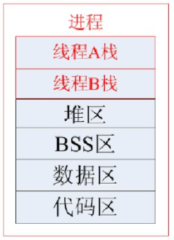

## ReadMe

## API

```cpp
int pthread_create(pthread_t *thread, const pthread_attr_t *attr, void *(*start_routine) (void *), void *arg);
```

## 线程属性
线程有如下属性
[scope](#scope)
[detach](#detach)
[cancel](#cancel)
[堆栈](#堆栈)
[优先级](#优先级)
[亲和性](#亲和性)
[TSD](#TSD)

```cpp
int pthread_attr_init(pthread_attr_t *attr);
int pthread_attr_destroy(pthread_attr_t *attr);
```

### scope
决定了此线程是否是与系统内所有线程、进程内所有线程竞争CPU。<font color=red>Linux仅支持与系统内所有线程竞争</font>。
```cpp
int pthread_attr_setscope(pthread_attr_t *attr, int scope);
	//PTHREAD_SCOPE_SYSTEM 系统中所有线程一起竞争CPU时间；
	//PTHREAD_SCOPE_PROCESS 与同进程中的线程竞争CPU；
int pthread_attr_getscope(pthread_attr_t *attr, int *scope);
```

### detach
决定线程以什么方式终止自己。<font color=red>默认非分离</font>。
```cpp
int pthread_attr_setdetachstate(pthread_attr_t *attr, int detachstate);
	//PTHREAD_CREATE_DETACHED 分离
	//PTHREAD_CREATE_JOINABLE 非分离
int pthread_attr_getdetachstate(pthread_attr_t *attr, int *detachstate);

int pthread_detach(pthread_t thread);
int pthread_join(pthread_t thread, void **retval);
```
注意：

- 分离状态的线程如果运行很快并于pthread\_create之前结束线程，那么pthread\_create返回的pthread\_id将是错误的，因为有关此线程的资源已经被系统回收了；
- 非分离下当线程终止时并没有真正的释放其所占用的资源需要用pthread\_join()回收。


进程空间如下：
|--线程A栈--|--线程B栈--|--线程C栈--|--堆区--|--BSS区--|--数据区--|--代码区--|



### cancel
给目标线程发送取消请求，让目标线程退出；<font color=red>实质上是发个信号，但不能保证目标线程的结果（是否退出）；</font>
目标线程的结果依赖：目标线程的取消状态，取消类型；
> 状态：可取消、不可取消；
> 类型：立即、延迟；

取消线程
```cpp
int pthread_cancel(pthread_t thread);
```

设置是否可被取消
```cpp
int pthread_setcancelstate(int state, int *oldstate);
	//PTHREAD_CANCEL_ENABLE 此线程可被取消；（默认状态）
	//PTHREAD_CANCEL_DISABLE 此线程不可被取消；
		//收到的取消信号会排队直到变成cancel\_enable状态
```

设置取消的类型
```cpp
int pthread_setcanceltype(int type, int *oldtype);
```
- type=PTHREAD\_CANCEL\_ASYNCHRONOUS
	- 能立马使线程退出，不依赖取消点之类的；但是系统不能保证做到这一点；
- type=PTHREAD\_CANCEL\_DEFERRED
	- 取消动作延后到取消点执行；（man 7 pthreads 可以看内置取消点）
	- 在取消点，会检测线程是否有取消信号，如果有则执行取消动作；
	- 取消动作是：
		- 调用clean-up函数；pthread\_cleanup\_push(3)
		- Thread-specific data destructors；pthread\_key\_create(3)
		- thread is terminated；pthread\_exit(3)
	- 默认类型；

取消点难道不能人工设置吗[rwhy]？？ 
> 貌似只能用pthead\_testcancel，但这是测试用的呀。。。

会创建一个取消点；
多用于测试或者在没有取消点的代码段中增加取消点；
```cpp
void pthread_testcancel(void);
```

### 堆栈
栈大小；默认1MB
```cpp
int pthread_attr_setstacksize(pthread_attr_t *attr, size_t stacksize);
int pthread_attr_getstacksize(pthread_attr_t *attr, size_t *stacksize);
```

### 优先级
默认同于父进程。
```
//调度策略
int pthread_attr_setschedpolicy(pthread_attr_t *attr, int policy);
int pthread_attr_getschedpolicy(pthread_attr_t *attr, int *policy);

//调度参数，包含优先级（每个系统可设值不一样，故先取出最大值、最小值，再去设置大小，Linux为1-99）
int pthread_attr_setschedparam(pthread_attr_t *attr, const struct sched_param *param);
int pthread_attr_getschedparam(pthread_attr_t *attr, struct sched_param *param);
```

获取policy类型对应的最高、低优先级；
```cpp
int sched_get_priority_max(int policy=SCHED_OTHER|SCHED_FIFO|SCHED_RR); 
int sched_get_priority_min(int policy);

#ifdef HAVE_SCHED_GET_PRIORITY_MIN
    int min_priority = sched_get_priority_min(pthread_policy);
#endif
#ifdef HAVE_SCHED_GET_PRIORITY_MAX
    int max_priority = sched_get_priority_max(pthread_policy);
#endif
```

### 亲和性
就是线程核绑定，让哪个线程优先在哪个核运行；（在网络程序开发中特别有用，如绑定数据面、控制面的线程）

### TSD
Thread-Specific Data实质上就是如何在线程中安全的使用静态变量；
以前在线程中使用静态变量，要担心线程安全；所以才会产生thread-specific data；
可以把它理解为一个指针数组, 但对于每个线程来说是唯一的；

其api如下
```cpp
int pthread_key_create(pthread_key_t *key, void (*destr_function) (void *));
int pthread_key_delete(pthread_key_t key);

int pthread_setspecific(pthread_key_t key, const void *pointer);
void * pthread_getspecific(pthread_key_t key);
```


## 清理函数
Cleanup Handlers是一些函数, 它们会被pthread_exit按顺序调用. 它们以栈风格被管理.
这种机制的目的是希望在退出前释放掉一些占用的资源.

其api如下
```cpp
void pthread_cleanup_push(void (*routine)(void *), void *arg);
void pthread_cleanup_pop(int execute);
```

## 线程与信号
- 所有线程共享一组，信号处理函数；
	- 进程触发了信号函数，但由哪个线程处理是未知的。 --rwhy
- 类似于进程的信号阻塞集sigprocmask()；每个线程有自己的信号阻塞集合，pthread\_sigmask()。
- 每个线程可向其它线程发送信号；如pthread\_kill()

```cpp
//针对how的指示把set操作到oldset；
int pthread_sigmask(int how, const sigset_t *set, sigset_t *oldset);

//向thread发送sig信号；
int pthread_kill(pthread_t thread, int sig);

int sigwait(const sigset_t *set, int *sig);
```


## 线程调度策略
线程调度策略（linux内核进程调度法）
> http://www.slac.stanford.edu/grp/eg/minos/external/installation/doc/google-perftools-0.1/cpu_profiler.html
> http://blog.csdn.net/maray/article/details/2900689

### linux内核的三种调度方法：
多任务OS分为抢占式多任务、非抢占式多任务；
> 抢占式：在进程执行期间，如果有优先级更高的进程就绪，那么当前执行进程会被抢占；
> 非抢占式：在进程执行期间，不会被抢占，除非是自己原因让出，或者其它OS原因；

linux采用的是抢占式多任务，具体为OS中的调度器；
> 调度器决定了什么时候停止一个进程以便让其他进程有机会运行，同时挑选出一个其他的进程开始运行。

linux中调度策略如下：
/usr/include/x86\_64-linux-gnu/bits/sched.h
```cpp
 29 /* Scheduling algorithms.  */
 30 #define SCHED_OTHER     0
 31 #define SCHED_FIFO      1
 32 #define SCHED_RR        2
 33 #ifdef __USE_GNU
 34 	# define SCHED_BATCH        3
 35 	# define SCHED_IDLE     5
 36    
 37 	# define SCHED_RESET_ON_FORK    0x40000000
 38 #endif
```
0: 针对的是普通进程（非实时进程）。
1：针对实时进程的先进先出调度。（适合对时间性要求比较高但每次运行时间比较短的进程）
2：针对的实时进程的时间片轮转调度。（适合每次运行时间比较长得进程）
3：针对批处理进程的调度。（适合那些非交互性且对cpu使用密集的进程）

#### SCHED\_OTHER
分时调度策略；
不支持优先级；

- 执行过程
	1. 创建任务指定采用分时调度策略，并指定优先级nice值(-20~19)。
	2. 将根据每个任务的nice值确定在cpu上的执行时间(counter)。
	3. 如果没有等待资源，则将该任务加入到就绪队列中。
	4. 调度程序遍历就绪队列中的任务，通过对每个任务动态优先级的计算(counter+20-nice)结果，选择计算结果最大的一个去运行，当这个时间片用完后(counter减至0)或者主动放弃cpu时，该任务将被放在就绪队列末尾(时间片用完)或等待队列(因等待资源而放弃cpu)中。
	5. 此时调度程序重复上面计算过程，转到第4步。
	6. 当调度程序发现所有就绪任务计算所得的权值都为不大于0时，重复第2步。


#### SCHED\_FIFO
实时调度策略之先到先服务；
支持优先级，1-99越高越优先；

- 执行过程
	1. 创建进程时指定采用FIFO，并设置实时优先级rt_priority(1-99)。
	2. 如果没有等待资源，则将该任务加入到就绪队列中。
	3. 调度程序遍历就绪队列，根据实时优先级计算调度权值,选择权值最高的任务使用cpu，该FIFO任务将一直占有cpu直到有优先级更高的任务就绪(即使优先级相同也不行)或者主动放弃(等待资源)。
	4. 调度程序发现有优先级更高的任务到达(高优先级任务可能被中断或定时器任务唤醒，再或被当前运行的任务唤醒，等等)，则调度程序立即在当前任务堆栈中保存当前cpu寄存器的所有数据，重新从高优先级任务的堆栈中加载寄存器数据到cpu，此时高优先级的任务开始运行。重复第3步。
	5. 如果当前任务因等待资源而主动放弃cpu使用权，则该任务将从就绪队列中删除，加入等待队列，此时重复第3步。

#### SCHED\_RR
实时调度策略之时间片轮转；
RR来自Round-Robin简称；
支持优先级，1-99越高越优先；

- 执行过程
	1. 创建任务时指定调度参数为RR，并设置任务的实时优先级和nice值(nice值将会转换为该任务的时间片的长度)。
	2. 如果没有等待资源，则将该任务加入到就绪队列中。
	3. 调度程序遍历就绪队列，根据实时优先级计算调度权值,选择权值最高的任务使用cpu。
	4. 如果就绪队列中的RR任务时间片为0，则会根据nice值设置该任务的时间片，同时将该任务放入就绪队列的末尾。重复步骤3。
	5. 当前任务由于等待资源而主动退出cpu，则其加入等待队列中。重复步骤3。


#### SCHED小结
linux 支持两种类型的进程调度，实时进程和普通进程。

- 实时进程按SCHED\_FIFO和SCHED\_RR调度策略；
	- 实时进程将得到优先调用，实时进程根据实时优先级决定调度权值;（当实时进程准备就绪后，如果当前cpu正在运行非实时进程，则实时进程立即抢占非实时进程。）
	- 采用实时优先级做为调度的权值标准。
- 普通进程按SCHED\_NORMAL策略；
	- 分时进程则通过nice和counter值决定权值；
	- nice越小，counter越大，被调度的概率越大，也就是曾经使用了cpu最少的进程将会得到优先调度。[rwhy]哪来的nice？？？


RR是FIFO的一个延伸
> FIFO时，如果两个进程的优先级一样，则这两个优先级一样的进程具体执行哪一个是由其在队列中的未知决定的，这样导致一些不公正性(优先级是一样的，为什么要让你一直运行?)。
> 如果将两个优先级一样的任务的调度策略都设为RR,则保证了这两个任务可以循环执行，保证了公平。


## Thread Sync
线程间同步技术大概有如下几种：
APUE书中第一种：[互斥量](#互斥量)
APUE书中第二种：[读写锁](#读写锁)
APUE书中第三种：[条件变量](#条件变量)
[信号量](#信号量)
[自旋锁](#自旋锁)
[小结](#ThreadSync小结)

### 互斥量
互斥量亦称为互斥锁
其api如下
```cpp
PTHREAD_MUTEX_INITIALIZER //静态初始化 
int pthread_mutex_init()
int pthread_mutex_destroy()

int pthread_mutex_lock()
int pthread_mutex_trylock()
int pthread_mutex_unlock()	

pthread_mutexattr_init() //锁的初始化
pthread_mutexattr_setpshared() //锁的范围：进程内线程；多进程；
pthread_mutexattr_settype()	 //锁的类型
```

锁的类型很多，Linux下实现了如下：（其中np结尾的不是posix标准）

| 类型 | 名称 |
|:--|:--|
|fast |PTHREAD_MUTEX_INITIAL
|recursive |PTHREAD_RECURSIVE_MUTEX_INITIALIZER_NP
|error check |PTHREAD_ERRORCHECK_MUTEX_INITIALIZER_NP

- mutex.lock()
	- mutex被其它线程locked
		- fast, 挂起当前线程, 直到被其他线程unlock；
		- resursive, 挂起当前线程, 直到被其他线程unlock；
		- errorCheck, 挂起当前线程, 直到被其他线程unlock；
	- mutex被自己locked
		- fast, 挂起当前线程；（不就是死锁了吗）
		- resursive, 成功并立刻返回当前被锁定的次数；
		- errorCheck, 立刻返回EDEADLK；
- mutex.unlock()
	- mutex被其它线程locked
		- fast, --未定义？
		- resursive, --未定义？
		- errorCheck, 返回EPERM； 
	- mutex被自己locked
		- fast, 唤醒第一个被锁定的线程；
		- resursive, 减少lock数(这个数仅仅是被自己lock的, 不关其它线程的) 当lock数等于零的时候, 才被unlock并唤醒第一个被锁定的线程；
		- errorCheck, 唤醒第一个被锁定的线程；

锁的竞争条件？
> 先到先得吗，还是按优先级先到先得？ --就是先到先得，唤醒第一个被锁定的的；


### 读写锁
其api如下
```cpp
int pthread_rwlock_init ()
int thread_rwlock_destroy()
int pthread_rwlockattr_init()
int pthread_rwlockattr_destroy()
int pthread_rwlock_rdlock()
int pthread_rwlock_tryrdlock()
int pthread_rwlock_timedrdlock ()
int pthread_rwlock_wrlock()
int thread_rwlock_trywrlock()
int pthread_rwlock_timedwrlock ()
int pthread_rwlock_unlock()
```

非常适用于读多，写少的场景；
> 并发性肯定比单纯的mutex高；（因为mutex即使遇到读所有线程都会被串行化）


### 条件变量
需要一个mutex进行配合；为什么？
> 当cond不成立的时候需要把call thread放在等待cond成立的等待列表中；（保证原子）

api如下：
```cpp
int pthread_cond_init()
PTHREAD_COND_INITIALIZER
int pthread_cond_destroy()
int pthread_cond_timedwait()
int pthread_cond_wait(pthread_cond_t *cond, pthread_mutex_t *mutex);
int pthread_cond_signal(pthread_cond_t *cond);
int pthread_cond_broadcast()
```

#### pthread\_cond\_wait
等待cond的成立，如果不成立会陷入睡眠，阻塞等待cond的成立；

pthread\_cond\_wait阻塞时、唤醒时各自有什么操作？
> 当cond不成立时，即阻塞时：
>> 把call thread放到了等待cond的thead list中；
>> 对参数mutex进行unlock()；
>
> 当cond成立时，即唤醒时：
>> 对mutex进行lock()；


#### pthread\_cond\_signal
通知cond的一个等待线程，其所等待的条件成立；
> 他不会做额外的操作，感觉就给竞选出的线程发个信号。

调用时机，请看如下demo
```cpp
//错误的：先通知、再解锁
pthread_mutex_lock();
.. do process ..
pthread_cond_signal();
pthread_mutex_unlock();

//正确的：先解锁、再发通知
pthread_mutex_lock();
.. do process ..
pthread_mutex_unlock();
pthread_cond_signal();
```
A线程在unlock前发通知，那么其所通知的B线程会去lock() mutex；
> 如果此时线程恰好从A切到B，那么A中的mutex未被释放，B又锁不上mutex，所以B再度进入阻塞休眠状态；


### 信号量
[参考](process.md#IPC信号量)
但最好用基于内存实现的信号量，即posix sem；


### 自旋锁
先来看看互斥锁、读写锁阻塞等待经历了什么？
> 1. 调用线程先空转一段时间试图来获取锁；
> 2. 当上述时间跑完之后，仍然未获得锁，那么就会放弃空转并更改线程为waiting状态、线程contex切换、让出cpu进行等待锁；
> 3. 等锁可用之后，线程会被唤醒；
> 
>> 之所以要空转一段时间折衷了：担心马上能获得锁、但没进行尝试而带来的contex切换；又或者一直在尝试、其实是要等很长时间才能获得锁的，那倒不如把cpu时间让出来；

而spin是一种这样的锁：在第一次申请加锁失败的时候，会不断轮询，直到申请加锁成功为止，期间不会进行线程context的切换。（也就是我们平时说的忙等）

为什么pthread中没有这个呢？ --rwhy
> 因为如果互斥、读写锁获取不到锁，那么用spin也没用，因为它们在wait之前也尝试了多次旋转；
> 如果这样，那么就是临界区太长了，或者线程太多了。

```cpp
int pthread_spin_init (__pthread_spinlock_t *__lock, int __pshared);
int pthread_spin_destroy (__pthread_spinlock_t *__lock);
int pthread_spin_trylock (__pthread_spinlock_t *__lock);
int pthread_spin_unlock (__pthread_spinlock_t *__lock);
int pthread_spin_lock (__pthread_spinlock_t *__lock);
```
对自旋锁来说
> 它只需要消耗很少的资源来建立锁；
> 当线程被阻塞时，它就会一直重复检查看锁是否可用了，也就是说当自旋锁处于等待状态时它会一直消耗CPU时间；

对于互斥锁来说，与自旋锁相比
> 它需要消耗大量的系统资源来建立锁；
> 当线程被阻塞时，线程的调度状态被修改，并且线程被加入等待线程队列；最后当锁可用时，在获取锁之前，线程会被从等待队列取出并更改其调度状态；但是在线程被阻塞期间，它不消耗CPU资源。

所以自旋锁和互斥锁适用于不同的场景
> 自旋锁适用于那些仅需要阻塞很短时间、或者实时性较高的场景；
> 互斥锁适用于那些可能会阻塞很长时间的场景；


### ThreadSync小结
线程同步大概可以分成两类
> 保护临界区，解决互斥问题；
>> 互斥锁、读写锁、自旋锁等各种锁；
> 
> 异步通知，解决同步、互斥的问题；
>> 条件变量、信号量；
>> 信号量多用于进程间的同步；条件变量多用于线程间的同步；
>

