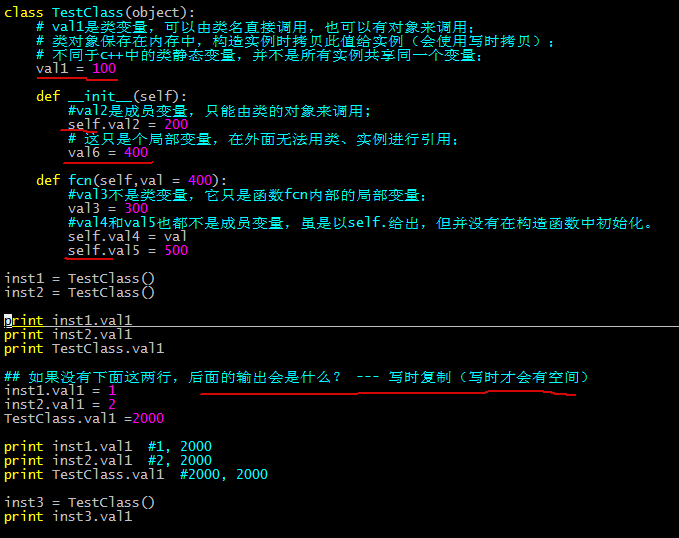

[TOC]

Python是一种解释型、面向对象、动态数据类型的高级程序设计语言。
- 解释型 = 不需要编译、链接之类的，直接可以在python解释器中执行；
- 面向对象 = 同c++一样是面向对象
- 动态数据类型 = 声明变量时不需要声明变量的类型。（是不是只有定义变量这一说了）

动态语言？
> Python是动态语言，类以及根据类创建的实例可以任意绑定属性以及方法。  
>> http://www.cnblogs.com/seirios1993/p/6624157.html

## 安装与使用

### 目录与环境
/usr/share/pyshared/
> 这些库不管是哪个版本的python都能用

/usr/lib/python2.6(2.7/3)
> 这下面的库，只能是特定版本的python能用


sys.path —— 动态地改变Python搜索路径
```python
>>> import sys  
>>> sys.path.append(’引用模块的地址')  
>>> sys.path.insert(0, '引用模块的地址')  

>>> print sys.path
['', '/usr/lib/python2.7', '/usr/lib/python2.7/plat-linux2', '/usr/lib/python2.7/lib-tk', '/usr/lib/python2.7/lib-old', '/usr/lib/python2.7/lib-dynload', '/usr/local/lib/python2.7/dist-packages', '/usr/local/lib/python2.7/dist-packages/docker_registry-1.0.0_dev-py2.7.egg', '/usr/local/lib/python2.7/dist-packages/setuptools-36.0.1-py2.7.egg', '/usr/local/lib/python2.7/dist-packages/pip-8.0.1-py2.7.egg', '/usr/lib/python2.7/dist-packages', '/usr/lib/python2.7/dist-packages/PIL', '/usr/lib/python2.7/dist-packages/gtk-2.0', '/usr/lib/pymodules/python2.7']
>>>
```

问题：dist-packages VS site-packages ？？
> 用工具安装(pip..)的库均会到dist目录，如/usr/local/lib/python2.7/dist-packages；手动安装的库会到site目录下。   
>> dist目录下的库，每个库对应一个同名的dist-info或者egg-info目录。应该分别对应两种对应的打包工具？？      

### 帮助系统
```python
$ python 
$ import xx
$ help(xx) 或者 help(xx.fun)
```


## 包的部署与管理


distutils
> distutils是Python标准库的一部分。提供了打包、包安装的服务。 

setuptools
> distutils的增强版。   
> 引入包依赖管理；可为python包创建egg文件；提供easy_install脚本来安装egg包。   
>> python的egg文件有点像java中的jar文件，是一个工程打包文件，便于安装部署。

pip
> easy_install的增强版。  
> 无需要使用egg文件；安装失败后不会出现只安装一部分的情况；跟踪所有安装的包。  


### pip 

安装pip
> 下载pip的tar.gz 进行python setup.py install --record file.list   
>  setup.py安装的办法，pip跟踪不了，只能依赖file.list来删除。  


~/.pip/pip.conf
> trusted-host = pypi.douban.com  如果是ssl连接的话，就需要验证证书了。  
> index-url = http://pypi.douban.com/simple   源  


pip命令
> pip install package_name  
> pip install package_name==version  
>> 如果安装成功，那么在最后会显示： Successfully installed markdoc 之类的。  

>
> pip install --upgrade package_name==version  

>
> pip uninstall package_name   
>> 不能删除setup.py安装类的库（setup.py类型的只能用record方法）。  

>
> list  列出已安装包.   
> show  显示包详细信息。（包括版本、位置之类的）    
> search  搜索包，类似yum里的search.  


pip的官网源 https://pypi.python.org/pypi
> 上面的库都只链接了最新的版本，如何下载历史版本？   
>> 找到该项目的github地址，然后再在发布版本中去找（打了tag）。  


#### 问题

- 用pip安装软件失败，并显示以下内容？？
> your setuptools is too old (<12)  
> setuptools_scm functionality is degraded  
> 
> 解决：  
> 下载 version > 12的setuptools，并解压    
> python setup.py build  
> python setup.py install  

- urllib3连接https站点时报InsecurePlatformWarning 错误
> 是下载的pip-9.0.1安装包 基于 Python 2 >=2.7.9 or Python 3 >=3.4，但自己的python为2.7.3  
> 要不就换更低版本的pip，要不就更换更高版本的python语言。  


## 变量
- python中的变量与对象  

	> 类型是属于对象的，而不是变量。  
	> 变量和对象是分离的：对象是内存中储存数据的实体，变量则是指向对象的指针。  
	>> 对象分为：可变对象和不可变对象。
	>>> 不可变对象（如果对象值更改那么就会是一个新的对象，老对象将会迎来垃圾回收机制。---id(obj)获取对象的id）：int，float，long，str，tuple  
	>>> 可变对象：list，set，dict  

	- 赋值（默认为引用）、拷贝（默认为浅拷贝）
	
		> b = a 引用，因为此时2个变量的id一致（注意：a是否为可变对象，随着其中任一一个的修改会出现不同的情况）。    
		> c = copy.copy(a) 浅拷贝（指向同一份资源），2个变量的id不一致。       
		> d = copy.deepcopy(a) 深拷贝，2个变量的id不一致。   

	- 函数传参（同于赋值）
		
		> 隐式传递。  
		>> 对于不可变对象作为函数参数，相当于C系语言的值传递；   
		>> 对于可变对象作为函数参数，相当于C系语言的引用传递;   
			

	```python
	def __lstTest(lstA, lstB):
    ''' 
    '''
    la = [1,2,3]
    lb = [3,4,5]
    ## method 1: all of these methods cant chane lstA and why.
    lstA = la
    lstA = copy.copy(la)
    lstA = copy.deepcopy(la)
    lstA = list(set(la).intersection(set(lb))) ##交集
    print lstA                                                                                                                                                           
	
    ## method 2
    for it in lb: 
        lstB.append(it)
        
	def lstTest():
	    ''' 
	    '''
	    a = []
	    b = []
	    __lstTest(a, b)
	    print a, b
	        
	lstTest()
	```


### 整数
### 字符串


- 集成的方法如下：  
	- str.upper()转大写  
	- str.lower()转小写  

- 转义（特殊声明）
	- "\\\\"   
		- r"\\" 保持原样

	
- str分割
	- splitLst = str.split("splitStr", num=1)
		- num=1为分割的次数；


- str合并
	- +号
	- Python join() 方法用于将序列中的元素以指定的字符连接生成一个新的字符串 
		
		```python
		str = '-';
		lst = [a, b, c];
		print str.join(lst)
		```
	
	- 格式化%   
	
		```python
		# 法一用元组：
		strFormat = "I'm format string with %-10s %d %.2f" % (format1, format2, format3)  
		
		# 法二用字典：
		print("I'm %(name)s. I'm %(age)d year old" % {'name':'Vamei', 'age':99})
		```

- str查找 
	- str.find(str1)  
		return str1's pos, otherwise -1.
	
	- str.index(str1)   
		return str1's pos, otherwise raise exception.

- str截取
	- str[1:3]
	- str[1:]
	- str[-1]


### 列表list []

复制是个坑哦
> L1 = L      #L1为L的别名，用C来说就是指针地址相同，对L1操作即对L操作。函数参数就是这样传递的。   
> L1 = L[:]   #L1为L的克隆，即另一个拷贝。 


|函数名|说明|
|----|----|
|cmp(lst1, lst2)
|len()
|Max/min(lst)
|List(tuple)| tuple to list
|range(from, to, 步阶) |产生一个递增的list


|方法名|说明|
|----|----|
|Append(obj)| vs extend(seq)
|Count(obj)|
|Index(obj)|
|Insert(index, obj)|
|Remove(obj)| vs pop(obj=lst[-1])
|Sort([func])| vs reverse()


- 注意：lst.index()方法会抛出异常，建议用count()。


### 元组tuple ()
同于列表，唯有元素不可改。 

只有一个值时，需要注意后缀的逗号
```python
t2 = (3)
print t2  #3
t3 = (3,)
print t3  #(3,)
```

|函数名|说明|
|----|----|
|Cmp(tuple1, tuple2)/len()	
|Max/min(t)	
|Tuple(list)	|Seq to tuple


### 字典 {}

复制是个坑哦
> dict1 = dict        #别名  
> dict2=dict.copy()   #克隆，即另一个拷贝。但这也只是个浅拷贝。  


|函数名|说明|
|----|----|
|cmp
|len
|Str()
|Type()


|方法名|说明|
|----|----|
|keys()/values()/items() |Items()返回(key,value)元组的list
|copy() |浅拷贝（我的理解是指拷贝了指针的值，但没拷贝指针所指向的资源，亦即两个对象共享某一资源）怎么理解？因为pyton没有指针，所以哪来的浅拷贝？？？
|has_key(key) |返回True/False
|get(key, default=None)
|setdefault(key, default=None)	
|update(dict2)	
|fromkeys(seq[, val]))	
|clear()	


### 时间、日期


## 面向对象

类中要经常用self == cpp中的this指针
- 类函数的声明；
- 类函数的调用；

没有用public，private等关键词来标志；
> __ 前缀为私有标志
> self.__A() 可以调用 self.__B吗？    ---可以的


### 构造函数
子类的构造函数定要手动调用基类的构造函数，否则默认是不会调用基类构造的。
```python
class Base(object):
    def __init__(self):
        print "Base created"
 
class ChildA(Base):
    def __init__(self):
		#老式类的写法；
        Base.__init__(self)
 
class ChildB(Base):
    def __init__(self):
		#新式类的写法，避免了写基类的名字（在多继承下应该很管用）
        super(ChildB, self).__init__()
print ChildA(),ChildB()
```

问题：新式类有什么特点？？
> type（对象）的时候是类名，而非是一个实例。  
> 调用基类的函数可以用super关键字。


### 类变量、类成员变量
如下：  



### 继承

语法参照2.1节；


## 多线程
thread 有些缺陷，threading是对thread的补充
```python
t1 = threading.Thread(target=fun1, args=('1111111111',))  #args元组中有个逗号
t1.start()
```


## 注意点
- for
	- 只有for.. in..， 没有for(;;)这种步阶

- 空对象  
None和任何其他的数据类型比较永远返回False  
可以将None复制给任何变量，但是你不能创建其他NoneType对象。
```python
>>> type(None)
<class 'NoneType'>
>>> None == 0
False
>>> None == ' '
False
>>> None == None
True
>>> None == False
False
```
	- if x:  这是True/False判断  
	None,  False, 空字符串"", 0, 空列表[], 空字典{}, 空元组()都相当于False
	- if x is not None: 这是单独判断x不是None

- 没有自增、自减 i++ i--


## 常用
- sleep
> time.sleep(1)  
> time.sleep(0.1)

- 时间截
> Print time.ctime()

- 类型转换
> str -> int   int(str)  
> int -> str   str(int)  
> str -> list  json.loads(str)   

- 随机数
> random.randint(1,10)
