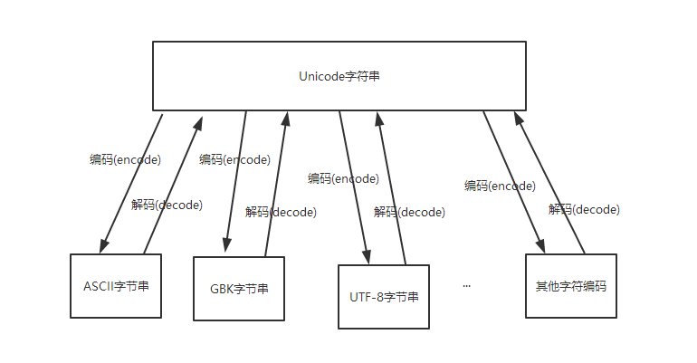

[TOC]


## ReadMe

重点、难点；


## 乱码

Python2的 默认编码是ASCII，不能识别中文字符，需要显式指定字符编码；  
Python3的 默认编码 为Unicode，可以识别中文字符。

```python
name = u'\u6027\u80fd...'  #这种格式的一般为unicode格式的
name = '\xe6\x96\xb0...'   #这种格式一般为utf8（python中utf8/utf-8一样）格式的
name = '&#92;&#117;&#56;&#48;'  #这种格式一般为ascii；
```

### 编码探测
可用以下两种方法进行探测
```python 
# coding=utf-8
s_str = "天天向上"
s_uni = u"天天向上"

#法一
if isinstance(s_str, str):
    print type(s_str).__name__
if isinstance(s_uni, unicode):
    print type(s_uni).__name__
 
#法二
import chardet
print chardet.detect(s_str)
print chardet.detect(s_uni)  #这是错误的，参数只能为str类型； chardet.detect(s_uni.encode('utf-8'))
```

### 转换
UNICDOE才是真正的字符串，而用ASCII、UTF-8、GBK等字符编码表示的是字节串。  
字符编码的作用就是将人类可识别的字符转换为机器可识别的字节码，以及反向过程。



#### python2
python2.x字符串格式有

- str

	默认格式（字符编码为ASCII）

	print str 如果str中包含中文那么这个操作的错误的；
	
	```python
	import sys
	reload(sys)
	sys.setdefaultencoding('utf8')
	```

- unicode

  字节串.decode('原来的字符编码')  ==>   <font color=red>Unicode字符串</font>.encode('新的字符编码')   ==>  新的字节串

  python2.7中任何 type(字节串) 为str
  
  ```python
  #!/usr/bin/env python
  # -*- coding:utf-8 -*-
  utf_8_a = '我爱中国'
  gbk_a = utf_8_a.decode('utf-8').encode('gbk')
  print(gbk_a.decode('gbk'))
  ```

- <font color=red>问题</font>：如何通过python2.7的thrift客户端接口调用另外一个C++编写的thrift服务端的接口，且服务端内部只能处理utf8格式的数据？？
	
	> 保证python客户端调用thrift接口时，接口中的参数里面的字符串字段为utf8编码；
	>> 1. 在给参数中字符串字段赋值时，首先查看当前将要赋值的数据类型是否为unicode，如果不是那么先decode到unicode状态；
	>> 2. 其次对unicode字符串进行utf8编码.encode('utf8')，然后赋值给参数结构中的字符串字段；


- <font color=red>问题</font>：python中如何返回utf8格式的json串给其它模块？？
	
	> json.dumps(python-obj, ensure_ascii=False).encode('utf8')
	>> 默认为True，所有的非ascii字符在输出时都会被转义为\uxxxx的序列，返回的对象是一个只由ascii字符组成的str类型；<br>
	>> 为False时不会进行转义输出，反回的对象是个unicode。（这个参数对包含中文的json输出时非常有用）
	
	```python
	def getStr():                                           
    	dic = {"name" : "胡立中", "age" : "das29"}
    	return json.dumps(dic, ensure_ascii=False).encode('utf8')  #'ascii' codec can't decode byte 0xe8 in position 26: ordinal not in range(128)
    	return json.dumps(dic, ensure_ascii=True).encode('utf8')  ##ok
	```

#### python3
Python3中定义的字符串默认就是unicode，因此不需要先解码，可以直接编码成新的字符编码：  
字符串-->encode('新的字符编码')-->字节串

```python
#!/usr/bin/env python
# -*- coding:utf-8 -*-
utf_8_a = '我爱中国'
gbk_a = utf_8_a.encode('gbk')
print(gbk_a.decode('gbk'))
```


## Other

TODO https://blog.csdn.net/Jerry_1126/article/details/44023949


深拷贝 VS 浅拷贝 

```python
import copy
b = copy.copy(a)      #浅拷贝是将对象的引用复制给另一个对象，更改b会影响a。
b = copy.deepcopy(a)  #深拷贝是将对象本身复制给另一个对象。
```


-----

python中的三元表达式

```python
[on true] if [expression] else [on false]
	#如果 [expression] 为真, 则 [on true] 部分被执行。如果表示为假则 [on false] 部分被执行
```


---

python中如何实现多线程

线程是轻量级的进程，多线程允许一次执行多个线程。众所周知，Python 是一种多线程语言，它有一个多线程包。

GIL（全局解释器锁）确保一次执行单个线程。一个线程保存 GIL 并在将其传递给下一个线程之前执行一些操作，这就产生了并行执行的错觉。但实际上，只是线程轮流在 CPU 上。当然，所有传递都会增加执行的开销。

```python

```


---

help() 返回帮助文档和参数说明。

dir()  返回对象中的所有成员 (任何类型)。


### About Thread

什么是GIL(Global Interpreter Lock)全局解释器锁? 简单地说就是:
每一个interpreter进程,只能同时仅有一个线程来执行, 获得相关的锁, 存取相关的资源.
那么很容易就会发现,如果一个interpreter进程只能有一个线程来执行, 
多线程的并发则成为不可能, 即使这几个线程之间不存在资源的竞争.
从理论上讲,我们要尽可能地使程序更加并行, 能够充分利用多核的功能.


### About Function

函数变参

```python
*args, **kwargs

def fun(*arg):  #不知道将多少个参数传递给函数。
    for i in args:
        print i;
fun(1, 2, 3)

def fun(**kwargs):  #不知道将会传入多少关键字参数。
    for i in kargs:
        print i, kwargs[i]
fun(a=1, b=2, c=3)        
```


### About Memory


**当退出 Python 时是否释放所有内存分配？**

答案是否定的。那些具有对象循环引用或者全局命名空间引用的变量，在 Python 退出是往往不会被释放

另外不会释放 C 库保留的部分内容。


**如何在 Python 中管理内存?**

Python 用一个私有堆内存空间来放置所有对象和数据结构，我们无法访问它。由解释器来管理它。不过使用一些核心 API，我们可以访问一些 Python 内存管理工具控制内存分配。


