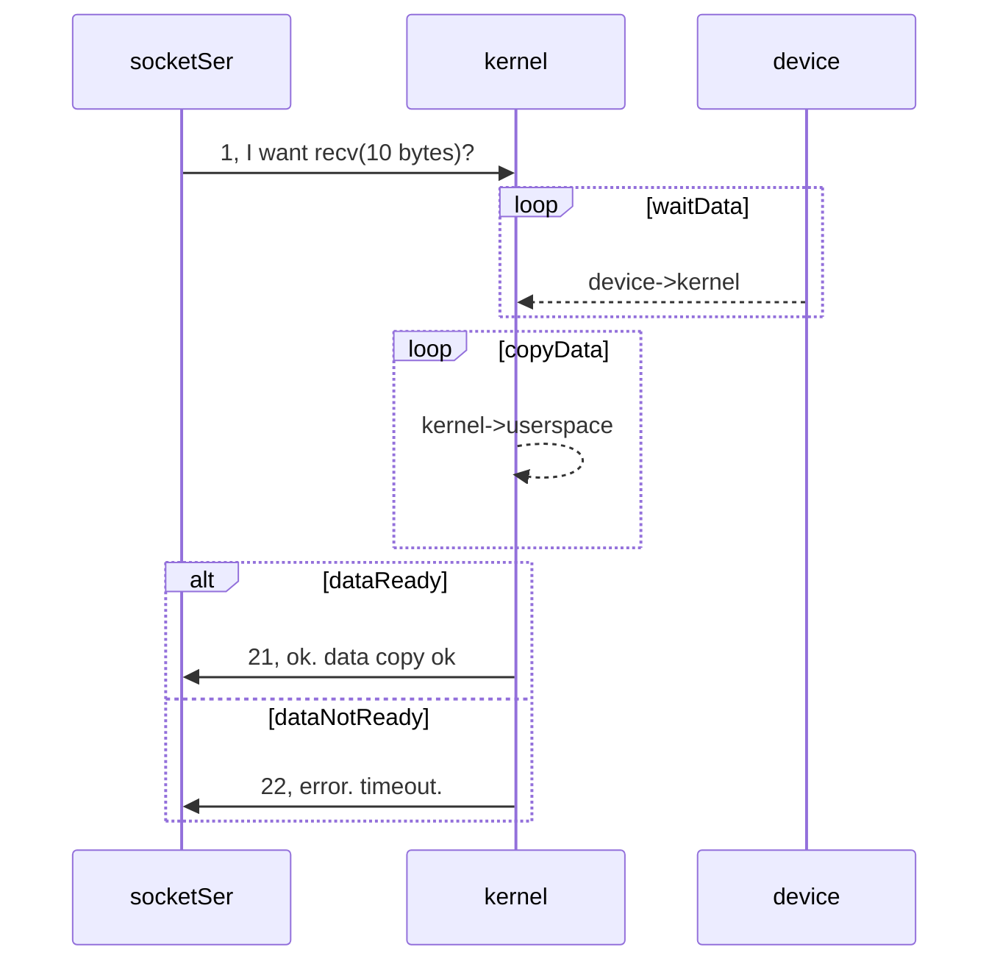
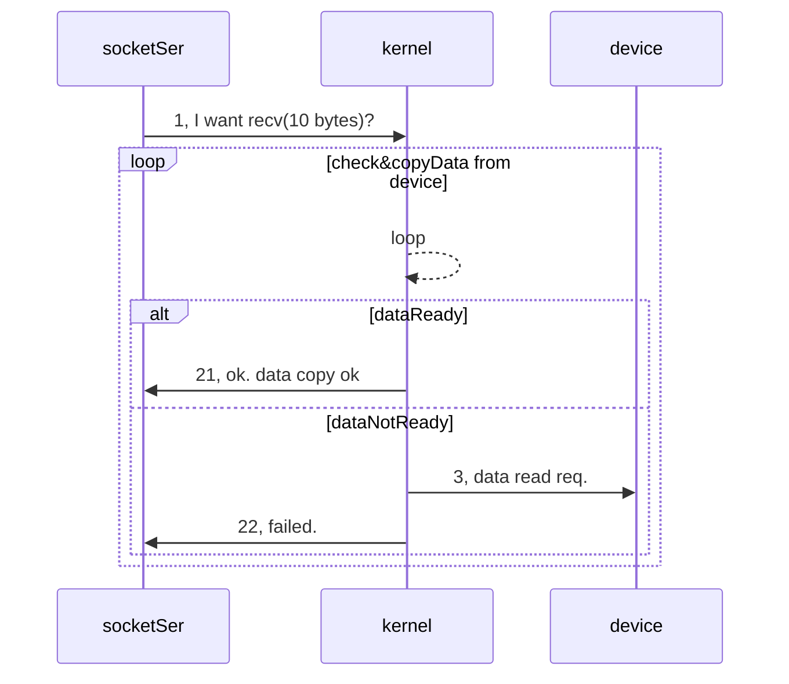
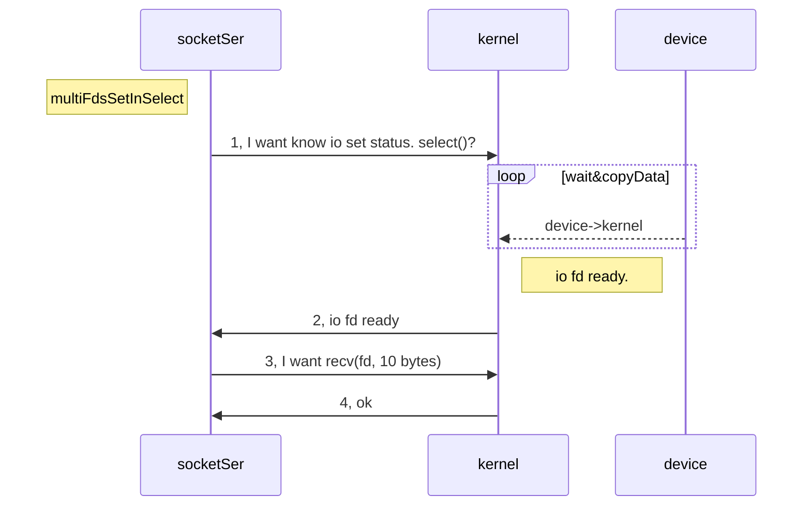
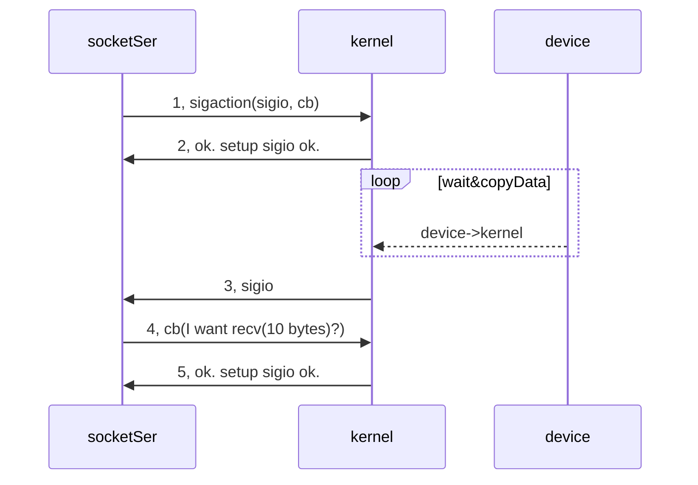
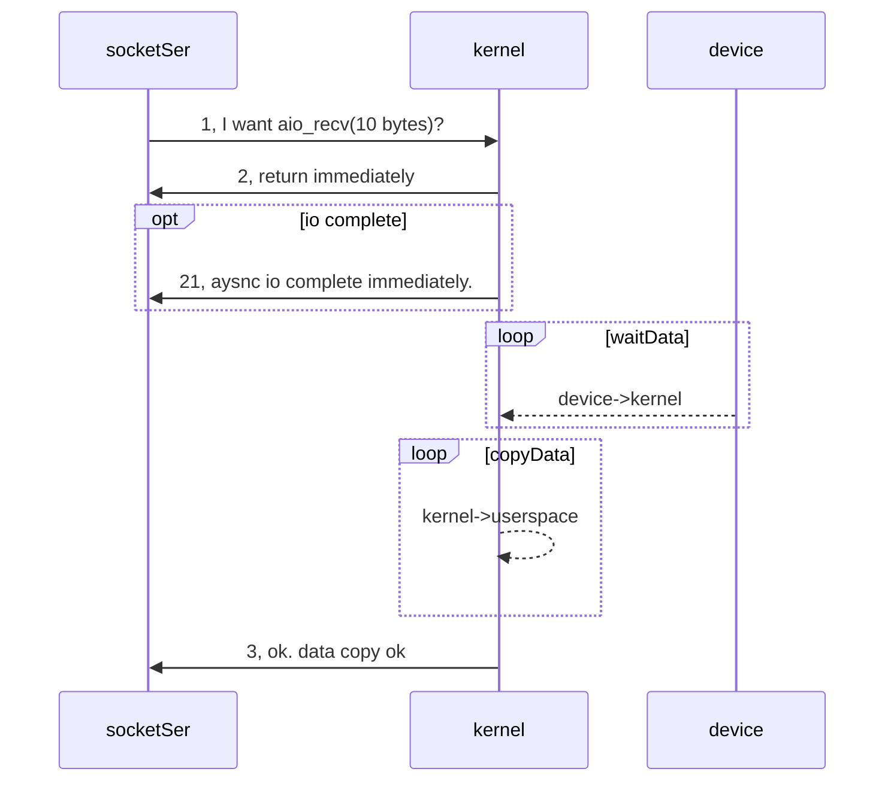

[TOC]

## ReadMe

探索io模型；

## Outline

IO即输入、输出，对应着输入、输出设备（对应着网络、磁盘、。。）。一般输入输出设备都自带内存。

如上，app应用不能直接操作外设（磁盘、网卡），需要通过kernel提供的接口进行操作，而kernel则通过外设提供的驱动对device进行操作。
  a. app调用kernel提供的接口发出io请求；
  b. kernel查看kernel中的队列是否满足；（要么要数据可读，要么有空间可写）
    b1. 如果满足，直接操作；（user space, kernel space之间的数据拷贝）
    b2. 如果不满足，那么app需要等待，直到条件满足；
所以：**数据的流通需要两个阶段：devcie<->kernel, kernelspace<->userspace.processSpace.**

**Q. 为什么外设不算内存，即说io的时候怎么没有说内存的？？**
因为cpu可以直接访问内存？或者冯诺依曼体系就说mem不是外设？

## 阻塞io模型

如下，网络io之recv io request.
  socketSer从1（发出io请求）之后就一直阻塞，直到返回2（21成功；22失败）；
这种**模型特点**：
  socketSer进程阻塞陷入内核态，不消耗cpu资源，能及时响应io请求；
  实现难度小；
  适用于：并发量小 + 及时响应的网络服务；（因为一个client请求会消耗一个线程、进程）

## 非阻塞io模型

如下，网络io之recv io request.
  socketSer从1（发出请求）之后，立马能得到成功、失败的结果，即使kernel没准备好数据也不会被阻塞；
这种**模型特点**：
  进程轮询调用，消耗cpu的资源；
  实现难道小；
  适用于：并发量小 + 不需要及时响应的网络应用；

## io复用模型

如下，网络io之recv io request.
  socketSer先将一堆的fd（即io set）注册到复用器(select上)，这个复用器的调度单独放一个进程；
  socketSer从1处（发出监控请求），就一直阻塞，直到所等待的事件发生、或者超时；
  socketSer从2处得到io状态/事件（哪个fd上readable, writeable，或者timeout）；
  socketSer从3处（发出io读写请求），数据从kernel space到user space.
  socketSer从4处得到3的结果；
这种**模型特点**：
  多个进程、线程注册了io之后，只有一个进程、线程阻塞在复用器调度上；
    即专一进程解决多个进程的IO阻塞问题，性能好，----reactor模式。
  实现难度大；
  适用于：高并发的 + 一个进程、线程响应多个请求的网络应用。

### select, poll, epoll

Linux中IO复用的实现方式主要有select、poll和epoll：

Select：注册IO、阻塞扫描，监听的IO最大连接数不能多于FD_SIZE；

Poll：原理和Select相似，没有数量限制，但IO数量大扫描线性性能下降；

Epoll ：事件驱动不阻塞，mmap实现内核与用户空间的消息传递，数量很大，Linux2.6后内核支持；

## 信号驱动io模型

如下，网络io之recv io request.
  socetSer从1处（发起一个io请求，向kernel注册sigio处理函数），立即返回不阻塞；
  kernel数据就绪时会向socketSer发一个sigio信号；（3）
  触发sigio的callback，进行4的io读写；
这种**模型特点**：
  回调机制；
  开发难度大；

## 异步io模型

如下，网络io之recv io request.
  socketSer从1处，发出异步读写io请求，会立即返回；（这一步io操作有时会立即完成，如21）
  kernel等待数据、拷贝数据；
  kernel通知socketSer异步读写结果；
这种**模式特点**：
  不阻塞，数据一步到位；--------proactor模式。
  实现难度大；
  适合高性能网络服务应用；

