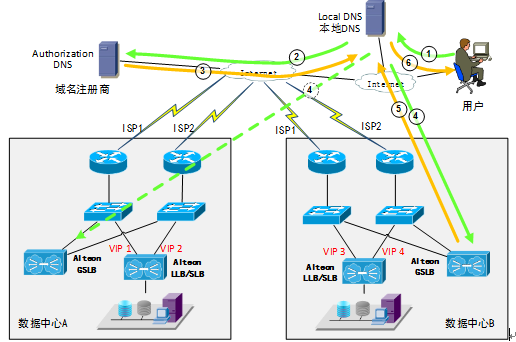

[TOC]

哪一层的负载；  
负载产品，及各自特性；  

## 本地LB
本地负载均衡是指对本地的服务器群做负载均衡，能有效地解决数据流量过大、网络负荷过重的问题，并且不需花费昂贵开支购置性能卓越的服务器，可充分利用现有设备，避免服务器单点故障造成数据流量的损失。

## 全局LB Global Server Load Balance
把各地的用户对于资源的访问，根据内容有无，服务器负载，网络带宽和速度，将请求导向到不同的服务器集群进行服务。

- 策略：
	- Internet的智能DNS + 内容重定向的方法；

### 智能DNS: 

- 定义或者概念：对于资源访问，采用统一的域名，但是智能DNS可以根据地域，把不同的请求分别指向各自的边缘服务器进行服务。
	- 通常需要在不同的地区设立多个数据中心，每个数据中心又使用多个运营商的线路。
	
	- GSLB设备收到的DNS请求的源地址不是用户的地址而是用户所配置的本地DNS服务器地址，而GSLB的就近性探测是根据这个地址来判断的；所以跟用户配置的DNS有很大的关系。
		- 可以在SLB设备正式收到用户发来的请求时，再次查找就进性表，当发现用户的最佳访问节点非自己时，通过http 302重定向来再次引导用户流量。

- 缺点：
	- 智能DNS有粒度太粗的问题，所以常常需要和其他方式配合，比如4/7层交换和内容重定向。
		- 智能DNS服务器无法判断边缘服务器是否拥有该内容；
		- 智能DNS服务器无法判断边缘服务器是否健康是否有足够的能力服务。
		
	- 通过公网健康检查可能会受到运营商网络拥塞的影响，并且不能感知站点内部的情况。
	
	

#### 智能DNS的请求流

1. 用户向本级配置的本地DNS服务器发出查询请求，如果本地DNS服务器有该域名的缓存记录，则返回给用户，否则进行第2步；
2. 本地DNS服务器进行递归查询，最终会查询到域名注册商处的授权DNS服务器，这里可能有多个步骤，图中只反映最后一步；
3. 授权DNS服务器返回一条NS记录给本地DNS服务器。根据授权DNS服务器上的不同设置，这条NS记录可能是指向随机一个GSLB设备的接口地址或者是所有GSLB设备的接口地址；
4. 本地DNS服务器向其中一个GSLB地址发出域名查询请求，如果请求超时会向其它地址发出查询；
5. GSLB设备返回一条A记录给本地DNS服务器。根据全局负载均衡策略设定的不同可能返回一个或多个VIP地址；
6. 本地服务器将查询结果通过一条A记录返回给用户，并将缓存这条记录。

