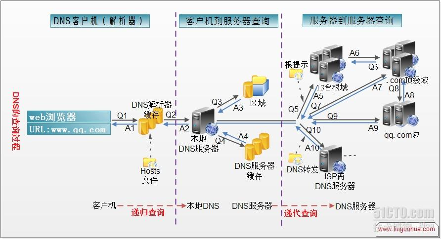

[TOC]

## ReadMe
DNS协议及相关协议、dns查询相关内容；

## Protocol

### whois

whois（读作“Who is”，非缩写）是用来查询域名的IP以及所有者等信息的传输协议。
简单说，whois就是一个用来查询域名是否已经被注册，以及注册域名的详细信息的数据库（如域名所有人、域名注册商）。

## DNS Query

查询流程：
1. 用户发起查询www.xxorg.com
2. 本地递归服务器
3. 根权威服务器
4. COM权威服务器
5. xxorg.com权威服务器
6. 用户
  

### Query Method

迭代查询 --返回能查询的DNS
> DNS服务器会向客户机提供其他能够解析查询请求的DNS服务器地址。
> 当客户机发送查询请求时，DNS服务器并不直接回复查询结果，而是告诉客户机另一台DNS服务器地址，客户机再向这台DNS服务器提交请求，依次循环直到返回查询的结果为止。

递归查询  --返回最终的结果
> DNS服务器接收到客户机请求，必须使用一个准确的查询结果回复客户机。
> 如果DNS服务器本地没有存储查询DNS信息，那么该服务器会询问其他服务器，并将返回的查询结果提交给客户机。

### About Query

泛域名与泛解析 
> 泛域名是指在一个域名根下，以*.Domain.com的形式表示这个域名根所有未建立的子域名。 
> 泛解析是把*.Domain.com的A记录解析到某个IP 地址上，通过访问任意的前缀.domain.com都能访问到你解析的站点上。 

- 域名绑定

域名绑定是指将域名指向服务器IP的操作。 

- 域名转向

域名转向又称为域名指向或域名转发，当用户地址栏中输入您的域名时，将会自动跳转到您所指定的另一个域名。一般是使用短的好记的域名转向复杂难记的域名。

### Records Category
- A记录 A（Address）A记录

	指定请求主机名（或域名）对应的IP地址记录。

- NS记录 NS（Name Server）域名服务器记录

	指定请求域名由哪个DNS服务器来进行解析。 

	> 您注册域名时，总有默认的DNS服务器，每个注册的域名都是由一个DNS域名服务器来进行解析的。 

	- 应用：
		- CDN
		- 负载均衡时使用

- MX记录 MX（Mail Exchanger）邮件交换记录

	它指向一个邮件服务器；
	
	- 应用：
		- 用于电子邮件系统发邮件时根据收信人的地址后缀来定位邮件服务器（rabin：仅用于发送邮件）。

- CNAME记录 CNAME（Canonical Name ）别名记录 

	允许您将多个名字映射到同一台计算机。
	
	- 应用：
		- 通常用于同时提供WWW和MAIL服务的计算机。 

- TXT记录 
	TXT记录，一般指某个主机名或域名的说明。

	- 应用：
		- 如：admin IN TXT "管理员, 电话：XXXXXXXXXXX"，mail IN TXT "邮件主机，存放在xxx , 管理人：AAA"，Jim IN TXT "contact: abc@mailserver.com"，也就是您可以设置 TXT 内容以便使别人联系到您。 

- TTL值 TTL（Time-To-Live）

  TTL就是一条域名解析记录在DNS服务器中的存留时间，单位是秒，默认一般为86400，即1天。

  > 当各地的DNS服务器接受到解析请求时，就会向域名指定的NS服务器发出解析请求从而获得解析记录；在获得这个记录之后，记录会在DNS服务器中保存一段时间，这段时间内如果再接到这个域名的解析请求，DNS服务器将不再向NS服务器发出请求，而是直接返回刚才获得的记录，而这个记录在DNS服务器上保留的时间，就是TTL值。 

  - 应用： 
    - ttl增大：增加缓存的生效时间，因为域名的a记录不会老变； 
    - 减小ttl：因为重新绑定了记录之后，要等待记录的生效； 

  - 网络上的TTL：
  	- 原理：TTL是IP协议包中的一个值，它告诉网络路由器包在网络中的时间是否太长而应被丢弃。	
  		- 每个路由器都至少要把TTL域减一，当记数到0时，路由器决定丢弃该包，并发送一个ICMP报文给最初的发送者。

- PTR值 PTR是pointer的简写

	用于将一个IP地址映射到对应的域名，也可以看成是A记录的反向，IP地址的反向解析。 

	- 应用：
		- PTR主要用于邮件服务器，比如邮箱AAA@XXX.com给邮箱BBB@yahoo.com发了一封邮件，yahoo邮件服务器接到邮件时会查看这封邮件的头文件，并分析是由哪个IP地址发出来的，然后根据这个IP地址进行反向解析，如果解析结果对应XXX.com的IP地址就接受这封邮件，反之则拒绝接收这封邮件。 

## DNS Servers

### Server Category
- 授权DNS：

权威DNS是经过上一级授权对域名进行解析的服务器，同时它可以把解析授权转授给其他服务器；

> 如a.b.c，它的区域域名就是*.a.b.c这些；
>
> 如COM顶级服务器可以授权xxorg.com这个域名的的权威服务器为NS.ABC.COM，同时NS.ABC.COM还可以把授权转授给NS.DDD.COM，这样NS.DDD.COM就成了ABC.COM实际上的权威服务器了。

- 递归DNS：根据缓存、及请求授权DNS来提供请求域名的解析

负责接受用户对任意域名查询，并返回结果给用户。

> 递归DNS可以缓存结果以避免重复向上查询。我们平时使用最多的就是这类DNS，他对公众开放服务，一般由网络运营商提供，大家都自己可以架递归DNS提供服务。
>
> 递归DNS一定要有可靠的互联网连接方可使用。比如谷歌的8.8.8.8和8.8.4.4以及114的114.114.114.114和114.114.115.115都属于这一类DNS。
>
> 你本地电脑上设置的DNS就是这类DNS。

- 转发DNS

负责接受用户查询，并返回结果给用户。但这个结果不是按标准的域名解析过程得到的，而是直接把递归DNS的结果转发给用户。它也具备缓存功能。

他主要使用在没有直接的互联网连接，但可以连接到一个递归DNS那里，这时使用转发DNS就比较合适。

- 缺陷是：
	- 直接受递归DNS的影响，服务品质较差。
	- 比如我们用的路由器里面的DNS就是这一类，用路由器的朋友可以看下本地电脑的DNS一般都是192.168.1.1。

问题：以上这些DNS都是什么人在管理？？

> 本地递归服务器一般由电信运营商架设，服务于自己的用户，并有其管理，自然人也架设。
> 根服务器与顶级域服务器由国际组织统一部署管理（实际控制器在美国政府）。对顶级域服务器来说销售商有可控的写入权。

