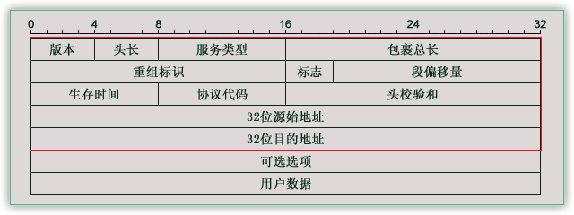

[toc]

## ReadMe

ipv4的包长的像这样（一个刻度表示1个二进制位（比特））



```bash
1-1.版本4位，表示版本号，目前最广泛的是4=B1000，即常说的IPv4；相信IPv6以后会广泛应用，它能给世界上每个纽扣都分配一个IP地址。
1-2.头长4位，数据包头部长度。它表示数据包头部包括多少个32位长整型，也就是多少个4字节的数据。无选项则为5（红色部分）。
1-3.服务类型，包括8个二进制位，每个位的意义如下：
       过程字段：3位，设置了数据包的重要性，取值越大数据越重要，取值范围为：0（正常）~ 7（网络控制）
       延迟字段：1位，取值：0（正常）、1（期特低的延迟）
       流量字段：1位，取值：0（正常）、1（期特高的流量）
       可靠性字段：1位，取值：0（正常）、1（期特高的可靠性）
       成本字段：1位，取值：0（正常）、1（期特最小成本）
       保留字段：1位 ，未使用
1-4.包裹总长16位，当前数据包的总长度，单位是字节。当然最大只能是65535，及64KB。
2-1.重组标识16位，发送主机赋予的标识，以便接收方进行分片重组。
2-2.标志3位，他们各自的意义如下：
       保留段位(2)：1位，未使用
       不分段位(1)：1位，取值：0（允许数据报分段）、1（数据报不能分段）
       更多段位(0)：1位，取值：0（数据包后面没有包，该包为最后的包）、1（数据包后面有更多的包）
2-3.段偏移量13位，与更多段位组合，帮助接收方组合分段的报文，以字节为单位。
3-1.生存时间8位，经常ping命令看到的TTL（Time To Live）就是这个，每经过一个路由器，该值就减一，到零丢弃。
3-2.协议代码8位，表明使用该包裹的上层协议，如TCP=6，ICMP=1，UDP=17等。
3-3.头检验和16位，是IPv4数据包头部的校验和。
4-1.源始地址，32位4字节，我们常看到的IP是将每个字节用点（.）分开，如此而已。
5-1.目的地址，32位，同上。
6-1.可选选项，主要是给一些特殊的情况使用，往往安全路由会当作攻击而过滤掉，普联（TP_LINK）的TL-ER5110路由就能这么做。
7-1.用户数据。
```

ip分片 
> IP数据报下一层要通过数据链路层封装成帧发送出去，但帧大小受网络设备电气属性影响是有限制的，即MTU，不同的网络拓扑和设备的MTU也不同，如以太网是1500字节。如果IP数据报大于MTU，那么它必须分片才能实现数据的传送，分片发生在各个网络设备上，在目的主机参照标识字段、标志位和片偏移来实现重组。值得注意的是，ip分片传输后，标识字段都被复制到每一个分片上，而总长度也变为该片的长度。
>> 优点是IP数据报可以穿过复杂多变的网络环境。  
>> 缺点是一个分片丢失，该数据报就发送失败，增大了丢包的概率。

