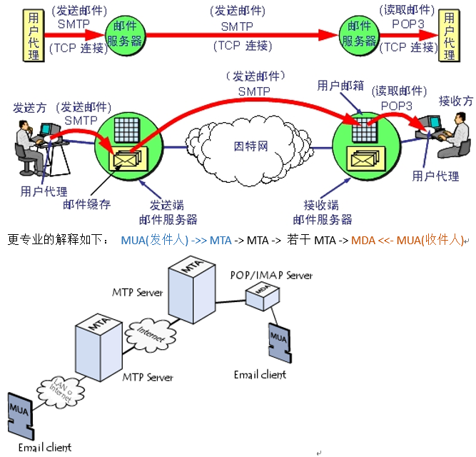

[TOC]


## ReadMe

邮件协议相关内容，包含smpt, imap, pop3；


## An Email Flow




MUA（Mial User Agent）—邮件用户代理，就是用户使用的一个应用程序(like outlook)。  
MTA（Mail Transfer Agent）邮件传输代理。

> 主要工作就是将电子邮件从一台主机发送到另一台主机。  
>
> > Exim是linux下一个MTA（Mail Transfer Agent，邮件传输代理）服务器软件。

MDA（Mail Delivery Agent）邮件投递代理，把邮件放到用户的邮箱里。
> 主要工作就是将邮件放到磁盘上，等待MUA来取邮件并进行邮件的维护。


## SMTP

### SMTP Command

smtp指令集如下：

|Smtp指令 |说明|
|--------|---|
|HELO |向服务器标识发送者身份。|
|MAIL |初始化邮件传输|
|RCPT |标识单个的邮件接收人；常在MAIL命令后面　　可有多个rcpt　to: |
|DATA |在单个或多个RCPT命令后，表示所有的邮件接收人已标识，并初始化数据传输结束。|
|QUIT |结束会话 |
|RSET |重置会话，当前传输被取消 |
|VRFY |用于验证指定的用户/邮箱是否存在；由于安全方面的原因，服务器常禁止此命令 |
|EXPN |验证给定的邮箱列表是否存在，扩充邮箱列表，也常被禁用 |
|HELP |查询服务器支持什么命令 |
|NOOP |无操作，服务器应响应OK |


### Capture An Email

再来看看send mail的抓包 

    

  


## POP3


## IMAP


## MIME
Multipurpose Internet Mail Extensions  --多用途互联网邮件扩展。
> 它是当前广泛应用的一种电子邮件技术规范，基本内容定义于RFC 2045-2049。

在MIME出台之前，使用RFC 822只能发送基本的ASCII码文本信息，邮件内容如果要包括二进制文件、声音和动画等，实现起来非常困难。MIME提供了一种可以在邮件中附加多种不同编码文件的方法，弥补了原来的信息格式的不足。实际上不仅仅是邮件编码，现在MIME已经成为HTTP协议标准的一个部分。  
> 可以多种不同编码文件了。  

从编码方式来说，MIME定义了两种编码方法Base64与QP(Quote-Printable)。


Mime定义的一些邮件消息头

|头字段 |意义|
|------|---|
|To |收件人地址|
|Cc |抄送地址|
|Bcc |暗送地址|
|Date |日期和时间|
|Subject |主题|
|Content-Type |内容的类型|
|From |发件人地址|
|||
|Content-Disposition |需要指定以什么方式下载（附件居多）、文件名|

### content-type

格式如下

```bash
content-type : [type]/[subtype]
	#Multipart：用于连接消息体的多个部分构成一个消息，这些部分可以是不同类型的数据；（复合文件）
	#Application：用于传输应用程序数据或者二进制数据；
	#Text：用于标准化地表示的文本信息，文本消息可以是多种字符集和或者多种格式的；
	#Message：用于包装一个E-mail消息；
	#Image：用于传输静态图片数据；
	#Audio：用于传输音频或者音声数据；
	#Video：用于传输动态影像数据，可以是与音频编辑在一起的视频数据格式。
```


### Base64

base64的初衷。是为了方便把含有不可见字符串的信息用可见字符串表示出来，以便复制粘贴。

特性
- 标准base64只有64个字符（英文大小写、数字和+、/）以及用作后缀等号‘=’。  
- base64是把3个字节变成4个可打印字符，所以base64编码后的字符串一定能被4整除（不算用作后缀的等号）。   
- 等号一定用作后缀，且数目一定是0个、1个或2个。  


