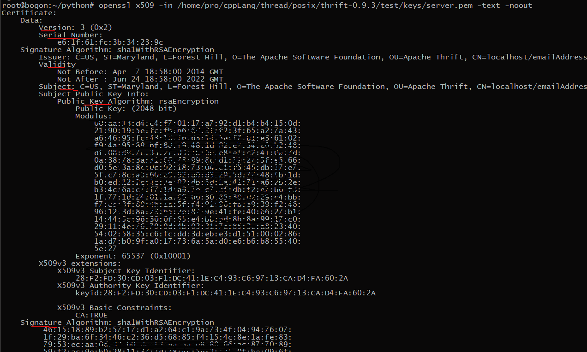

[TOC]


## ReadMe

如何让http通信安全呢？方法很多，大概如下：
- 网络层：IPSec.
  - ip/ipsec >> tcp >> http|ftp|smtp.
- 传输层：SSL/TLS.
  - ip >> tcp >> ssl|tls >> http|ftp|smtp.
- 应用层：S/MIME, PGP, SET, Kerberos.
  - ip >> tcp >> smtp|http >> s/mime|pgp|set
  - ip >> udp >> kerberos.


## 前言

### 密码学

密码学提供
- 保密性：加密。
- 身份认证（验证通信对端身份）：一般用数字证书。
- 数据完整性（是否损坏、恶意篡改）：单向哈希算法，如md5(128bit), sha-1(160-bit), sha256, sha512。
- 不可否认性（抗抵赖）：公钥算法（私钥签名 + 公钥验证）。

加密方式
- 密钥加密（对称加密），如des(40/56-bit), 3des(168-bit), aes(256-bit+), rc4(128-bit).
  - 用于大量数据的加、解密。
  - 块加密。idea/128bit, rc2-40/40, des-40/40, des/56, 3des/168, fortezza/80bit.
  - 流加密。rc440/40bit, rc4-128/128bit.
- 公钥加密（非对称加密），如rsa(512/1024/1536/2048-bit).
  - 算法复杂+运算量大，用于‘密钥’交换过程、数字签名。


### PKI（公开密钥体系）

PKI提供了一个通过信任第三方来认证的方案，相关主题如下：

- 数字证书：包含个体相关信息。
  
- 证书申请（CSR）：为了签发证书，产生CSR并提交给CA。
  
  - 包含申请者的识别信息、公钥。
  
- 证书认证机构（CA）：签发证书的机构。
  - 产生证书、并对证书进行签名（对证书信息hash，并生成的hash用ca的私钥加密），把加密摘要附加到证书中。
  - CA是分级的，根CA,各下级CA，所以就会有了证书链的存在。
  
- 证书认证

- 证书作废清单（CRL）
  
  - 由CA发布，包含了一个冻结、作废证书的序列号的清单。


**T.数字证书的标准、格式**

数字证书都遵守X.509标准，版本有如下：

- x.509v1, 1988
- x.509v2, 1933
- x.509v3, 1997
- x.509v4, 2000

数字证书的内容，如下：

- x509的版本号；
- 证书的序列号；（证书的唯一标识）
- 签名算法标识符；（认证机构对数字证书签名时所使用的数字签名算法的标识）
- 数字证书发放者；（发行数字证书的认证机构的名称）
- 有效期；
- 主体名称；
- 主体的公钥信息；（主体的公钥值、该 公钥使用时所使用的算法标识）
- 数字证书发放者的唯一标识符；（可选项，当实体具有相同名称时，使认证机构的名称具有唯一性）
- 主体的唯一标志符；（可选项，当实体名称相同时，使主体的名称唯一性）

数字证书的格式，如下：

 - pem(Privacy Enhanced Mail). 用base64编码的der证书，可以包含多个证书。

    	- 旨在为电子邮件提供消息机密性和完整性。

 - cer, .crt .der. 一般为二进制格式。

 - p7b, .p7c PKCS#7. 是一容器标准，可装证书、及证书加密的数据。

 - p12 -PKCS#12，通常包含公钥、私钥，<font color=gree>受密码保护</font>。

 - pfx(Personal Information Exchange)，通常包含公钥、私钥，<font color=gree>受密码保护</font>。

    	- 这种格式更适合用于创建用于对应用程序、网站进行身份验证的证书。

    如下指令可实现以上格式之间的转换

    ```bash
    openssl x509 –in C:\OpenSSL\Certificate.cer –out C:\OpenSSL\Certificate.pem
    	# cer -> pem
    openssl pkcs12 -export -out C:\OpenSSL\Certificate.pfx -inkey C:\OpenSSL\RSAKeys.key -in certificate.pem
    	# pem -> pfx
    openssl pkcs12 -export -out C:\OpenSSL\Certificate.p12 -inkey C:\OpenSSL\RSAKeys.key -in certificate.pem
    	# pem -> p12
    openssl pkcs12 -export -out C:\OpenSSL\Certificate.pem -inkey C:\OpenSSL\RSAKeys.key -in certificate.p12
    	# p12 -> pem
    ```

    

如图x509标准证书


## SSL/TLS

ssl在tcp、应用层之间。如https就是在ssl上的http。

ssl要解决的问题，如下：
- 身份认证
  - client对server身份验证；server对client身份验证 ---x.509v3数字证书。
- server, client之间安全的数据通道。
  - 传输数据的机密性 ---对称加解密。
  - 传输数据的完整性 ---信息摘要算法。


### version

| Protocol | Published   | Status                |
| -------- | ----------- | --------------------- |
| SSL 1.0  | Unpublished | Unpublished           |
| SSL 2.0  | 1995        | Prohibited in 2011    |
| SSL 3.0  | 1996        | Prohibited in 2015    |
| TLS 1.0  | 1999        | Deprecation suggested |
| TLS 1.1  | 2006        |                       |
| TLS 1.2  | 2008        |                       |
| TLS 1.3  | 2018        |                       |


### ssl protocol stack

- 基础服务协议
  - ssl record protocol
- 高层管理协议：用于管理ssl密钥信息的交换。
  - ssl handshake protocol
  - ssl change cipher spec protocol
  - ssl alert protocol. 警告协议，包含警告级别、警告说明。
    - alert level = warning/fatal, fatal会导致连接失败，warning的结果按照接收者的策略。


### <font color=cc00ff>ssl message</font>

refer. https://www.acunetix.com/blog/articles/establishing-tls-ssl-connection-part-5/

- <font color=#cc00ff>clientHello</font>. 连接请求。
  - client_version, client所支持的ssl/tls版本列表，首选最高可用的版本。
  - random, 32位，4位server当前时间+28位随机数，稍后用于密钥生成。
  - session_id, 为了session复用，（如果server端在其session cache找到该id）。
  - compression_methods, 压缩算法，减少带宽占用、提高传输速度，但是会有安全隐患。
  - Cipher Suites, 密码套件组，如TLS_ECDHE_ECDSA_WITH_AES_128_GCM_SHA256
    - 包含：key exchange算法、身份验证算法、加解密算法、消息验证算法。
    - TLS, 被使用的协议。
    - ECDHE, key exchange algorithm.(Elliptic curve Diffie–Hellman)
    - ECDSA, authentication algorithm.(Elliptic Curve Digital Signature Algorithm)
    - AES_128_GCM, data encryption algorithm.(Advanced Encryption Standard 128 bit Galois/Counter Mode)
    - SHA256, Message Authentication Code (MAC) algorithm.(Secure Hash Algorithm 256 bit)
  - extensions, 额外功能，如果server端不支持这些，那么client可以按需结束session。
- <font color=#cc00ff>serverHello</font>. 如果clientHello在server看来能进行对其服务。（即client选择的一些参数）
  - server_version, server通常将选择client的首选版本。
  - random, 32位，4位server当前时间+28位随机数，稍后用于密钥生成。
  - session_id, 为空则意味着为该连接新创建一个会话。
  - compression_method, 如果支持，那么同意client首选的算法。
  - cipher_suites, 如果支持，那么同意client首选的算法组合。
- <font color=#cc00ff>certificate.</font> 发送证书指令。
  - 证书，用于向对端证明自己的身份；其中亦包含自己的公钥。
- <font color=#cc00ff>serverKeyExchange</font>.
  - sent only if the server certificate is not sufficient to allow the client to exchange a pre-master secret. 
  - DHE_DSS,DHE_RSA and DH_anon这些密钥交换算法时会发送该消息。（rsa, dh, ecdh不会发送）
  - 包含公钥、签名（同于客户端认证时需要发送certificate verify）、自己使用的椭圆曲线。
- <font color=#cc00ff>serverHelloDone</font>.
  - sent to the client as a confirmation that the Server Hello message is completed.
- <font color=#cc00ff>clientKeyExchange</font>.
  - 生成pre_master_secret，并用对端的公钥加密（如此只有对端才能解开此加密信息），传输给对端。
    - 生成算法依赖选用的cipher suite.
  - 对端在收到pms之后，就可产生ms了。
    - 本端也可产生ms了。
    - master_secret = PRF(pre_master_secret, "master secret", ClientHello.random + ServerHello.random);
    - PseudoRandom Function (PRF). A PRF is a function used to generate arbitrary amounts of pseudorandom data.
    - ms, 48 bytes, be used by both client and server to symmetrically encrypt the data for the rest of the communication.
  - pre_master_secret包含加密密钥、加密初始化向量、hmac的密钥。
- <font color=#cc00ff>changeCipherSpec</font>.
  - 产生了ms之后，通信双方使用Change Cipher Spec protocol，进入加密通道。
- <font color=#cc00ff>finished</font>. 握手结束。
- <font color=#cc00ff>applicationData</font>. 加密数据
- <font color=#cc00ff>alert</font>. 警告协议发出的警告信息，包含level, description.
- <font color=#cc00ff>certificateRequest</font>.
- <font color=#cc00ff>certificateVerify</font>. 用于让server验证client可信。
  - 由client构造，它包含了握手信息的hash签名（将握手信息摘要用自己的私钥进行签名）。
  - 一般认证包含：证书可信即证书是知名CA签发 + 连接实体可信即它是证书的合法拥有者（有key）。
- <font color=#cc00ff>encryptedHandshakeMessage</font>.
- <font color=#cc00ff>newSessionTicket</font>. session复用机制之一。
  - 会在clientHello的扩展头中增加sessionTicketTLS信息（如果复用上那么data字段就会有信息）。
  - server如果支持，那么在serverHello中也会挂上sessionTicketTLS，表明后续还会发newSessionTicket.
  - server在连接建立成功后server发送newSessionTicket，包含lifeTime、sessionTicket(其中至少包含ms).
  - client保存dip+dport <-> sessionTicket
  - client在后续有访问到此服务时在clientHello中extension: sessionTicket TLS把此sessionTicket加载上。
  - server端解密sessionTicket，恢复ms, 加密套件，协议等。回复serverHello + changeCipherSpec + finished.


### ssl alert 

no.


### ssl proxy

SSL代理分为两种场景，如下
- 服务器端：proxy位于server的网关，proxy用server的证书与client通信，并把明文发送到backend server.
- 客户端：proxy位于client的网关，client需要信任proxy的代理证书。


### ssl acceleration

ssl加速
将运算密集的ssl密钥处理、对称加解密过程从应用服务器分离（如web server），使性能更优。


### 单、双向认证

https的认证一般为单向认证（即只有服务器认证），但也可以强制进行双向认证（即服务器认证 + 客户端认证）

服务器认证
- 通信开始前，client验证server身份。
- https就是用的这种。

客户端认证
- 通信开始前，server验证client身份。
- 在安全性较高的场景，如B2B交易等。


## Session

### communication

ssl基本的连接通信

- c->s, client initates ssl session.
- s<-c, server responds with certificate.
  - containing host, domain, public key.
- c->s, make session key and pre-master key.
  - client generates session key using a random pre-master key.
  - encrypts the pre-master key using the servers public key.
  - sends encrypted pre-master key to the server.
- c<-s, got the session key, begins communicating in encrypted mode.
  - server decrypts pre-master using its private key and generates session key with it.(same as client)
  - begins communicating in encrypted mode.
- https encrypted data flow.


### create new session

建立新会话，过程如下

- c->s
  - clientHello.
- s->c
  - serverHello.
  - certificate.
  - option.serverKeyExchange.
  - optionClientVerify.certificateRequest.
  - serverHelloDone.
- c->s
  - optionClientVerify.certificate.
  - clientKeyExchange.
  - optionClientVerify.certificateVerify.
  - changeCipherSpec.
  - finished(encrypted).
- s->c
  - changeCipherSpec.
  - finished(encrypted).


### reuse old session

session复用机制，大概有如下2种解决方案：  refer. https://blog.csdn.net/mrpre/article/details/77868669
- 法一：session id.
  - 缺点：
    - server端堆积大量的session，且session老化的时间一般为几个小时，故浪费内存、安全性低。
    - server集群时，client与serverA的session_id不能在cleint与serverB之间使用。
- 法二：session ticket.
  - sessionTicket存储在client端，复用时直接加载上就行了。


session重用时，建立会话过程如下

- c->s
  - clientHello.
- s->c
  - serverHello.
  - changeCipherSpec.
  - finished(encrypted).
- c->s
  - changeCipherSpec.
  - finished(encrypted).


### session key

client_random + server_random + pre_master_secret >> ms >> key

- pre-master_secret
  - pms在使用过后应该立刻从内存中清除。
- master_secret, 由client_random + server_random + pms生成；
  - master secret、会话密钥，会话的生命周期内常驻内存，并面向session。
- shared_secret/session_key，由ms生成；
  - 最终的对称密钥，面向connection。


pmk/pms有2种生成模式

- rsa加密，即用server的public key加密，并发送给对端。
- dh协商的，双方各自贡献一部分公共信息，但key只在本地产生，不进行网络传输。


**问题**：会话密钥生成怎么依赖client_random + server_random + pre_master_secret三项？？
其中client_random, server_random是明文传输的，只有pre_master_secret是加密传输的。
client_random, server_random加入密钥的生成，是防止重放攻击，而非增加随机性。因为只要pms被猜到，引入前两个随机数（明文传输）来计算最终密钥也于事无补。
所以，<font color=blue>本来可以让pms直接作为会话密钥，但pms可能在会话间重复（随机数），且会话密钥需要常驻内存(增加了泄漏的风险)。一旦泄漏，使用该pms的所有会话都遭殃了。但加上另外两random（其中包括client, server当前的时间）后将会话密钥泄漏的影响面限制在单个会话</font>。


## other..


https://en.wikipedia.org/wiki/Transport_Layer_Security


协议选择？？


错误码：


### 问题集

#### Could not validate certificate: current time

系统时间错误引起的证书不能用，注意这种情况！

SNI（Server Name Indication）是为了解决一个服务器使用多个域名和证书的SSL/TLS扩展。定义在RFC 4366。是一项用于改善SSL/TLS的技术，在SSLv3/TLSv1中被启用。它允许客户端在发起SSL握手请求时（具体说来，是客户端发出SSL请求中的ClientHello阶段），就提交请求的Host信息，使得服务器能够切换到正确的域并返回相应的证书。一句话简述它的工作原理就是，在连接到服务器建立SSL链接之前先发送要访问站点的域名（Hostname），这样服务器根据这个域名返回一个合适的证书。目前，大多数操作系统和浏览器都已经很好地支持SNI扩展，OpenSSL 0.9.8已经内置这一功能，据说新版的nginx也支持SNI。  --rtodo

ssl在 Web 服务(HTTPS)相关的扩展，如 SNI, NPN, ALPN。  --rtodo


#### SSL peer certificate or SSH remote key was not OK

client验证server证书时，采用了最严格的检验方法（cn的内容是否与连接对端一致）。
在这种场景下server证书中的CN使用了IP，并且client连接server的网络中间途经其它设备（如iptable的DNAT，因为与client直连的并非server，但拿到的证书是server的证书），那么就会报这个错误！

```cpp
//libcurl中有如下开关
CURLOPT_SSL_VERIFYPEER
	//true 检验对方证书。
CURLOPT_SSL_VERIFYHOST
	//0 为不检查名称。
	//1 是检查服务器SSL证书中是否存在一个公用名(common name)。
		//公用名CN一般来讲就是填写你将要申请SSL证书的域名 (domain)或子域名(sub domain)。
	//2，会检查公用名是否存在，并且是否与提供的主机名匹配
```

