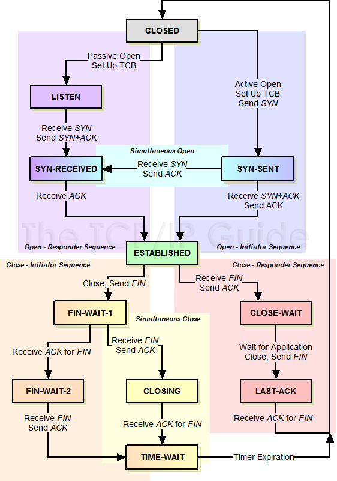
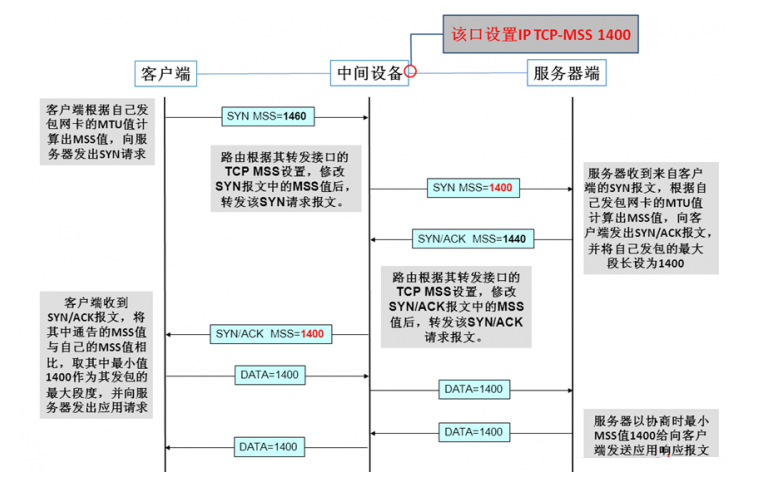
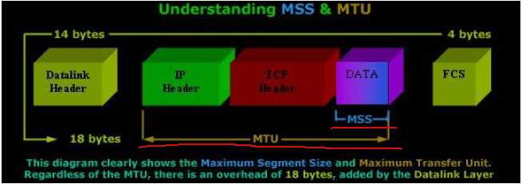
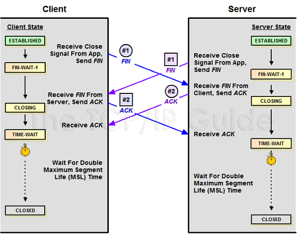

[TOC]


## ReadMe

tcp connection des.


问题：为什么在TCP协议里，建立连接是三次握手，而关闭连接却是四次握手呢?

> 因为当处于LISTEN 状态的服务器端SOCKET当收到SYN报文(客户端希望新建一个TCP连接)后，它可以把ACK(应答作用)和SYN(同步作用)放在同一个报文里来发送给客户端。  
>
> > 这是不是捎带确认？---**应该就是delay ack.**
>
> 但在关闭TCP连接时，当收到对方的FIN报文时，对方仅仅表示对方没有数据发送给你了，但未必你的所有数据都已经全部发送给了对方，所以你大可不必马上关闭SOCKET(发送一个FIN报文)，等你发送完剩余的数据给对方之后，再发送FIN报文给对方来表示你同意现在关闭连接了，所以通常情况下，这里的ACK报文和FIN报文都是分开发送的。 


## Connection Build

tcp连接建立的目的是为连接分配资源、协商ISN值、告知mss值。




**Notice.** 
主动connect()，是在发送ack k+1之后才是established. 而不是在收到syn k的时候；
主动close()，是在发送完ack n+1之后才是time_wait，而不是在收到fin n的时候；
​    fin_wait_2就是平时我们说的半关闭；
​    time_wait到closed之间需要2MSL时长；（尽力保证最后一个ACK能成功的被对端接收）
被动accept()，是在发送完syn k, ack j+1之后才是syn_rcvd状态；
被动close()，是发送ack m+1之后才是close_wait状态；

持续监测各种状态的连接数量，如下：

```bash
watch -n 0.6 -d 'netstat -t | grep 8837 | grep CLOSE_WAIT |  wc -l'
watch -n 0.6 -d 'netstat -t | grep 8837 | grep TIME_WAIT |  wc -l'
watch -n 0.6 -d 'netstat -t | grep 8837 | grep ESTABLISHED |  wc -l'
```


内核相关参数：

> net.ipv4.tcp_synack_retries = 5
> ​	server决定内核在放弃连接之前所送出的 SYN+ACK （连接第2步）数目。
> net.ipv4.tcp_syncookies = 1
> ​	防止SYN Flood攻击。


### Maximal Segment Size

用于保证TCP每次传输的数据都能被控制在一个合理的范围内，避免IP分片的发生，增大传输效率，最大化利用资源。

> 防止传输数据过小造成资源浪费。比如发送数据每次都是1Byte，在每一层都会添加首部（20Byte的TCP首部和20Byte的IP首部），之后才会完成发送。也就是说传送的41Byte中，只有1Byte是有效数据，这明显造成了资源的浪费。  
> 防止传输数据过大造成传输效率降低。如果发送的数据过大，超过了MTU的值，那么在IP层就会出现分片现象，而接收方也要耗费更多的资源和时间来处理分片，如果在传输过程中发生丢片，也会进一步增大网络开销。

MSS是在建立连接时协商出来的（只会出现在syn包中），如下：   



问题：MTU MSS？

> MTU 即Maximal Transmission Unit，最大传输单元，是指<font color=red>网络接口层</font>中由于受传输介质的物理特性制约一次可以传送的最大字节数，如以太网中MTU为1500Byte。MTU可以由人为修改，从而达到最优网络传输效率。  
> MSS 即Maximal Segment Size，最大段长度，是传输层中TCP报文段中数据段的最大长度，默认是536Byte。

参考（mtu=ipHead+tcpHead+mss）：




### Inital Sequence Number

初始化序列号（缩写为ISN：Inital Sequence Number）现在的实现大多是在一个基准值的基础上随机进行的。


**问题：ISN不能固定吗？**

可以固定，我们来看看会出现什么问题。
假设ISN固定是1，Client和Server建立好一条TCP连接后，Client连续给Server发了10个包，这10个包不知怎么被链路上的路由器缓存了(*路由器会毫无先兆地缓存或者丢弃任何的数据包*)，这个时候碰巧Client挂掉了，然后Client用同样的端口号重新连上Server，Client又连续给Server发了几个包，假设这个时候Client的序列号变成了5。接着，之前被路由器缓存的10个数据包全部被路由到Server端了，Server给Client回复确认号10，这个时候，Client整个都不好了，这是什么情况？我的序列号才到5，你怎么给我的确认号是10了，整个都乱了。


### syn timeout

目前，Linux下默认会进行5次重发SYN-ACK包，重试的间隔时间从1s开始，下次的重试间隔时间是前一次的双倍，5次的重试时间间隔为1s，2s，4s，8s，16s，总共31s，第5次发出后还要等32s都知道第5次也超时了，所以，总共需要1s + 2s + 4s+ 8s+ 16s + 32s = 63s，TCP才会断开这个连接。由于，SYN超时需要63秒，那么就给攻击者一个攻击服务器的机会，攻击者在短时间内发送大量的SYN包给Server(俗称SYN flood攻击)，用于耗尽Server的SYN队列。对于应对SYN过多的问题，Linux提供了几个TCP参数：`tcp_syncookies`、`tcp_synack_retries`、`tcp_max_syn_backlog`、`tcp_abort_on_overflow`来调整应对。


### HalfConnection & SYN Flood

--------

**Half Connection**

顾名思义就是还没有完成三次握手建立连接。

具体是指服务端在收到客户端的SYN包后，会据此生成一个半连接的对象，并将其存储在一个半连接队列(SYN Queue)中进行维护。一旦收到客户端的ACK包后会将该对象从半连接队列(SYN Queue)转移到已连接队列(Accept Queue)中等待accept系统调用。一经accept调用，数据的传输和接收才会正式开始。队列肯定是不能无限长的，因为每个对象都会占据存储资源。


------------

**SYN FLood**

利用了半连接队列的长度限制来完成攻击的。

攻击策略为伪造大量SYN包发送给服务端，但不返回ACK包，导致服务端半连接队列被迅速占满，正常的连接被抛弃。服务端会有大量处于SYN_RECV状态的连接，其会尝试重发ACK包给实际不存在的客户端，导致CPU满负载，内存耗尽，从而达到攻击效果。

**net.ipv4.tcp_syncookies**

原理是：在TCP服务器收到TCP SYN包并返回TCP SYN+ACK包时，不分配一个专门的数据区，而是根据这个SYN包计算出一个cookie值。在收到TCP ACK包时，TCP服务器在根据那个cookie值检查这个TCP ACK包的合法性。如果合法，再分配专门的数据区进行处理未来的TCP连接。


## Connection Free

如下，4步挥手中，主动方吃time_wait，被动方吃close_wait.


相关内核参数：

1. /proc/sys/net/ipv4/tcp_fin_timeout = 60s  主动关闭方FIN-WAIT-2状态的保持时间。


**问题：关闭TCP连接一定需要4次挥手吗? **

> 不一定，4次挥手关闭TCP连接是最安全的做法。但在有些时候，我们不喜欢TIME_WAIT 状态(如当MSL数值设置过大导致服务器端有太多TIME_WAIT状态的TCP连接，减少这些条目数可以更快地关闭连接，为新连接释放更多资源)，这时我们可以通过设置SOCKET变量的SO_LINGER标志来避免SOCKET在close()之后进入TIME_WAIT状态，这时将通过发送RST强制终止TCP连接(取代正常的TCP四次握手的终止方式)。但这并不是一个很好的主意，TIME_WAIT 对于我们来说往往是有利的。


### time_wait

因为TCP协议规定，不对ACK进行ACK，如果主动关闭方不进入`TIME_WAIT`，那么主动关闭方在发送完ACK就释放连接，如果最后发送的ACK在路由过程中丢掉了，最后没能到被动关闭方，这个时候被动关闭方没收到自己FIN的ACK就不能关闭连接，接着被动关闭方会超时重发FIN包，但是这个时候已经没有对端会给该FIN回ACK，被动关闭方就无法正常关闭连接了，所以主动关闭方需要进入`TIME_WAIT`以便能够重发丢掉的被动关闭方FIN的ACK。

超时设置是 2*MSL，RFC793定义了MSL为<font color=blue>2min</font>，Linux设置成了<font color=blue>30s</font>。


----

**time_wait想要解决的问题**

1. 尽最大努力保证最后一个FIN的ack能到达对端，让连接正常关闭；
   否则应该是对端收不到ack之后超时重传，这边已经没这个连接的信息了所以会给对端发送rst。
2. 在连接2重用了连接1的五元组（srcip, srcport, tcp, dstip, dstport）的场景下，防止网络中残留的FIN包误杀新连接2。但这种概率比较低，因为fin的seq要对上，但ISN是随机的所以也保不齐。
3. 防止链路上已经关闭的连接的残余数据包（a lost duplicate packet or a wandering duplicate packet）干扰正常的数据包，造成数据流不正常。


----

**time_wait带来的问题** 

连接进入TIME_WAIT状态后需要等待2*MSL(一般是1到4分钟)的时间才能断开连接释放连接占用的资源，所以：

1. as server side. 
   短时间内关闭大量的client connection,就会造成大量的time_wait连接，占据着服务器的网络资源（五元组）。

2. as client side.

   短时间内大量的短连接，会消耗掉client上的tcp port，毕竟只有65535个。


---

**如何避免**

法一：time_wait快速回收

linux下可快速回收time_wait的连接（需要3.5*RTO, 1RTO=[200ms, 120s]），只要打开如下开关：

> /proc/sys/net/ipv4/tcp_tw_recycle = 0, 默认关闭
> /proc/sys/net/ipv4/tcp_timestamps = 1, 默认打开

快速回收有可能reset掉一些合法的连接请求！！！ ---是什么？？


法二：time_wait重用（**相对快速回收更加完美，但是为什么呢？**）

一样的需要同时开启如下开关：

> /proc/sys/net/ipv4/tcp_tw_reuse =0, default off.
> /proc/sys/net/ipv4/tcp_timestamps  =1, default on.

tcp_tw_reuse VS <font color=red>SO_REUSEADDR</font>是两个不同的东西：
so_reuseaddr，是告诉内核如果端口忙并且处于time_wait状态，则可重用端口；其它状态则不能重用。

time_wait重用是有条件的！！！ -----是什么？？


其它开关：

> /proc/sys/net/ipv4/tcp_max_tw_buckets
> ​	系统保持time_wait的连接最大数，如果超过则会被清除并打印日志。
> ​	但这最被是用来防简单的ddos攻击的。而不是用来消除time_wait连接。


### broken pipe

对本端已经close()的连接进行write()操作。

1. 第1次write()，会得到一个rst包；
2. 第2次wite()，会得到sig_pipe信号；

即，在收到RST包的时候，还往这个连接写数据，就会收到Broken pipe错误了。

```cpp
signal(SIGPIPE, SIG_IGN);
	//代码跨平台；

int  set = 1;
setsockopt(sd, SOL_SOCKET, SO_NOSIGPIPE, (void  *)&set, sizeof(int));
	//代码不跨平台，只适合mac platform.
```


### close at the same time




双方都会出现time_wait的状态。


## Rules About Syn Rst Ack

- 关闭端口
  - 收到SYN/FIN，丢弃并向源RST；----<font color=red>连接一个不存在的服务（未listen的ip+port）</font>.
  - 收到RST，丢弃；
- 监听端口
  - 收到不包含SYN的数据包、丢弃；
  - 收到RST，丢弃；
  - 收到FIN，丢弃；
  - 收到包含ACK的数据包，丢弃并向源RST；
- 打开端口

我理解是后续还有可能收到包，但不是我（端口）想收的，那么就要丢弃收到包并向源发RST；


## Max Connection Number

最大连接数量，

首先了解linux用4元组来标志一个连接，即{lip, lport, rip, rport}。  
> 四元组是：源IP地址、目的IP地址、源端口、目的端口
> 五元组是: 源IP地址、目的IP地址、源端口、目的端口、协议号
> 七元组是: 源IP地址、目的IP地址、源端口、目的端口、协议号、服务类型、接口索引

其次如果没有设置地址、端口重用下，默认都是独占的。


### client's max tcp connection

client每次发起tcp连接请求时，除非绑定端口，通常会让系统选取一个空闲的本地端口（local port），该端口是独占的，不能和其他tcp连接共享。  

> tcp端口的数据类型是unsigned short，因此本地端口个数最大只有65536，端口0有特殊含义，不能使用，这样可用端口最多只有65535，所以在全部作为client端的情况下，最大tcp连接数为65535，这些连接可以连到不同的server ip。

### server's max tcp connection

场景设定：只在一台机器上的一个端口；

server通常固定在某个本地端口上监听，等待client的连接请求。

```bash
tcp   0  0   0.0.0.0:22              0.0.0.0:*               LISTEN      2323/sshd
tcp   0  96  172.22.48.101:22        172.22.48.100:50888     ESTABLISHED 6402/2
```

不考虑地址重用（unix的SO_REUSEADDR选项）的情况下，即使server端有多个ip，本地监听端口也是独占的，因此server端tcp连接4元组中只有remote ip（也就是client ip）和remote port（客户端port）是可变的，因此最大tcp连接为客户端ip数×客户端port数，对IPV4，不考虑ip地址分类等因素，最大tcp连接数约为2的32次方（ip数）×2的16次方（port数），也就是server端单机最大tcp连接数约为2的48次方。

> lip,lport - rip,rport   
> 那么一个server上端口全开呢？那么internet上全部的连接数呢？


### at the end

上面给出的是理论上的单机最大连接数，在实际环境中，受到机器资源、操作系统等的限制，特别是sever端，其最大并发tcp连接数远不能达到理论上限。  
在unix/linux下限制连接数的主要因素是

- 用户进程允许打开的文件描述符个数（每个socket就是一个文件描述符） 
- 网络内核对TCP连接的有关限制
- 使用支持高并发网络I/O的编程技术
- 内存（每个tcp连接都要占用一定内存）
- 另外1024以下的端口通常为保留端口。


server端，通过增加内存、修改最大文件描述符个数等参数，单机最大并发TCP连接数超过10万 是没问题的，国外  Urban Airship 公司在产品环境中已做到 50 万并发 。在实际应用中，对大规模网络应用，还需要考虑C10K 问题。	

http://blog.csdn.net/guowake/article/details/6615728  
http://blog.sae.sina.com.cn/archives/1988  


