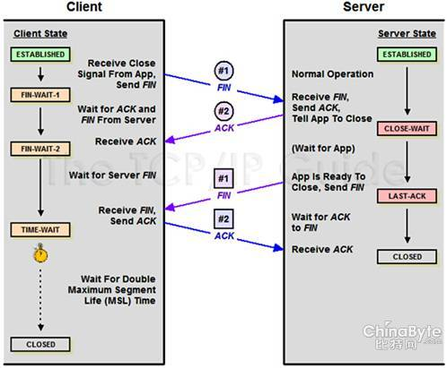

[TOC]


## ReadMe

tcp connection des.


问题：为什么在TCP协议里，建立连接是三次握手，而关闭连接却是四次握手呢?

> 因为当处于LISTEN 状态的服务器端SOCKET当收到SYN报文(客户端希望新建一个TCP连接)后，它可以把ACK(应答作用)和SYN(同步作用)放在同一个报文里来发送给客户端。  
>
> > 这是不是捎带确认？
>
> 但在关闭TCP连接时，当收到对方的FIN报文时，对方仅仅表示对方没有数据发送给你了，但未必你的所有数据都已经全部发送给了对方，所以你大可不必马上关闭SOCKET(发送一个FIN报文)，等你发送完剩余的数据给对方之后，再发送FIN报文给对方来表示你同意现在关闭连接了，所以通常情况下，这里的ACK报文和FIN报文都是分开发送的。 


## Connection Build

tcp连接建立的目的是为连接分配资源、协商ISN值、告知mss值。


内核相关参数：

> net.ipv4.tcp_synack_retries = 5
> ​	server决定内核在放弃连接之前所送出的 SYN+ACK （连接第2步）数目。
> net.ipv4.tcp_syncookies = 1
> ​	防止SYN Flood攻击。


### Maximal Segment Size

用于保证TCP每次传输的数据都能被控制在一个合理的范围内，避免IP分片的发生，增大传输效率，最大化利用资源。

> 防止传输数据过小造成资源浪费。比如发送数据每次都是1Byte，在每一层都会添加首部（20Byte的TCP首部和20Byte的IP首部），之后才会完成发送。也就是说传送的41Byte中，只有1Byte是有效数据，这明显造成了资源的浪费。  
> 防止传输数据过大造成传输效率降低。如果发送的数据过大，超过了MTU的值，那么在IP层就会出现分片现象，而接收方也要耗费更多的资源和时间来处理分片，如果在传输过程中发生丢片，也会进一步增大网络开销。

MSS是在建立连接时协商出来的（只会出现在syn包中），如下：   


问题：MTU MSS？

> MTU 即Maximal Transmission Unit，最大传输单元，是指网络接口层中由于受传输介质的物理特性制约一次可以传送的最大字节数，如以太网中MTU为1500Byte。MTU可以由人为修改，从而达到最优网络传输效率。  
> MSS 即Maximal Segment Size，最大段长度，是传输层中TCP报文段中数据段的最大长度，默认是536Byte。

参考（mtu=ipHead+tcpHead+mss）：


### Inital Sequence Number

初始化序列号（缩写为ISN：Inital Sequence Number）现在的实现大多是在一个基准值的基础上随机进行的。


**问题：ISN不能固定吗？**

可以固定，我们来看看会出现什么问题。
假设ISN固定是1，Client和Server建立好一条TCP连接后，Client连续给Server发了10个包，这10个包不知怎么被链路上的路由器缓存了(*路由器会毫无先兆地缓存或者丢弃任何的数据包*)，这个时候碰巧Client挂掉了，然后Client用同样的端口号重新连上Server，Client又连续给Server发了几个包，假设这个时候Client的序列号变成了5。接着，之前被路由器缓存的10个数据包全部被路由到Server端了，Server给Client回复确认号10，这个时候，Client整个都不好了，这是什么情况？我的序列号才到5，你怎么给我的确认号是10了，整个都乱了。


### syn timeout

目前，Linux下默认会进行5次重发SYN-ACK包，重试的间隔时间从1s开始，下次的重试间隔时间是前一次的双倍，5次的重试时间间隔为1s，2s，4s，8s，16s，总共31s，第5次发出后还要等32s都知道第5次也超时了，所以，总共需要1s + 2s + 4s+ 8s+ 16s + 32s = 63s，TCP才会断开这个连接。由于，SYN超时需要63秒，那么就给攻击者一个攻击服务器的机会，攻击者在短时间内发送大量的SYN包给Server(俗称SYN flood攻击)，用于耗尽Server的SYN队列。对于应对SYN过多的问题，Linux提供了几个TCP参数：`tcp_syncookies`、`tcp_synack_retries`、`tcp_max_syn_backlog`、`tcp_abort_on_overflow`来调整应对。


### HalfConnection & SYN Flood

--------

**Half Connection**

顾名思义就是还没有完成三次握手建立连接。

具体是指服务端在收到客户端的SYN包后，会据此生成一个半连接的对象，并将其存储在一个半连接队列(SYN Queue)中进行维护。一旦收到客户端的ACK包后会将该对象从半连接队列(SYN Queue)转移到已连接队列(Accept Queue)中等待accept系统调用。一经accept调用，数据的传输和接收才会正式开始。队列肯定是不能无限长的，因为每个对象都会占据存储资源。


------------

**SYN FLood**

利用了半连接队列的长度限制来完成攻击的。

攻击策略为伪造大量SYN包发送给服务端，但不返回ACK包，导致服务端半连接队列被迅速占满，正常的连接被抛弃。服务端会有大量处于SYN_RECV状态的连接，其会尝试重发ACK包给实际不存在的客户端，导致CPU满负载，内存耗尽，从而达到攻击效果。

**net.ipv4.tcp_syncookies**

原理是：在TCP服务器收到TCP SYN包并返回TCP SYN+ACK包时，不分配一个专门的数据区，而是根据这个SYN包计算出一个cookie值。在收到TCP ACK包时，TCP服务器在根据那个cookie值检查这个TCP ACK包的合法性。如果合法，再分配专门的数据区进行处理未来的TCP连接。


## Connection Free

如下，4步挥手中，主动方吃time_wait，被动方吃close_wait.



相关内核参数：

1. /proc/sys/net/ipv4/tcp_fin_timeout = 60s  主动关闭方FIN-WAIT-2状态的保持时间。


**问题：关闭TCP连接一定需要4次挥手吗? **

> 不一定，4次挥手关闭TCP连接是最安全的做法。但在有些时候，我们不喜欢TIME_WAIT 状态(如当MSL数值设置过大导致服务器端有太多TIME_WAIT状态的TCP连接，减少这些条目数可以更快地关闭连接，为新连接释放更多资源)，这时我们可以通过设置SOCKET变量的SO_LINGER标志来避免SOCKET在close()之后进入TIME_WAIT状态，这时将通过发送RST强制终止TCP连接(取代正常的TCP四次握手的终止方式)。但这并不是一个很好的主意，TIME_WAIT 对于我们来说往往是有利的。


### time_wait

因为TCP协议规定，不对ACK进行ACK，如果主动关闭方不进入`TIME_WAIT`，那么主动关闭方在发送完ACK就释放连接，如果最后发送的ACK在路由过程中丢掉了，最后没能到被动关闭方，这个时候被动关闭方没收到自己FIN的ACK就不能关闭连接，接着被动关闭方会超时重发FIN包，但是这个时候已经没有对端会给该FIN回ACK，被动关闭方就无法正常关闭连接了，所以主动关闭方需要进入`TIME_WAIT`以便能够重发丢掉的被动关闭方FIN的ACK。

超时设置是 2*MSL，RFC793定义了MSL为<font color=blue>2min</font>，Linux设置成了<font color=blue>30s</font>。


----

**time_wait想要解决的问题**

1. 尽最大努力保证最后一个FIN的ack能到达对端，让连接正常关闭；
   否则应该是对端收不到ack之后超时重传，这边已经没这个连接的信息了所以会给对端发送rst。
2. 在连接2重用了连接1的五元组（srcip, srcport, tcp, dstip, dstport）的场景下，防止网络中残留的FIN包误杀新连接2。但这种概率比较低，因为fin的seq要对上，但ISN是随机的所以也保不齐。
3. 防止链路上已经关闭的连接的残余数据包（a lost duplicate packet or a wandering duplicate packet）干扰正常的数据包，造成数据流不正常。


----

**time_wait带来的问题** 

连接进入TIME_WAIT状态后需要等待2*MSL(一般是1到4分钟)的时间才能断开连接释放连接占用的资源，所以：

1. as server side. 
   短时间内关闭大量的client connection,就会造成大量的time_wait连接，占据着服务器的网络资源（五元组）。

2. as client side.

   短时间内大量的短连接，会消耗掉client上的tcp port，毕竟只有65535个。


---

**如何避免**

法一：time_wait快速回收

linux下可快速回收time_wait的连接（需要3.5*RTO, 1RTO=[200ms, 120s]），只要打开如下开关：

> /proc/sys/net/ipv4/tcp_tw_recycle = 0, 默认关闭
> /proc/sys/net/ipv4/tcp_timestamps = 1, 默认打开

快速回收有可能reset掉一些合法的连接请求！！！ ---是什么？？


法二：time_wait重用（**相对快速回收更加完美，但是为什么呢？**）

一样的需要同时开启如下开关：

> /proc/sys/net/ipv4/tcp_tw_reuse =0, default off.
> /proc/sys/net/ipv4/tcp_timestamps  =1, default on.

tcp_tw_reuse VS <font color=red>SO_REUSEADDR</font>是两个不同的东西：
so_reuseaddr，是告诉内核如果端口忙并且处于time_wait状态，则可重用端口；其它状态则不能重用。

time_wait重用是有条件的！！！ -----是什么？？


其它开关：

> /proc/sys/net/ipv4/tcp_max_tw_buckets
> ​	系统保持time_wait的连接最大数，如果超过则会被清除并打印日志。
> ​	但这最被是用来防简单的ddos攻击的。而不是用来消除time_wait连接。


### broken pipe

对本端已经close()的连接进行write()操作。

1. 第1次write()，会得到一个rst包；
2. 第2次wite()，会得到sig_pipe信号；

即，在收到RST包的时候，还往这个连接写数据，就会收到Broken pipe错误了。

```cpp
signal(SIGPIPE, SIG_IGN);
	//代码跨平台；

int  set = 1;
setsockopt(sd, SOL_SOCKET, SO_NOSIGPIPE, (void  *)&set, sizeof(int));
	//代码不跨平台，只适合mac platform.
```


### close at the same time


双方都会出现time_wait的状态。


## Rules About Syn Rst Ack

- 关闭端口
  - 收到SYN/FIN，丢弃并向源RST；
  - 收到RST，丢弃；
- 监听端口
  - 收到不包含SYN的数据包、丢弃；
  - 收到RST，丢弃；
  - 收到FIN，丢弃；
  - 收到包含ACK的数据包，丢弃并向源RST；
- 打开端口

我理解是后续还有可能收到包，但不是我（端口）想收的，那么就要丢弃收到包并向源发RST；


