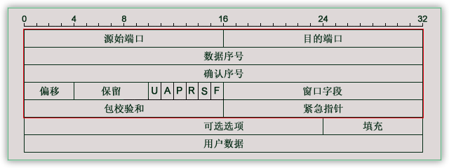
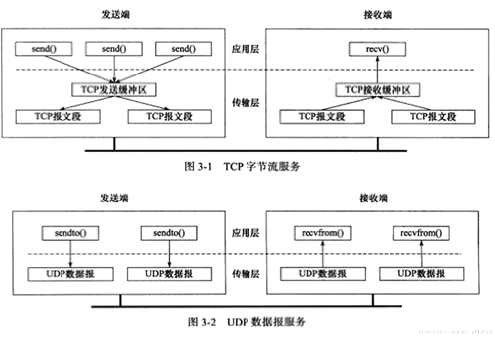

[TOC]


## ReadMe

tcp协议相关内容；


在IP基础上提供可靠的流式服务；

> 可靠性：ACK确认机制；


流式服务：数据没有明确的分割、send(), recv()调用次数没有必然的关系。

> send()只是将数据写到tcp send buffer, 然后tcp protocol将send buffer中的数据流打包成报文段发送出去；
> recv()只是从tcp recv buffer中进行数据的读取，recv buffer中的数据是由tcp protocol来进行填充的。

数据报服务：数据有明确分隔、sendto(), recvfrom()调用次数一致；

> sendto()直接将数据打包成报文段发送出去，因为没有udp send/recv buffer这一说。


https://blog.csdn.net/changyourmind/article/details/53127100

重传机制。


ACK

可以累计ack

> 收到报文1、2、3，那么只要ack 3那么就默认1,2也接收正常。

缓存乱序的包

> 收到报文1、3，那么不会丢弃3，然后等待2的到来；
> 如果一定时间内收不到2，则会丢弃3，而ack 1.
> 如果一定时间内收到2，则会ack 3.


## TCP Package

tcp的包长的像这样（一个刻度表示1个二进制位（比特））    



```bash
16srcPort, 16dstPort.
32seq.
32ack.
4offset, 6reserve, 1U,1A,1P,1R,1S,1F, 16winSize.
16checksum, 16urgentPointer.
24optional, 8fill.
transmitData.

1-1.源始端口16位，范围当然是0-65535啦。
1-2.目的端口，同上。
2-1.数据序号32位，TCP为发送的每个字节都编一个号码，这里存储当前数据包数据第一个字节的序号。
3-1.确认序号32位，为了安全，TCP告诉接受者希望他下次接到数据包的第一个字节的序号。
4-1.偏移4位，类似IP，表明数据距包头有多少个32位。
4-2.保留6位，未使用，应置零。
4-3.紧急比特URG—当URG＝1时，表明紧急指针字段有效。它告诉系统此报文段中有紧急数据，应尽快传送(相当于高优先级的数据)。
4-4.确认比特ACK—只有当ACK＝1时确认号字段才有效。当ACK＝0时，确认号无效。参考TCP三次握手
4-5. PSH 接收方应该尽快将这个报文段交给应用层。 
4-6.复位比特RST(Reset) —当RST＝1时，表明TCP连接中出现严重差错（如由于主机崩溃或其他原因），必须释放连接，然后再重新建立运输连接（重建连接）。参考TCP三次握手
4-7.同步比特SYN—同步比特SYN置为1，就表示这是一个连接请求或连接接受报文（发起一个连接）。参考TCP三次握手
4-8.终止比特FIN(FINal)—用来释放一个连接。当FIN＝1时，表明此报文段的发送端的数据已发送完毕，并要求释放运输连接。
4-9.窗口字段16位，窗口字段用来控制对方发送的数据量，单位为字节。TCP连接的一端根据设置的缓存空间大小确定自己的接收窗口大小，然后通知对方以确定对方的发送窗口的上限。
5-1.包校验和16位，包括首部和数据这两部分。在计算检验和时，要在TCP报文段的前面加上12字节的伪首部。
5-2.紧急指针16位，紧急指针指出在本报文段中的紧急数据的最后一个字节的序号。
6-1.可选选项24位，类似IP，是可选选项。
6-2.填充8位，使选项凑足32位。
7-1.用户数据……
```

**tcp的6个标志**
urg, ack, psh, rst, syn, fin.

16位窗口大小，**65535**.


## TCP Features

refer. https://blog.csdn.net/changyourmind/article/details/53127100


### Flow Control

流量控制是保证可靠性的一个重要措施，若无流控，可能会因接收缓冲区溢出而丢失大量数据，导致许多重传，造成网络拥塞恶性循环。主要解决“fast sender & slow receiver.”的问题！

TCP采用滑动窗口进行流量控制，<font color=red>由接收方控制发送方发送的数据量</font>。

------

Sliding Window

tcp是全双工协议，因为连接双方<font color=red>每端都维护着一个发送窗口、接收窗口</font>；

> **接收窗口由本地系统限制**；（协议、系统、应用、硬件）
> **发送窗口受限于对方的接收窗口**；


**发送端滑动窗口有如下概念**

对于TCP会话的发送方，任何时候在其发送缓存内的数据都可以分为4类，其中“**已经发送但还未收到对端ACK的**”和“**未发送但对端允许发送的**”这两部分数据称之为<font color=red>发送窗口</font>（中间两部分）

1. Sent and Acknowledged. 已经发送并得到对端ACK的；

   > 这些数据其它已经不在滑动窗口内了。
   > 只要发送端收到ack，那么序列号<=ACK的字节序都会被移出窗口，从而留出空间填入待发送的新数据。

2. Send But Not Yet Acknowledged. 已经发送但还未收到对端ACK的；

   > 这部分数据属于窗口内。

3. Not Sent, Recipient Ready to Receive.  未发送但对端允许发送的；

   > 这部分数据属于窗口内，等待发送的。 ---这个窗口叫<font color=red>可用窗口</font>。
   > 其大小由接收方告知（recipient win size - sent but not yet ack size），所以发送方应该尽快把这些数据发送出去。

4. Not Sent, Recipient Not Ready to Receive.  未发送且对端不允许发送；

   > 这部分数据不属于窗口内。


**接收端有如下概念**

对于TCP会话的接收方，在某一时刻在它的接收缓存内存在3种（由于ACK直接由TCP协议栈回复，默认无应用延迟，不存在“**已接收未回复ACK**”）。

1. 已接收
2. 未接收准备接收 ---称之为**接收窗口**
3. 未接收并未准备接收


### Congestion Control

本质上，网络上拥塞的原因就是**大家都想独享整个网络资源**。

对于TCP，端到端的流量控制必然会导致网络拥堵。

1. TCP只看到对端的接收空间的大小，而无法知道链路上的容量，只要双方的处理能力很强，那么就可以以很大的速率发包，于是链路很快出现拥堵，进而引起大量的丢包，丢包又引发发送端的重传风暴，进一步加剧链路拥塞。
2. 链路上的转发节点的转发性能，例如路由器，再好的路由器只要接入网络，总是会拉低网络的总带宽，如果在路由器节点上出现处理瓶颈，那么就很容易出现拥塞。

由于TCP看不到网络的状况，那么拥塞控制是必须的并且需要采用试探性的方式来控制拥塞，于是拥塞控制要完成两个任务：(1)**公平性**；(2) **拥塞过后的恢复**。现在应用最广的应该是Reno算法。


TCP的拥塞控制主要原理依赖于一个**拥塞窗口（cwnd, Congestion Window）**来控制，我们知道有一个接收端通告的接收窗口（rwnd）用于流量控制；加上拥塞控制后，发送端真正的发送窗口=**min(rwnd, cwnd)**。关于cwnd的单位，在TCP中是以字节来做单位的，我们假设TCP每次传输都是按照MSS大小来发送数据，因此你可以认为cwnd按照数据包个数来做单位也可以理解，下面Reno算法中如果没有特别说明是字节，那么cwnd增加1也就是相当于字节数增加1个MSS大小。


Reno算法（RFC5681）的拥塞控制由4个核心算法组成：

1. 慢启动（Slow Start）
2. 拥塞避免（Congestion voidance）
3. 快速重传 （Fast Retransmit）
4. 快速恢复（Fast Recovery）

总体来说应该是这样的：

```cpp
/* init the cwnd, threshold. */
int cwnd = 3; //according to rfc5681.
int threshold = ??; //according to what ???


/* cwnd increase. */
if (cwnd < threshold) {
    slowStart(); //慢启动阶段，cwnd指数增长
}
if (cwnd >= threshold) {
    congestionVoidance(); //拥塞避免阶段，cwnd线性增长
}


/* retransmit occured(timeout/3DupACK) when cwnd increase. */
if (timeout) {
    threshold = cwnd/2;
    cwnd = 1; //1 MSS.
    slowStart();
}
if (3DupAck) {
    fastRetransmit() {
        threshold = cwnd/2;
        cwnd = threshold;
        fastRecovery() {
            cwnd = threshold + 3; //定律：包守恒。
            retransmit(package);
            if (rcvDupAck) { //再次收到dup ack.
                cwnd++;
            }
            if (recNonDupAck) { //收到新的ack.
                cwnd = threshold;
                congestionVoidance();
            }
        }
    }
}
```


------

**Slow Start**

慢启动体现了一个试探的过程，刚接入网络的时候先发包慢点，探测一下网络情况，然后在慢慢提速。

1. 连接建好的开始先初始化cwnd = N，表明可以传N个MSS大小的数据

   > 根据RFC5681，如果MSS > 2190 bytes，则N = 2；如果MSS < 1095 bytes，则N = 4；如果2190 bytes >= MSS >= 1095 bytes，则N = 3。一篇Google的论文《*An Argument for Increasing TCP’s Initial Congestion Window*》建议把cwnd初始化成了10个MSS。Linux 3.0后采用了这篇论文的建议。

2. 每当收到一个ACK，++cwnd; 呈线性上升

3. 每当过了一个RTT，cwnd = cwnd*2; 呈指数让升

4. 还有一个慢启动门限ssthresh（slow start threshold），是一个上限，当cwnd >= ssthresh时，就会进入”拥塞避免算法-Congestion Avoidance”


--------

**Congestion Voidance**

慢启动的时候cwnd是指数快速增长的，但是增长是有个门限ssthresh（一般来说大多数的实现ssthresh的值是65535字节）的，到达门限后进入拥塞避免阶段。

在进入拥塞避免阶段后，cwnd值变化算法如下：

1. 每收到一个ACK，调整cwnd为(cwnd + 1/cwnd)*MSS个字节 
2. 每经过一个RTT的时长，cwnd增加1个MSS大小。


TCP是看不到网络的整体状况的，那么TCP认为网络拥塞的主要依据是它重传了报文段。前面我们说过TCP的重传分两种情况：

1. 出现RTO超时，重传数据包。这种情况下，TCP就认为出现拥塞的可能性就很大，于是它反应非常’强烈’。
   1. 调整门限ssthresh的值为当前cwnd值的1/2。 
   2. reset自己的cwnd值为1。
   3. 然后重新进入慢启动过程。
2. 在RTO超时前，收到3个duplicate ACK进行重传数据包。这种情况下，收到3个冗余ACK后说明确实有中间的分段丢失，然而后面的分段确实到达了接收端，因为这样才会发送冗余ACK，这一般是路由器故障或者轻度拥塞或者其它不太严重的原因引起的，因此此时拥塞窗口缩小的幅度就不能太大，此时进入**快速重传**。


-----------

**Fast Retransmit**

快速重传Todo.

1. 调整门限ssthresh的值为当前cwnd值的1/2； 

2. 将cwnd值设置为新的ssthresh的值； 

3. 重新进入~~拥塞避免阶段~~，快速恢复阶段。

   > 在快速重传的时候，一般网络只是**轻微拥堵**，在进入拥塞避免后，cwnd恢复的比较慢。所以，“快速恢复”算法被添加进来。


--------

**Fast Recovery**

快速恢复的思想是“数据包守恒”原则，即带宽不变的情况下，在网络同一时刻能容纳数据包数量是恒定的。当“老”数据包离开了网络后，就能向网络中发送一个“新”的数据包。既然已经收到了3个冗余ACK，说明有三个数据分段已经到达了接收端，既然三个分段已经离开了网络，那么就是说可以在发送3个分段了。于是只要发送方收到一个冗余的ACK，于是cwnd加1个MSS。快速恢复步骤如下（在进入快速恢复前，cwnd 和 sshthresh已被更新为：sshthresh = cwnd /2，cwnd = sshthresh）：


快速恢复Todo. （此前**sshthreshNew** = cwnd /2，**cwnd** = sshthresh）

1. 把cwnd设置为ssthresh的值加3，重传Duplicated ACKs指定的数据包
2. 如果再收到 duplicated Acks，那么cwnd = cwnd +1
3. 如果收到新的ACK，而非duplicated Ack，那么将cwnd重新设置为**sshthreshNew**的值。然后进入拥塞避免状态。


### ACK

ACK的确认号，是确认按序收到的最后一个字节序，对于乱序到来的TCP分段，接收端会回复相同的ACK分段，只确认按序到达的最后一个TCP分段。

TCP协议不对ACK进行ACK，RFC建议最多等待2个包的积累确认，这样能够及时通知对端Peer我这边的接收情况。


#### Delay ACK

按照TCP协议，确认机制是累积的，也就是确认号X确认指示的是**所有X之前但不包括X的**数据已经收到了。

确认号（ACK）本身就是不含数据的分段，因此大量的确认号消耗了大量的带宽，网络的利用率就会下降。
为缓解这个问题，RFC建议了一种延迟的ACK，也就是说，ACK在收到数据后并不马上回复，而是延迟一段可以接受的时间，延迟一段时间的**目的是看能不能和接收方要发给发送方的数据一起回去**，因为TCP协议头中总是包含确认号的，如果能的话，就将数据一起捎带回去，这样网络利用率就提高了。


Linux实现中，有延迟ACK和快速ACK，并根据当前的包的收发情况来在这两种ACK中切换。
一般情况下，ACK并不会对网络性能有太大的影响，延迟ACK能减少发送的分段从而节省带宽，而快速ACK能及时通知发送方丢包，避免滑动窗口停等，提升吞吐率。


#### Duplicate Acknowledgment

冗余ACK、重复ACK。

通常一个ACK被称为冗余ACK，要同时满足下面几个条件（对于SACK，那么根据SACK的一些信息来进一步判断）：

1. 接收ACK的那端已经发出了一些还没被ACK的数据包 
2. 该ACK没有捎带data。
3. 该ACK的SYN和FIN位都是off的，也就是既不是SYN包的ACK也不是FIN包的ACK。 
4. 该ACK的确认号等于接收ACK那端已经收到的ACK的最大确认号 
5. 该ACK通知的窗口等接收该ACK的那端上一个收到的ACK的窗口


### Retransmission

概念
RTO. Retransmission TimeOut
RTT. Round Trip Time


----

**TCP的重传机制**

解决什么时候重传、重传哪些数据这两个问题。
如问题，发送端发送1、2、3、**4**、5、**6**、7、8这几个包之后，中途丢失了4、6两包，收到ACK 3之后，触发超时，此时应该重传4，或者重传4、5、6、7、8？？


**什么时候触发重传？**

时机一：超时重传（时间驱动）

> 重传定时器超时的时候进行数据的重传。

时机二：快速重传（数据驱动，即当前的网络状态驱动）

> 在连续收到3次相同确认号的ACK，就进行重传。
> 这个算法基于假设：连续收到3个相同的ACK，那么说明当前的网络状况变好了，可以重传丢失的包了。


**重传哪些数据？**

RFC2018提出了Selective Acknowledgment（SACK，选择确认）机制，SACK是TCP的扩展选项，包括

1. SACK允许选项（Kind=4,Length=2，选项只允许在有SYN标志的TCP包中）。
2. SACK信息选项（Kind=5,Length）。

RFC2883对SACK进行了扩展，提出了D-SACK，也就是利用第一块SACK数据中描述重复接收的不连续数据块的序列号参数，其他SACK数据则描述其他正常接收到的不连续数据。这样发送方利用第一块SACK，可以发现数据段被网络复制、错误重传、ACK丢失引起的重传、重传超时等异常的网络状况，使得发送端能更好调整自己的重传策略。


------------

**RTO的计算**

原则上RTO不宜过大（收发包效率低）、过小（浪费带宽资源、且效率低）、并且应该随网络状态进行适配。

> 获取当前网络状况：一个数据包从发出去到回来的时间RTT——Round Trip Time。
> 那么根据这个RTT我们就可以方便设置TimeOut——RTO（Retransmission TimeOut）了。（间接算出）


采取**每一个TCP连接单一超时定时器的设计**则成了一个默认的选择，并且RFC2988给出了每连接单一定时器的设计建议算法规则：

1. 每一次一个包含数据的包被发送（<font color=red>包括重发</font>），如果还没开启重传定时器，则开启它，使得它在RTO秒之后超时（按照当前的RTO值）。
2. 当接收到一个ACK确认一个新的数据，如果所有发出数据都被确认了，关闭重传定时器。
3. 当接收到一个ACK确认一个新的数据，还有数据在传输，也就是还有没被确认的数据，重新启动重传定时器，使得它在RTO秒之后超时（按照当前的RTO值）。
4. 当重传定时器超时后，依次做下列3件事情：
   1. 重传最早的尚未被TCP接收方ACK的数据包；
   2. 重新设置RTO为RTO*2（“还原定时器”），但是新RTO不应该超过RTO的上限（RTO有个上限值，这个上限值最少为60s）；
   3. 重启重传定时器。


为什么不是一个数据包一个定时器呢？

> 每一个数据包维护一个定时器，在这个定时器到期前没收到确认，则进行重传。这种在设计理论上是很合理的，但是实现上，这种方案将会有非常多的定时器，会带来巨大内存开销和调度开销。


## TCP Timer

refer. https://blog.csdn.net/woay2008/article/details/79649931

TCP为每条连接建立了七个定时器，如下：


------

**连接建立(connection establishment)定时器**

在发送SYN报文段建立一条新连接时启动。如果没有在<font color=red>75s</font>内收到响应，连接建立将中止。


-------

**重传(retransmission)定时器**

在TCP发送数据时设定。如果定时器已超时而对端的确认还未到达，TCP将重传数据。

重传定时器的值RTO是动态计算的，取决于TCP为该连接测量的RTT和该报文段已被重传的次数。


----

**延迟ACK(delayed ACK)定时器**

在TCP收到必须被确认但无需马上发出确认的数据时设定。TCP等待<font color=red>200ms</font>后发送确认响应。如果，在这200ms内，有数据要在该连接上发送，延迟的ACK响应就可随着数据一起发送回对端，称为“捎带确认”。


--------

**持续(persist)定时器**

在连接对端通告接收窗口为0，阻止TCP继续发送数据时设定。由于连接对端发送的窗口通告不可靠(只有数据才会被确认，ACK不会被确认)，允许TCP继续发送数据的后续窗口更新有可能丢失。因此，如果TCP有数据要发送，但对端通告接收窗口为0，则持续定时器启动，超时后向对端发送1字节的数据，判定对端接收窗口是否已打开。与重传定时器类似，持续定时器的值也是动态计算的，取决于连接的往返时间，在5秒到60秒之间取值。


---

**保活(keepalive)定时器**

当应用进程设置了socket的SO_KEEPALIVE选项时生效。如果连接的连续空闲时间超过<font color=red>2h</font>，保活定时器超时，向对端发送保活探测报文段，强迫对端响应。如果收到了期待的响应，TCP可确定对端主机工作正常，在该连接再次空闲超过2小时之前，TCP不会再进行保活测试。如果收到的是其他响应，TCP可确定对端主机已重启。如果连续若干次保活测试都未收到响应，TCP就假定对端主机已崩溃，尽管它无法区分是主机故障(例如，系统崩溃而尚未重启)，还是连接故障(例如，中间的路由器发生故障或电话线断了)。


---

**FIN_WAIT_2定时器**

当某个连接从FIN_WAIT_1状态变迁到FIN_WAIT_2状态，并且不能再接收任何新数据时(意味着应用进程调用了close，而非shutdown，没有使用TCP的半关闭功能)，FIN_WAIT_2定时器启动，设为<font color=red>10min</font>。定时器超时后，重新设为<font color=red>75s</font>，第二次超时后连接被关闭。加入这个定时器的目的是为了避免如果对端一直不发送FIN，某个连接会永远滞留在FIN_WAIT_2状态。


----------

**TIME_WAIT定时器**

一般也称为2MSL定时器。2MSL指两倍的MSL，MSL指的是最大报文段生存时间。当连接转移到TIME_WAIT状态，即连接主动关闭时，定时器启动。连接进入TIME_WAIT状态时，RFC793指出该定时器设定为<font color=red>2min</font>(Net/3选用30秒的MSL，通常为30s、或者1min、或者2min)，超时后，TCP相关的资源被释放，端口号可重新使用。

*这个时间好像没有内核开关提供，但能用so_linger选项来进行间接的设置*。 ---rabin.


## Stick Package

引言
UDP协议的保护消息边界使得每一个消息都是独立的。client调用多少次send，server端就需要对应次数的recv方可把数据全部读取完。
TCP的流传输把数据当作一串数据流，他不认为数据是一个一个的消息。




所以：**TCP粘包是指发送方发送的若干包数据到接收方接收时粘成一包，从接收缓冲区看，后一包数据的头紧接着前一包数据的尾。**
粘包只会发生在TCP连接中，UDP是不会有的。
TCP连接中如果只发送数据无结构（如文件传输，这样发送方只管发送，接收方只管接收存储就ok的）不用考虑粘包。


**Stick Package产生的原因？**
有可能是由发送方造成；

> 优化方法（Nagle算法），将多次间隔较小、数据量小的数据，合并成一个大的数据块，然后进行封包。这样，接收端，就难于分辨出来了，必须提供科学的拆包机制。
> 如果发送的数据过大，超过了MSS的大小，tcp会对数据进行分段发送，此时也不可能一次性将数据发送完毕。

也可能由接收方造成。

> 接收方不及时接收缓冲区的包，造成多个包接收。


**如何解决Stick Package问题？？**
1、对于发送方引起的粘包现象，用户可通过编程设置来避免，TCP提供了强制数据立即传送的操作指令push，TCP软件收到该操作指令后，就立即将本段数据发送出去，而不必等待发送缓冲区满；（关闭了优化算法、降低了小包的网络发送效率，不建议）
2、对于接收方引起的粘包，则可通过优化程序设计、精简接收进程工作量、提高接收进程优先级等措施，使其及时接收数据，从而尽量避免出现粘包现象；（只能减少概率，治标不治本）
3、由接收方控制，将一包数据按结构字段，人为控制分多次接收，然后合并，通过这种手段来避免粘包。（降低了APP的效率）

 


## Others


拥塞 vs 流控

https://blog.csdn.net/qq_20233867/article/details/78255072

**拥塞控制**的**任务是确保子网能够承载所到达的流量**。这**是一个全局性问**题，涉及到各方面的行为，包括所有的主机、所有的路由器、路由器内部的存储转发处理过程，以及所有可能会削弱子网承载容量的其它因素。

**流控制只与特定的发送方和特定的接收方之间的点到点流量有关**。它的**任务是，确保一个快速的发送方不会持续地以超过接收方吸收能力的速率传输数据。**流控制通常涉及到的做法是，接收方向发送方提供某种直接的反馈，以便告诉发送方别人一端的情形到底怎么样。

https://www.cnblogs.com/wuchanming/p/4422779.html


