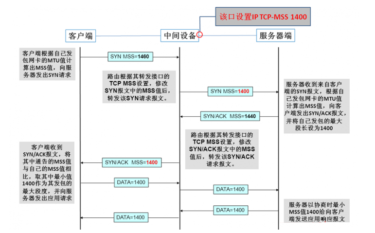
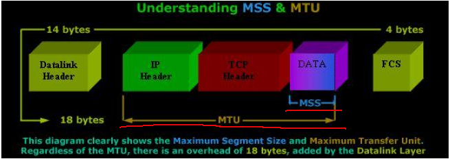

[TOC]


## ReadMe

tcp协议相关内容；


## TCP Package

tcp的包长的像这样（一个刻度表示1个二进制位（比特））    


```bash
1-1.源始端口16位，范围当然是0-65535啦。
1-2.目的端口，同上。
2-1.数据序号32位，TCP为发送的每个字节都编一个号码，这里存储当前数据包数据第一个字节的序号。
3-1.确认序号32位，为了安全，TCP告诉接受者希望他下次接到数据包的第一个字节的序号。
4-1.偏移4位，类似IP，表明数据距包头有多少个32位。
4-2.保留6位，未使用，应置零。
4-3.紧急比特URG—当URG＝1时，表明紧急指针字段有效。它告诉系统此报文段中有紧急数据，应尽快传送(相当于高优先级的数据)。
4-4.确认比特ACK—只有当ACK＝1时确认号字段才有效。当ACK＝0时，确认号无效。参考TCP三次握手
4-5. PSH 接收方应该尽快将这个报文段交给应用层。 
4-6.复位比特RST(Reset) —当RST＝1时，表明TCP连接中出现严重差错（如由于主机崩溃或其他原因），必须释放连接，然后再重新建立运输连接（重建连接）。参考TCP三次握手
4-7.同步比特SYN—同步比特SYN置为1，就表示这是一个连接请求或连接接受报文（发起一个连接）。参考TCP三次握手
4-8.终止比特FIN(FINal)—用来释放一个连接。当FIN＝1时，表明此报文段的发送端的数据已发送完毕，并要求释放运输连接。
4-9.窗口字段16位，窗口字段用来控制对方发送的数据量，单位为字节。TCP连接的一端根据设置的缓存空间大小确定自己的接收窗口大小，然后通知对方以确定对方的发送窗口的上限。
5-1.包校验和16位，包括首部和数据这两部分。在计算检验和时，要在TCP报文段的前面加上12字节的伪首部。
5-2.紧急指针16位，紧急指针指出在本报文段中的紧急数据的最后一个字节的序号。
6-1.可选选项24位，类似IP，是可选选项。
6-2.填充8位，使选项凑足32位。
7-1.用户数据……
```


## Tcp Connection

### Connection building & free

问题：为什么在TCP协议里，建立连接是三次握手，而关闭连接却是四次握手呢?
> 因为当处于LISTEN 状态的服务器端SOCKET当收到SYN报文(客户端希望新建一个TCP连接)后，它可以把ACK(应答作用)和SYN(同步作用)放在同一个报文里来发送给客户端。  
>
>> 这是不是捎带确认？
>
> 但在关闭TCP连接时，当收到对方的FIN报文时，对方仅仅表示对方没有数据发送给你了，但未必你的所有数据都已经全部发送给了对方，所以你大可不必马上关闭SOCKET(发送一个FIN报文)，等你发送完剩余的数据给对方之后，再发送FIN报文给对方来表示你同意现在关闭连接了，所以通常情况下，这里的ACK报文和FIN报文都是分开发送的。 


#### connection building


#### Connection Free


主动关闭吃time-wait  
被动关闭吃close-wait

问题：为什么TIME_WAIT 状态还需要等2*MSL秒之后才能返回到CLOSED 状态呢? 
> 因为虽然双方都同意关闭连接了，而且握手的4个报文也都发送完毕，按理可以直接回到CLOSED 状态(就好比从SYN_SENT 状态到ESTABLISH 状态那样)，但是我们必须假想网络是不可靠的，你无法保证你(客户端)最后发送的ACK报文一定会被对方收到，就是说对方处于LAST_ACK 状态下的SOCKET可能会因为超时未收到ACK报文，而重发FIN报文，所以这个TIME_WAIT 状态的作用就是用来重发可能丢失的ACK报文。

问题：关闭TCP连接一定需要4次挥手吗? 
> 不一定，4次挥手关闭TCP连接是最安全的做法。但在有些时候，我们不喜欢TIME_WAIT 状态(如当MSL数值设置过大导致服务器端有太多TIME_WAIT状态的TCP连接，减少这些条目数可以更快地关闭连接，为新连接释放更多资源)，这时我们可以通过设置SOCKET变量的SO_LINGER标志来避免SOCKET在close()之后进入TIME_WAIT状态，这时将通过发送RST强制终止TCP连接(取代正常的TCP四次握手的终止方式)。但这并不是一个很好的主意，TIME_WAIT 对于我们来说往往是有利的。


问题：服务端为了解决这个TIME_WAIT问题，可用哪些办法？
> 保证由客户端主动发起关闭（如apache中的，KeepAlive On   #表示服务器端不会主动关闭链接）。     
> 关闭的时候使用RST的方式。    
> 对处于TIME_WAIT状态的TCP允许重用。   


### Maximal Segment Size

用于保证TCP每次传输的数据都能被控制在一个合理的范围内，避免IP分片的发生，增大传输效率，最大化利用资源。
> 防止传输数据过小造成资源浪费。比如发送数据每次都是1Byte，在每一层都会添加首部（20Byte的TCP首部和20Byte的IP首部），之后才会完成发送。也就是说传送的41Byte中，只有1Byte是有效数据，这明显造成了资源的浪费。  
> 防止传输数据过大造成传输效率降低。如果发送的数据过大，超过了MTU的值，那么在IP层就会出现分片现象，而接收方也要耗费更多的资源和时间来处理分片，如果在传输过程中发生丢片，也会进一步增大网络开销。

MSS是在建立连接时协商出来的（只会出现在syn包中），如下：   



问题：MTU MSS？
> MTU 即Maximal Transmission Unit，最大传输单元，是指网络接口层中由于受传输介质的物理特性制约一次可以传送的最大字节数，如以太网中MTU为1500Byte。MTU可以由人为修改，从而达到最优网络传输效率。  
> MSS 即Maximal Segment Size，最大段长度，是传输层中TCP报文段中数据段的最大长度，默认是536Byte。

参考（mtu=ipHead+tcpHead+mss）：


### Rules About Syn Rst Ack

- 关闭端口
  - 收到SYN/FIN，丢弃并向源RST；
  - 收到RST，丢弃；
- 监听端口
  - 收到不包含SYN的数据包、丢弃；
  - 收到RST，丢弃；
  - 收到FIN，丢弃；
  - 收到包含ACK的数据包，丢弃并向源RST；
- 打开端口

我理解是后续还有可能收到包，但不是我（端口）想收的，那么就要丢弃收到包并向源发RST；


## Flow Control

流量控制也是保证可靠性的一个重要措施，若无流控，可能会因接收缓冲区溢出而丢失大量数据，导致许多重传，造成网络拥塞恶性循环。

TCP采用可变窗口进行流量控制，由接收方控制发送方发送的数据量。


## Stick Package

引言
UDP协议的保护消息边界使得每一个消息都是独立的。client调用多少次send，server端就需要对应次数的recv方可把数据全部读取完。
TCP的流传输把数据当作一串数据流，他不认为数据是一个一个的消息。


所以：**TCP粘包是指发送方发送的若干包数据到接收方接收时粘成一包，从接收缓冲区看，后一包数据的头紧接着前一包数据的尾。**
粘包只会发生在TCP连接中，UDP是不会有的。
TCP连接中如果只发送数据无结构（如文件传输，这样发送方只管发送，接收方只管接收存储就ok的）不用考虑粘包。


**Stick Package产生的原因？**
有可能是由发送方造成；

> 优化方法（Nagle算法），将多次间隔较小、数据量小的数据，合并成一个大的数据块，然后进行封包。这样，接收端，就难于分辨出来了，必须提供科学的拆包机制。
> 如果发送的数据过大，超过了MSS的大小，tcp会对数据进行分段发送，此时也不可能一次性将数据发送完毕。

也可能由接收方造成。

> 接收方不及时接收缓冲区的包，造成多个包接收。


**如何解决Stick Package问题？？**
1、对于发送方引起的粘包现象，用户可通过编程设置来避免，TCP提供了强制数据立即传送的操作指令push，TCP软件收到该操作指令后，就立即将本段数据发送出去，而不必等待发送缓冲区满；（关闭了优化算法、降低了小包的网络发送效率，不建议）
2、对于接收方引起的粘包，则可通过优化程序设计、精简接收进程工作量、提高接收进程优先级等措施，使其及时接收数据，从而尽量避免出现粘包现象；（只能减少概率，治标不治本）
3、由接收方控制，将一包数据按结构字段，人为控制分多次接收，然后合并，通过这种手段来避免粘包。（降低了APP的效率）

 


## HalfConnection & SYN Flood

### Half Connection

顾名思义就是还没有完成三次握手建立连接。

具体是指服务端在收到客户端的SYN包后，会据此生成一个半连接的对象，并将其存储在一个半连接队列(SYN Queue)中进行维护。一旦收到客户端的ACK包后会将该对象从半连接队列(SYN Queue)转移到已连接队列(Accept Queue)中等待accept系统调用。一经accept调用，数据的传输和接收才会正式开始。队列肯定是不能无限长的，因为每个对象都会占据存储资源。


### SYN FLood

利用了半连接队列的长度限制来完成攻击的。

攻击策略为伪造大量SYN包发送给服务端，但不返回ACK包，导致服务端半连接队列被迅速占满，正常的连接被抛弃。服务端会有大量处于SYN_RECV状态的连接，其会尝试重发ACK包给实际不存在的客户端，导致CPU满负载，内存耗尽，从而达到攻击效果。


## Tcp In Linux Kernel

### Queue

#### SYN Queue

半连接队列，用来保存处于SYN_SENT和SYN_RECV状态的请求。

设置点
- /proc/sys/net/ipv4/tcp_max_syn_backlog = 1024


#### Accept Queue

来保存处于established状态，但是应用层没有调用accept取走的请求。


设置点（取最小值）  
- listen(fd, backlog)  
- /proc/sys/net/core/somaxconn = 128  


### Switch in linux

#### About syn_recv

net.ipv4.tcp_synack_retries = 5
server决定内核在放弃连接之前所送出的 SYN+ACK （连接第2步）数目。

---

net.ipv4.tcp_syncookies = 1
防止SYN Flood攻击。

原理是：在TCP服务器收到TCP SYN包并返回TCP SYN+ACK包时，不分配一个专门的数据区，而是根据这个SYN包计算出一个cookie值。在收到TCP ACK包时，TCP服务器在根据那个cookie值检查这个TCP ACK包的合法性。如果合法，再分配专门的数据区进行处理未来的TCP连接。


#### About time_wait

net.ipv4.tcp_fin_timeout = 60    
减小fin_timeout（单位为s），减少TIME_WAIT连接数量。

net.ipv4.tcp_tw_reuse = 0  
连接重用功能：允许将TIME-WAIT sockets重新用于新的TCP连接（连接重用），默认为0，表示关闭；  

net.ipv4.tcp_tw_recycle = 0 
连接快速回收功能：表示开启TCP连接中TIME-WAIT sockets的快速回收，默认为0，表示关闭。


#### About Connection Num

- /proc/sys/net/ipv4/tcp_max_syn_backlog = 1024
- /proc/sys/net/core/somaxconn = 128  


