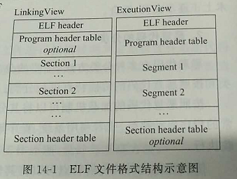

[TOC]


## 恶意代码

定义很多，但大概如下：
> 凡是人为编制的，干扰计算机正常运行并造成计算机软硬件故障，甚至破坏数据的计算机程序或指令集合。
>> 主要包括病毒、蠕虫、木马等。

病毒特点
> 能自我复制、需要文件宿主。

蠕虫特点
> 不需要文件宿主，通过网络复制。

木马特点
> 伪装欺骗的手段促使用户激活自身，不具备复制、传播功能。（宿主机可被远程控制来干其它业务，如下载恶意程序，攻击之类的）   

僵尸网络 Botnet 
> 是指采用一种或多种传播手段，将大量主机感染bot程序（僵尸程序）病毒，从而在控制者和被感染主机之间所形成的一个可一对多控制的网络。


## 可执行文件
### ELF文件
可从装载、连接两个角度来对elf文件进行分析。   


```cpp
//refer /usr/include/elf.h
typedef uint16_t Elf32_Half;
typedef uint32_t Elf32_Word;
typedef uint32_t Elf32_Addr;
typedef uint32_t Elf32_Off;

typedef struct
{ 
    unsigned char e_ident[EI_NIDENT]; /* Magic number and other info */
    Elf32_Half    e_type;         /* Object file type，1为重定位文件（连接）、2可执行文件（装载）、3共享动态库（装载）、4coredump文件*/
    Elf32_Half    e_machine;      /* Architecture */
    Elf32_Word    e_version;      /* Object file version */
    Elf32_Addr    e_entry;        /* Entry point virtual address */
    Elf32_Off e_phoff;        /* Program header table file offset */
    Elf32_Off e_shoff;        /* Section header table file offset */
    Elf32_Word    e_flags;        /* Processor-specific flags */
    Elf32_Half    e_ehsize;       /* ELF header size in bytes */
    Elf32_Half    e_phentsize;        /* Program header table entry size */
    Elf32_Half    e_phnum;        /* Program header table entry count */
    Elf32_Half    e_shentsize;        /* Section header table entry size */
    Elf32_Half    e_shnum;        /* Section header table entry count */
    Elf32_Half    e_shstrndx;     /* Section header string table index */
} Elf32_Ehdr;
```

### PE文件


## 恶意代码检测技术与发展趋势
恶意代码的检测技术有多种分类方法，便常用的还是按照部署方式、功能、检测数据类型分类。

### 恶意代码检测部署方式


### 恶意代码检测技术功能分类


### 恶意代码检测数据类型分析


### 现有的检测检测技术缺陷及未来发展趋势


## 开源恶意代码检测系统Clam AntiVirus

