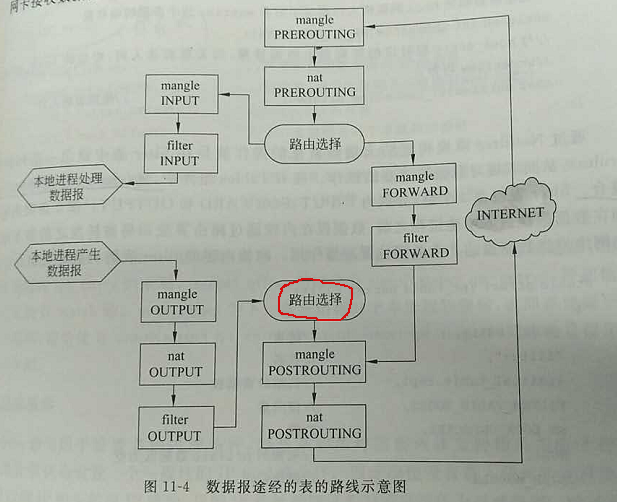

[TOC]


# ReadMe

iptables是Linux下 防火墙 + NAT 工具；

> iptables操作的是2.4以上内核的netfilter。（用户态除了iptables(ip包)，还有 arptables(arp包), ebtables(以太网帧)）  
> 其功能与安全性远远比其前辈ipfwadm,ipchains强大，iptables大致是工作在OSI七层的二、三、四层。  
> Filter表定义实现了 防火墙 的功能；  

 IP6Tables, OPTables, EBTables


# netfilter & hook

netfilter检查点   


iptable在netfilter hook点上注册的表  
  

表 + 链 + 规则 = 各种iptables策略


## tables, chains

- filter表（过滤功能）
	- INPUT  
	- FORWARD  
	- OUTPUT  

- nat表（地址转换） 
	- PREROUTING  
	- INPUT  
	- OUTPUT  
	- POSTROUTING
  
- mangle表（修改数据包头信息） 
	- PREROUTING  
	- INPUT  
	- OUTPUT  
	- POSTROUTING

- raw表（数据包跟踪）
	- PREROUTING   
	- OUTPUT  

- security
	- INPUT
	- FORWARD
	- OUTPUT


## rules

- 规则的操作
> 删除 -D、插入 -I、追加 -A、修改 -R、查看 -L、默认 -P、清空 -F；

- 匹配的条件 
> -o,-i 流出、流入的接口  
> -s,-d 来源、目标ip1-ip2 （注意-的使用）  
> --sport/dport port1:port2 （注意:的使用）  
> -p 协议  
> -m mac/multiport/state/limit 各种附加模块…  
>
> > 	-m state --state NEW   
> > 	-m limit --limit 50/second --limit-burst 100  

- 匹配的动作 -j
> ACCEPT、   
> REJECT（拒绝数据包通过，必要时会给数据发送端一个响应的信息）  
> DROP（直接丢弃数据包，不给任何回应信息）  
> LOG、INPUT、OUTPUT  
> DNAT --to ip:port、--to-destination ip  
> > 外网访问内网服务；（换成内部ip）   
> > 一般按端口来转； -p tcp –dport 80 –j DNAT –to ip   
> > 只能在prerouting, output处做DNAT  
>
> SNAT
> > 内网访问外网服务；（换成外部ip）   
> > 一般按网络来转（postrouting处）； -SNAT ip/24
>
> MASQUERADE
>
> > 地址伪装，对SNAT的补充，动态源地址转换；（出口Ip不固定的场景）MASQUERADE是用发送数据的网卡上的IP来替换源IP，因此，对于那些IP不固定的场合，比如拨号网络或者通过dhcp分配IP的情况下，就得用MASQUERADE。

```sh
root@Gateway:~# iptables -nvL -t nat 
Chain PREROUTING (policy ACCEPT 434K packets, 57M bytes)
 pkts bytes target     prot opt in     out     source               destination         
    2   104 DNAT       tcp  --  *      *       0.0.0.0/0            172.22.78.100        tcp dpt:13389 to:172.18.0.1:3389
   17   884 DNAT       tcp  --  *      *       0.0.0.0/0            172.22.78.100        tcp dpt:19923 to:172.16.200.210:22
   14   728 DNAT       tcp  --  *      *       0.0.0.0/0            172.22.78.100        tcp dpt:19922 to:172.16.200.240:22
13361  694K DNAT       tcp  --  *      *       0.0.0.0/0            172.22.78.100        tcp dpt:19924 to:172.16.200.150:22
   13   676 DNAT       tcp  --  *      *       0.0.0.0/0            172.22.78.100        tcp dpt:13390 to:172.18.0.150:3389
   87  4512 DNAT       tcp  --  *      *       0.0.0.0/0            172.22.78.100        tcp dpt:19926 to:172.16.200.170:22
    1    52 DNAT       tcp  --  *      *       0.0.0.0/0            172.22.78.100        tcp dpt:18801 to:172.16.1.1:22
  892 46076 DNAT       tcp  --  *      *       0.0.0.0/0            172.22.78.100        tcp dpt:19925 to:172.16.200.160:22
    0     0 DNAT       tcp  --  *      *       0.0.0.0/0            172.22.78.100        tcp dpt:18802 to:172.16.1.2:22

Chain INPUT (policy ACCEPT 19731 packets, 3402K bytes)
 pkts bytes target     prot opt in     out     source               destination         

Chain OUTPUT (policy ACCEPT 1118 packets, 68210 bytes)
 pkts bytes target     prot opt in     out     source               destination         

Chain POSTROUTING (policy ACCEPT 21 packets, 1204 bytes)
 pkts bytes target     prot opt in     out     source               destination         
4190K  278M MASQUERADE  all  --  *      eth0    0.0.0.0/0            0.0.0.0/0   #伪装所有的包，的snat为eth0的ip
```


# 场景

## 开启路由转发

```bash
[root@centos7~]#vim /etc/sysctl.conf
net.ipv4.ip_forward=1
[root@centos7~]#sysctl -p  使配置文件生效
net.ipv4.ip_forward = 1
```


## 端口转发

```bash
iptables -t nat -A PREROUTING -p tcp --dport 7979 -j REDIRECT --to-ports 8080
```


## 外网访问内网80端口？

需要注意三点：

- 入向时fw的公网ip,port转内网http服务器的ip,port;
- 转发规则源80目标任意port的处理; 
- 出向时将内网http服务器的ip,port转成dnat之前的目标ip,port；

```bash
-A FORWARD 1 -m state --state ESTABLISHED,RELATED -j ACCEPT ##老连接都能转发（依赖state模块）；
-A PREROUTING -d 1.1.1.1 -p tcp -m tcp --dport 8080 -j DNAT --to-destination 172.22.22.22:80 ##DNAT；
-A POSTROUTING -j MASQUERADE  ##源地址伪装成发送网卡的地址；
```

其中只做了dnat，没有做snat或者masquerade数据可以通吗？


## nat postroting加不了规则

加规则`iptables -t nat -A POSTROUTING -p tcp --dport 8443 -j DROP`,不行？ ----后面加manle表上了，一样的效果！

> The "nat" table is not intended for filtering the use of drop is therefore inhibited


## 双出口的dnat, snat怎么做？

即内部网络出口有联通、电信两个出口公网ip，怎么配置？


#  IP6Tables, OPTables, EBTables

ebtables
https://blog.csdn.net/wuruixn/article/details/8107862
ebtables即是以太网桥防火墙，以太网桥工作在数据链路层，ebtables来过滤数据链路层数据包。
ebtables 是主要是控制数据链路层的,在内核中，ebtables 的数据截获点比 iptables 更“靠前”，它获得的数据更“原始”，ebtables 多用于桥模式，比如控制 VLAN ID 等。 


