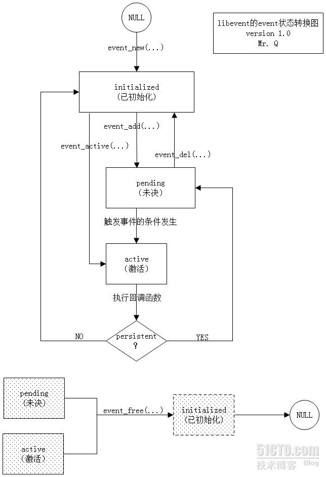

[toc]

## ReadMe
查看event相关的信息，包含event定义、event的操作函数event\_xx系列函数。

## Event Type
如下是event的类型
```cpp
// 定时事件
// 不需要传此标记给event_new/assign()来获得一个超时事件；
#define EV_TIMEOUT	0x01

// io事件，等待fd可读
#define EV_READ		0x02

// io事件，等待fd可写
#define EV_WRITE	0x04

// 等待一个POSIX signal触发
#define EV_SIGNAL	0x08

// 持续性的事件（事件激活之后监控不会被删除）
// 用于定时器：当激活之后，其超时时间重置为0；
#define EV_PERSIST	0x10

// 使用ET模式，如果backend的io复用模式支持
#define EV_ET		0x20

// 使线程A中的evnet_del不会阻塞等待线程B中的event callback完成；（event_del不会阻塞）
// 在多线程中应该配合event_finalize()/evetn_free_finalize()，来保证线程安全性；
// 这是个实验性的API，争取在2.1版本变得稳定；
#define EV_FINALIZE     0x40

// 探测连接关闭事件；（然后放弃未读取完的数据）
// 不是所有的backends都支持这个特性，可用EV_FEATURE_EARLY_CLOSE来检验下；
#define EV_CLOSED	0x80
```

## event STD

如下（event的状态迁移图）



## event定义
事件类型中io/signal二选一，但同时都可以并列超时事件；

### event的定义
event事件的定义如下
```cpp
struct event {
	struct event_callback ev_evcallback; //事件的回调函数；
	//#define ev_pri ev_evcallback.evcb_pri
	//#define ev_flags ev_evcallback.evcb_flags
	//#define ev_closure ev_evcallback.evcb_closure
	//#define ev_callback ev_evcallback.evcb_cb_union.evcb_callback
	//#define ev_arg ev_evcallback.evcb_arg

	union {
		TAILQ_ENTRY(event) ev_next_with_common_timeout;
		int min_heap_idx; //最小堆索引
	} ev_timeout_pos; //管理超时事件
	evutil_socket_t ev_fd; //fd, signalNo.

	struct event_base *ev_base; //该event关联到哪个base上；

	union {
		struct {
			LIST_ENTRY (event) ev_io_next;  //下一个ioEvent；（同一个fd的event会拉一个链表）
			struct timeval ev_timeout;
		} ev_io;  //管理io事件

		struct {
			LIST_ENTRY (event) ev_signal_next; //下一个signalEvent；（同一个signalNo的event会拉起一个链表）
			short ev_ncalls;   //事件就绪时调用callback的次数；
			short *ev_pncalls; //允许在callback中进行删除
		} ev_signal;  //管理signal事件
	} ev_; //要么是signal,要么是io事件，是或结构
	////io相关的ev宏
	//#define ev_io_next	ev_.ev_io.ev_io_next
	//#define ev_io_timeout	ev_.ev_io.ev_timeout
	////signal相关的ev宏
	//#define ev_ncalls	ev_.ev_signal.ev_ncalls
	//#define ev_pncalls	ev_.ev_signal.ev_pncalls
	//#define ev_signal_next	ev_.ev_signal.ev_signal_next

	short ev_events; //EV_xx系列标志，关心的事件集
	short ev_res;    //当前激活的事件类型，会传递给callback
	//rwhy,如果是io事件，那么ev_.ev_io同样也带个计时的，啥意思？
	struct timeval ev_timeout; //定时时长
};
```

### event\_callback
事件的callback，已经从event结构体中剥离出来；
这样一来，一个event是否就可有多个callback了？？？？rwhy 
> 我觉得不是，这里active\_next字段应该是组织cb的结构，而不是说一个event串很多cb

```cpp
struct event_callback {
	TAILQ_ENTRY(event_callback) evcb_active_next; //指向下一个callback
	short evcb_flags;     //EVLIST_xx类标志；
	ev_uint8_t evcb_pri;  //callback优先级；值越小，优先级越高；
	ev_uint8_t evcb_closure; //EV_CLOSURE_xx类标志，决定调用如下哪个callback；
        union {
		//EV_CLOSURE_EVENT, EV_CLOSURE_EVENT_SIGNAL, EV_CLOSURE_EVENT_PERSIST 
		void (*evcb_callback)(evutil_socket_t, short, void *);
		void (*evcb_selfcb)(struct event_callback *, void *);  //EV_CLOSURE_CB_SELF 
		void (*evcb_evfinalize)(struct event *, void *); //EV_CLOSURE_EVENT_FINALIZE, EV_CLOSURE_EVENT_FINALIZE_FREE 
		void (*evcb_cbfinalize)(struct event_callback *, void *); //EV_CLOSURE_CB_FINALIZE 
	} evcb_cb_union; //不同类型的callback
	void *evcb_arg;  //callback的参数
};

#define EVLIST_TIMEOUT	    0x01 //event在时间最小堆中
#define EVLIST_INSERTED	    0x02 //在已注册事件链表中，base.queue
#define EVLIST_SIGNAL	    0x04 //
#define EVLIST_ACTIVE	    0x08 //在激活链表中, base.active_queue
#define EVLIST_INTERNAL	    0x10 //内部使用标记
#define EVLIST_ACTIVE_LATER 0x20 //在下一次激活链表中
#define EVLIST_FINALIZING   0x40 //
#define EVLIST_INIT	        0x80 //已被初始化
#define EVLIST_ALL          0xff //全部状态，主要用于是否合法

#define EV_CLOSURE_EVENT 0 //普通的event，触发调用evcb_callback 
#define EV_CLOSURE_EVENT_SIGNAL 1 //信号事件，evcb_callback
#define EV_CLOSURE_EVENT_PERSIST 2 //持久的非signal事件，evcb_callback 
#define EV_CLOSURE_CB_SELF 3 //简单的callback，evcb_selfcb
#define EV_CLOSURE_CB_FINALIZE 4 //结束型callback，调用evcb_cbfinalize 
#define EV_CLOSURE_EVENT_FINALIZE 5 //结束型event，调用evcb_evfinalize
#define EV_CLOSURE_EVENT_FINALIZE_FREE 6 //结束型event稍后要释放，调用evcb_evfinalize
```

## API event 
### 事件初始化
- event_new()

	```cpp
	/**
	  创建一个事件

		fd, events决定触发什么事件；
		callback, callback_arg决定事件激活之后该做些什么；

		events
			events包含ev_read, ev_write时，检测fd是否可读、写；
			events包含ev_signal，那么fd就是等待的信号值；
			如果events没有包含上面这些标志，那么此event只能被手动event_active()、超时触发；（此时fd应该为-1）

			ev_persist标志，可使event_add()一直有效，直到event_del()被调用。
			ev_et标志，混搭着ev_read/write使用，但必须backends后端epoll,select支持才行。
				告诉backends的IO复用技术使用edge-triggered模式。
			ev_timeout标志，在此处没有影响。

			可以设置多个事件在同一fd上，但他们必须都在ET模式下，或者非ET模式下；

		当事件event触发时，会调用cb(fd, 触发的事件events, 之前设置回调时一并设置的参数arg)
		触发的events
			ev_read/write/signal
			ev_timeout代表超时；
			ev_et代表ev_triggered事件发生；

	  @param base the event base to which the event should be attached.
	  @param fd the file descriptor or signal to be monitored, or -1.
	  @param events desired events to monitor: bitfield of EV_READ, EV_WRITE,
		  EV_SIGNAL, EV_PERSIST, EV_ET.
	  @param callback callback function to be invoked when the event occurs
	  @param callback_arg an argument to be passed to the callback function

	  @return a newly allocated struct event that must later be freed with
		event_free().
	  @see event_free(), event_add(), event_del(), event_assign()
	 */
	typedef void (*event_callback_fn)(evutil_socket_t, short, void *);
	EVENT2_EXPORT_SYMBOL
	struct event *event_new(struct event_base *, evutil_socket_t, short, event_callback_fn, void *);
	```

- event_set()

	```cpp
	/**
	准备一个新的event.
	新代码中（2.0）不建议使用它了，而是用event_assign(), event_new()替代它；
	  @deprecated event_set() is not recommended for new code, because it requires
		 a subsequent后来的 call to event_base_set() to be safe under most circumstances环境.
		 Use event_assign() or event_new() instead.
	 */
	EVENT2_EXPORT_SYMBOL
	void event_set(struct event *, evutil_socket_t, short, void (*)(evutil_socket_t, short, void *), void *);
	```

- event_assign()

	```cpp
	/**
	  准备一个新的event, 它已经被分配好内存；
		分配的内存可能在堆上，这样做之后可能因结构体大小与后来的版本不兼容。	
			event_get_struct_event_size()可知道一个event占用的大小；
		当事件处于active,pending状态时，调用此函数是不安全的。
		参数同于event_new()

	  @param ev an event struct to be modified
	  @param base the event base to which ev should be attached.
	  @param fd the file descriptor to be monitored
	  @param events desired events to monitor; can be EV_READ and/or EV_WRITE
	  @param callback callback function to be invoked when the event occurs
	  @param callback_arg an argument to be passed to the callback function

	  @return 0 if success, or -1 on invalid arguments.

	  @see event_new(), event_add(), event_del(), event_base_once(),
		event_get_struct_event_size()
	  */
	EVENT2_EXPORT_SYMBOL
	int event_assign(struct event *, struct event_base *, evutil_socket_t, short, event_callback_fn, void *);
	```


### 事件注册
- event_add()

	```cpp
	/**
	  增加一个事件event到pending集合中去；

		事件ev必须由event_assign()赋值, event_new()生成，或者之前加的事件超时了；
		事件ev如果是个定时器，那么会覆盖之前的定时器；（定时器只能有一个？）

	  @param ev an event struct initialized via event_assign() or event_new()
	  @param timeout the maximum amount of time to wait for the event, or NULL
			 to wait forever
	  @return 0 if successful, or -1 if an error occurred
	  @see event_del(), event_assign(), event_new()
	  */
	EVENT2_EXPORT_SYMBOL
	int event_add(struct event *ev, const struct timeval *timeout);

	#include <sys/time.h>
	struct timeval
	{
		time_t tv_sec; //秒 [long int] = 1000ms
		suseconds_t tv_usec; //微秒 [long int] = 0.001ms
	};
	```

### 其它 

