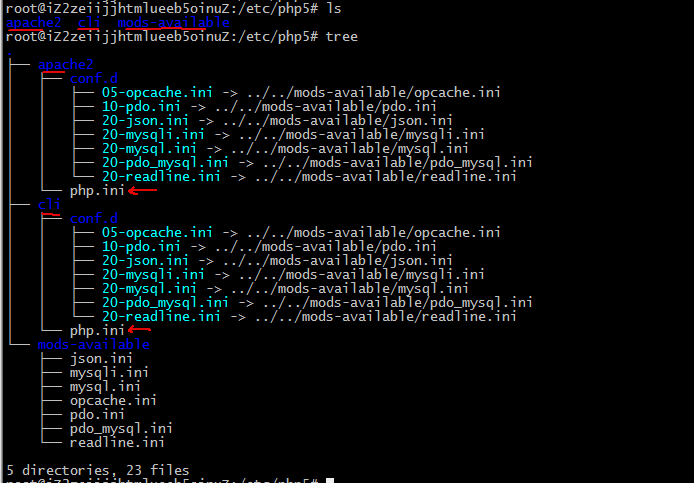

[TOC]


## ReadMe

讨论apache相关；


## apache2 feature

### rewrite

1. load rewrite.mod

2. httpd.conf

   > Options FollowSymLinks  
   > AllowOverride ALL  

3. .htaccess in webdata dir.

   > RewriteEngine On    
   > RewriteCond ..  
   > RewriteRule ..  
   >
   > > 打开webdata dir目录的FollowSymLinks属性且在.htaccess里要声明 RewriteEngine on  

域名跳转、URL跳转；
http://blog.csdn.net/chamtianjiao/article/details/6268746  


## apache config.

### MPM

多进程处理模块、多路处理模块！

如下，查看当前apache采用哪种mpm.（这个不能在配置中看！）

```bash
#/usr/sbin/apache2 -l
worker.c
prefork.c
```


prefork mpm
非线程型的、预派生的web服务器。
它适合于没有线程安全库，需要避免线程兼容性问题的系统。一个请求出现问题不会影响到其他请求。

```bash
<IfModule mpm_prefork_module>
    StartServers          5 #http启动时创建的子进程数；
    MinSpareServers       5 #最小空闲子进程数。
		#startsServers数子进程建立后，每隔1s按指数级增长（至多32个）创建子线程到达此n值。
    MaxSpareServers      10 #最大空闲子进程数。
    	#超过n，就会被控制进程kill掉。必须>minSpareServers.
    MaxClients          150 #同时连入的最大request数，超过就会被排队。
    	#ps -ef|grep http|wc -l 可查看。
    	#新版本叫MaxRequestWorkers
    MaxRequestsPerChild   0 #子进程服务了n个请求之后自动销毁。
    	#0为不销毁，非0可防止内存泄漏！
</IfModule>
```


worker mpm
多线程、多进程混合型web服务器。
1个控制进程，动态创建子进程来调节服务能力；每个子进程内有固定数线程。
使用线程来处理请求，系统资源的开销小于基于进程的MPM。

```bash
<IfModule mpm_worker_module>
    StartServers          2
    MinSpareThreads      25 #最少空闲线程数。针对apache所有线程而言。
    MaxSpareThreads      75
    ThreadLimit          64 #每个子进程可配置的线程数ThreadsPerChild上限。
    ThreadsPerChild      25 #每个子进程内有n个服务线程，1个监听线程。
    MaxClients          150
    MaxRequestsPerChild   0
</IfModule>
```


event mpm
一种更高处理能力的模型，它把服务进程从连接中分离出来。

```bash
<IfModule mpm_event_module>
    StartServers          2
    MinSpareThreads      25
    MaxSpareThreads      75
    ThreadLimit          64
    ThreadsPerChild      25
    MaxClients          150
    MaxRequestsPerChild   0
</IfModule>
```


## LinuxApacheMysqlPhp

### install process

```bash
# 如果是阿里云的服务器，那么配置阿里云的源，这样会快点；
apt-get install apache2

apt-get install php5
#如果是php7，那么还要安装个libapache2-mod-php7.0 
apt-get install php5-gd

apt-get install mysql-server
apt-get install php5-mysql
```


### install issue

#### apache

client访问网页报错：403 Forbidden: client denied by server configuration
查看apache error log如下：

```sh
[authz_core:error] [pid 779] [client 127.0.0.1:36184] AH01630: client denied by server configuration: /var/webdata/hello.php
[authz_core:error] [pid 777] [client 106.121.15.124:40040] AH01630: client denied by server configuration: /var/webdata/hello.php
```

apache2.2到2.4网站访问控制发生了改变。
apache2.2

> Order, Allow, Deny

apache2.4

> Require

```sh
Require all granted #允许所有
Require all denied #拒绝所有
Require env env-var [env-var] ... #允许匹配环境变量中任意一个
Require method http-method [http-method] ... #允许特定的HTTP方法（GET/POST/HEAD/OPTIONS）
Require expr expression #允许，表达式为true
Require user userid [ userid ] ... #允许特定用户
Require group group-name [group-name] ... #允许特定用户组
Require valid-user # #允许，有效用户
Require [not] ip 192.100 192.168.100 192.168.100.5 #允许特定IP或IP段，多个IP或IP段间使用空格分隔

# 关键字前加not表示取反。
```


-------

client访问网页报错：Permission denied: because search permissions are missing on a component of the path
站点目录的文件权限应该是755

> chmod a+x * -R    
> chmod -R 755 www/*


#### php

error>> PHP Fatal error:  Call to undefined function mysql_connect()
php缺少对mysql的支持

> apt-get install php5-mysql 


#### mysql

error>> allow mysql remote connection
打开Mysql的远程连接功能。

```sh
mysql -u root -p 
mysql>use mysql; 
mysql>update user set host = '%' where user = 'root'; 
mysql>select host, user from user;
```


### php5 config

其配置文件在/etc/php5/*，如下图：  


其中的apache2, cli是php提供的两种不同的(SAPI)接口类型。
Server Application Programming Interface（服务器应用编程接口）。PHP通过SAPI提供了一组接口，供应用和PHP内核之间进行数据交互。 

> PHP提供很多种形式的接口，包括apache、apache2filter、apache2handler、caudium、cgi 、cgi-fcgi、cli、...

