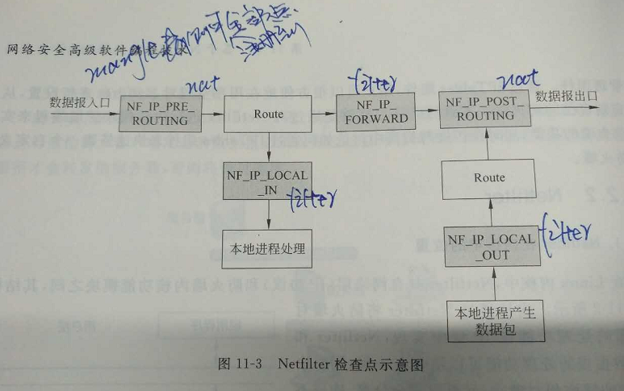
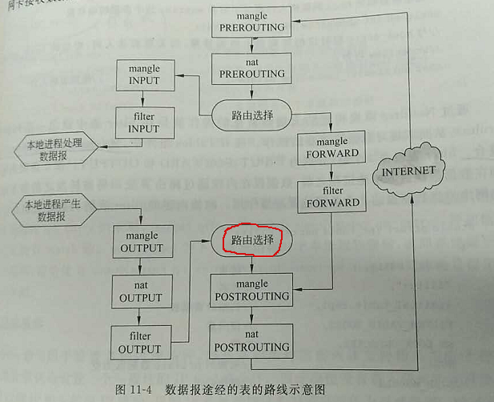

[TOC]


## ReadMe

netfilter相关知识；


## Netfilter

netfilter检查点   


一个包经过一个网关时，在netfilter的路径  
  


## Iptables

针对内核netfilter，用户态提供了iptables(ip包)，arptables(arp包), ebtables(以太网帧)；
iptables大致是工作在OSI七层的二、三、四层。   

### Tables

表及表上的链如下

| 表名                  | 链名        | 说明 |
| --------------------- | ----------- | ---- |
| filter table 过滤     | input       |      |
|                       | forward     |      |
|                       | output      |      |
| nat table 地址转换    | preRouting  |      |
|                       | input       |      |
|                       | output      |      |
|                       | postRouting |      |
| mangle table 修改包头 | preRouting  |      |
|                       | input       |      |
|                       | output      |      |
|                       | postRouting |      |
| raw table 包跟踪      | preRouting  |      |
|                       | output      |      |
| secrity table         | input       |      |
|                       | forward     |      |
|                       | output      |      |


### Rules

**T.常用指令**

```bash
#查看规则
iptable -nvL  #默认是filter表
iptable -ntL -t filter/nat/mangle

#修改规则
iptable <Operation> <Condition> <Action>
```


**T.规则的操作：增、删。。。**

```bash
-D #删除
-I #插入 
-A #追加
-R #修改
-L #查看
-P #默认
-F #清空
```

**T.规则的匹配条件**

```bash
-o,-i  #流出、流入的接口

-s,-d  #来源、目标ip1-ip2 （注意-的使用）  
--sport/dport port1:port2 #（注意:的使用）  

-p #协议  

-m mac/multiport/state/limit #各种附加模块…  
-m state --state NEW
-m limit --limit 50/second --limit-burst 100
```

**T.规则的动作 -j  action**

```bash
ACCEPT
REJECT  #拒绝数据包通过，必要时会给数据发送端一个响应的信息
DROP    #直接丢弃数据包，不给任何回应信息

LOG、INPUT、OUTPUT

--to ip:port、--to-destination ip  #DNAT 外网访问内网服务（换成内部ip）；
	# -p tcp –dport 80 –j DNAT –to ip   一般按端口来转
	# 只能在prerouting, output处做DNAT  

SNAT
	#内网访问外网服务；（换成外部ip）
	#一般按网络来转（postrouting处）； -SNAT ip/24

MASQUERADE
	#地址伪装，对SNAT的补充，动态源地址转换；（出口Ip不固定的场景）
```


如下是一台server的规则集

```bash
root@Gateway:~# iptables -nvL -t nat 
Chain PREROUTING (policy ACCEPT 434K packets, 57M bytes)
 pkts bytes target     prot opt in     out     source               destination         
    2   104 DNAT       tcp  --  *      *       0.0.0.0/0            172.22.78.100        tcp dpt:13389 to:172.18.0.1:3389

Chain INPUT (policy ACCEPT 19731 packets, 3402K bytes)
 pkts bytes target     prot opt in     out     source               destination         

Chain OUTPUT (policy ACCEPT 1118 packets, 68210 bytes)
 pkts bytes target     prot opt in     out     source               destination         

Chain POSTROUTING (policy ACCEPT 21 packets, 1204 bytes)
 pkts bytes target     prot opt in     out     source               destination         
4190K  278M MASQUERADE  all  --  *      eth0    0.0.0.0/0            0.0.0.0/0   #伪装所有的包，的snat为eth0的ip
```

