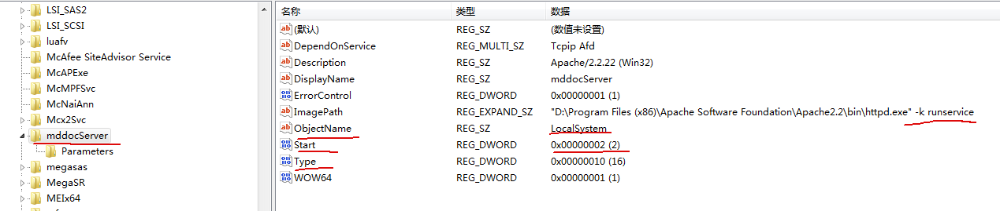
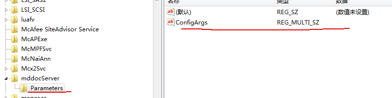

[TOC]

## 如何创建一个自启服务
如何创建一个服务（在services.msc中能看到），并让他开机自启动。

### 注册表法

regedit.exe
>> controlset001 系统原始配置。启动时拷贝一份至currentControlSet。    
>> currentControlSet 当前配置（更改currentControlSet也会自动覆盖到controlset001，以保证一致性）。   
>> controlset002 最后一次正确启动的配置。  
>
> hkey_local_machine -> system -> controlset001 -> services 新建项，然后添加如下配置

其中部分字段意义如下：
> ImagePath”，字符串值，对应该服务程序所在的路径；  
> ObjectName”，字符串值，值为“LocalSystem”，表示本地登录；  
> Start”，DWORD值，值为2表示自动运行，值为3表示手动运行，值为4表示禁止；  
> Type”，DWORD值，应用程序对应10，其他对应20。  

